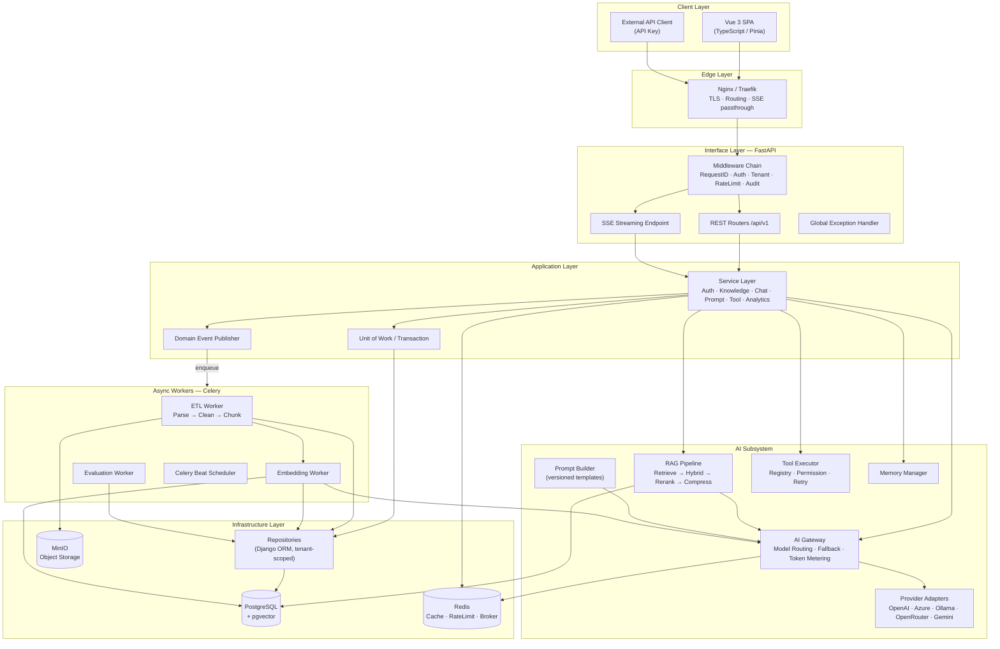
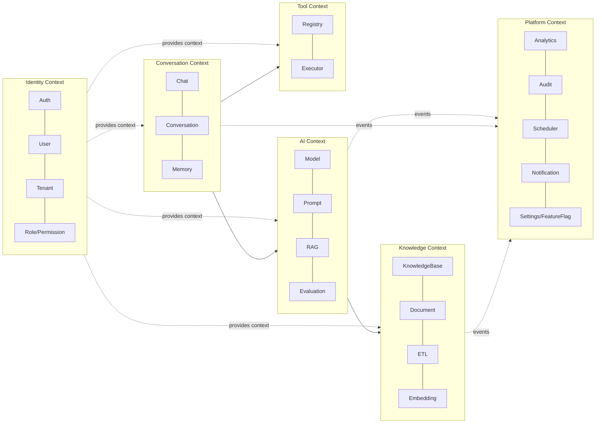
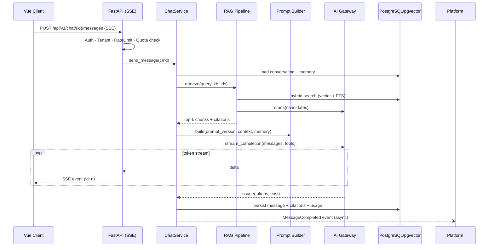

# 01 系統架構總覽（System Architecture）

| 項目 | 內容 |
|------|------|
| 文件編號 | 01 |
| 版本 | v1.1 |
| 日期 | 2026-07-30 |
| 狀態 | Draft — 待審閱 |
| 相依文件 | 00_專案總覽與文件索引 |
| 變更紀錄 | v1.1：新增附錄 A 部署拓撲（15 審查報告 F-04） |

---

## 1. 設計理念

本系統採 **Modular Monolith + Clean Architecture**：單一部署單元（降低初期維運複雜度、符合 YAGNI），內部以 DDD Bounded Context 劃分模組，模組間僅透過 Service Interface 與 Domain Event 溝通，為未來拆分 Microservices 保留清晰的切割線。

核心設計原則：

1. **單一對外入口**：FastAPI 是唯一 API Gateway，統一處理 Authentication、Rate Limit、Tenant Resolution、Exception、OpenAPI。
2. **同步 / 非同步分離**：HTTP 請求路徑保持輕量（< 數百 ms）；所有重活（ETL、Embedding、Evaluation、批次任務）一律走 Celery。
3. **AI 基礎設施抽象化**：LLM / Embedding / Reranker 均透過 Provider Interface 存取，業務程式碼不依賴任何特定廠商 SDK。
4. **租戶隔離內建於底層**：tenant filter 在 Repository Layer 強制注入，而非依賴各處業務程式碼自律。
5. **一切可觀測**：Request ID / Trace ID 貫穿 API → Service → Celery → LLM 呼叫，Token 用量與成本在 Gateway 層統一計量。

---

## 2. 整體架構圖

### 2.1 子系統說明

| 子系統 | 職責 | 關鍵設計 |
|--------|------|----------|
| **Frontend（Vue 3 SPA）** | Chat UI（SSE 渲染）、知識庫管理、Prompt 管理、Admin Dashboard | typed API client 由 OpenAPI codegen 產生（G-11）；Pinia 管狀態；不含業務邏輯 |
| **Edge（Nginx/Traefik）** | TLS 終結、路由、靜態資源、SSE passthrough | SSE 路徑關閉 proxy buffering（`X-Accel-Buffering: no`） |
| **Interface Layer（FastAPI）** | 認證、租戶解析、輸入驗證（Pydantic）、Rate Limit、回應格式、SSE | Controller 薄層，不含業務邏輯；Global Exception Handler 統一錯誤格式 |
| **Application Layer（Service）** | Use Case 編排、交易邊界（UoW）、Domain Event 發佈 | 唯一允許呼叫 AI Gateway 與 Repository 的層；可獨立單元測試 |
| **AI Subsystem** | LLM / Embedding / Rerank 呼叫、RAG 檢索、Prompt 組裝、Tool 執行、Memory | 全部經 AI Gateway 統一計量 token 與成本；Provider 可熱切換 |
| **Infrastructure Layer** | 資料持久化、快取、物件儲存、外部服務 Adapter | Repository 強制 tenant scope；Django ORM 只在此層出現 |
| **Async Workers（Celery）** | ETL、Embedding、Evaluation、排程、清理 | 佇列分流（etl / embedding / default）、Idempotent task、DLQ |

---

## 3. 關鍵架構決策（ADR）

### ADR-001 Django 與 FastAPI 共存策略 【P0 / G-01】

**決策**：FastAPI 為唯一對外 HTTP 入口；Django 降級為「ORM + Migration + Admin 引擎」，不對外提供業務 API。單一 codebase、單一 Docker image、兩個進程（api / worker）。

**運作方式**：

- 啟動時以 `django.setup()` 初始化 ORM（`os.environ["DJANGO_SETTINGS_MODULE"]`），在 **ASGI 入口（`config/asgi.py`）的 import 期**完成，且必須早於任何會觸及 model 的 import。**不可**放在 FastAPI lifespan：建立 app 物件需先 import router → repositories → models，而 model 於 import 當下即存取 app registry，lifespan 執行時序已太晚（`ImproperlyConfigured`）。
- FastAPI 為 async framework，Django ORM 為 sync：所有 ORM 存取包在 Repository 方法內，透過 `asgiref.sync.sync_to_async`（thread_sensitive=False 的受控 threadpool）呼叫；**禁止**在 async endpoint 內直接呼叫 ORM。
- DB connection 管理：threadpool worker 各自持有 connection，由 **`run_orm()` 於 threadpool 內、與 ORM 同一條執行緒**的 `finally` 呼叫 `close_old_connections()`。**不可**放在 middleware：Django connection 為 thread-local，middleware 執行於 event loop 執行緒，關不到 threadpool worker 上的連線，將導致連線持續累積。連線上限由 PgBouncer（transaction pooling）統一治理。
- Migration 僅使用 Django Migration（單一 Migration 系統，禁止混用 Alembic）。
- Django Admin 僅綁 internal port，供維運人員使用，不對公網開放。

**替代方案與取捨**：

| 方案 | 優點 | 缺點 | 結論 |
|------|------|------|------|
| A. 全 Django（DRF + Channels） | 單一 framework | SSE/async 支援弱、OpenAPI 體驗差、AI Gateway 難做 | 否 |
| B. FastAPI + SQLAlchemy | 原生 async、生態一致 | 違反題目指定 Django ORM；失去 Django Admin / Migration 成熟度 | 否（若無此限制為更優解，列為已知 Technical Debt 決策） |
| **C. FastAPI + Django ORM（採用）** | 符合指定技術棧；FastAPI 的 async / OpenAPI / DI 全數保留；Admin 免費取得 | ORM sync→async 橋接有 threadpool 成本；兩套設定需整合 | ✅ |

**風險與緩解**：threadpool 飽和 → 以 metrics 監控 threadpool queue depth，ORM-heavy 端點改用 `search_read` 式輕查詢與 cache；未來若 async ORM 成熟（Django 5.x async ORM 完整後）可平滑遷移，Repository 介面不變。

**修訂紀錄**：

- **2026-08-01**（ADR-001 穿刺驗證回饋）：修正「運作方式」前兩點。原文的 `django.setup()` 置於 lifespan、`close_old_connections()` 置於 middleware，經實作驗證在技術上均不成立（前者 import 時序、後者 thread-local 語意），已改為 import 期 / `run_orm()` 內。**決策本身（C 方案：FastAPI + Django ORM）不變**，僅修正落地機制。
- **2026-08-01**（spike B2 壓測結果）：上述「待決」已結案。`close_old_connections()` 下沉後 `CONN_MAX_AGE=0` 等於每次 ORM 呼叫重建連線，實測單改此項吞吐 2.4 倍，故 05 §5.5 改為 `CONN_MAX_AGE=300`。

### ADR-002 Multi-tenant 隔離模式 【P0 / G-02】

**決策**：Shared Database + Shared Schema + `tenant_id` Row-Level 隔離。

- 所有租戶資料表皆含 `tenant_id`（FK + composite index 首欄）。
- Repository 基底類別強制注入 `tenant_id` filter；缺 tenant context 直接 raise（Fail Fast），杜絕跨租戶洩漏。
- 縱深防禦：PostgreSQL Row Level Security（RLS）作為第二道防線，`SET app.tenant_id` 由 UoW 設定。
- pgvector 檢索一律帶 `tenant_id` 條件；HNSW index 與 tenant filter 併用。
- Redis key 一律 `t:{tenant_id}:` 前綴；MinIO 以 `tenant-{id}/` prefix 隔離。

**取捨**：Schema-per-Tenant 隔離更強但 Migration 成本 O(N 租戶)、連線暴增，違反 YAGNI；Database-per-Tenant 適合超大客戶專屬部署，保留為未來商業選項（Repository 抽象已可支援切換 connection routing）。

**已知偏離（spike 期，2026-08-03 起以 feature flag 收斂）**：`backend/api/main.py` 的 `tenant_middleware` 從 client 送的 `X-Tenant-Id` 標頭取租戶，違反本 ADR「不接受 client 自報 tenant_id」。存在的唯一理由是 B 組壓測需要在尚未接上認證的情況下切換租戶。

- 該 middleware 與 `/api/v1/spike/*` 路由**只在 `ENABLE_SPIKE_ENDPOINTS=true` 時註冊**；旗標預設 `False`（`config/settings/app_settings.py`），未設值的部署完全沒有這個未認證讀取面。
- 唯一開啟處是 `make api`（壓測目標）；`.env.example` 中此變數保持註解狀態，正式部署不得設定。
- 回歸測試：`backend/tests/api/test_api_errors.py::TestSpikeSurfaceOffByDefault`（含 env 預設值的正反向驗證）。
- **結案條件**：Phase 0 接上 JWT 認證後，`tenant_middleware`、`api/v1/spike.py`、`apps/spike/` 與 `enable_spike_endpoints` 旗標本身於**同一個 commit** 移除，租戶改由 `api/middleware/tenant_context.py` 從已驗證 claim 取得。

### ADR-003 Vector DB：pgvector 【P0】

**決策**：pgvector + HNSW index，與主庫同一 PostgreSQL instance。

理由：交易一致性（chunk 與 embedding 同交易寫入）、免去資料同步管線、維運面只有一套 DB、tenant filter 直接用 SQL。百萬級文件前效能足夠（詳見 11_NFR 容量規劃）。演進路徑：讀寫分離 → 獨立 vector PostgreSQL instance → 專用 Vector DB（Qdrant/Milvus），Retriever 介面已抽象、可無痛替換。

### ADR-004 即時傳輸：SSE 【P0 / G-06】

**決策**：SSE（非 WebSocket）。Chat 是單向串流場景，SSE 較簡單、經過 LB/CDN 友善、原生斷線重連。設計要點：每個 event 帶遞增 `id:`；client 斷線以 `Last-Event-ID` resume（server 端將已生成 token 暫存 Redis，TTL 5 分鐘）；串流中斷時已產生內容照常持久化與計費；心跳 comment frame 每 15s 防 idle timeout。

### ADR-005 訊息佇列：Celery + Redis → Kafka 演進 【P0】

**決策**：Celery + Redis broker。Domain Event 經 `EventPublisher` 介面發佈（目前實作 = 轉 Celery task）；未來事件量大或需要 event sourcing / 多消費者時，替換為 Kafka publisher，業務程式碼零修改。

### ADR-006 模組邊界（Bounded Context） 【P0】

規則：跨 Context 只能呼叫對方的 Service Interface（Python Protocol 定義於 `core/interfaces/`），或訂閱 Domain Event；**禁止**跨 Context 直接 import Model / Repository。這條線就是未來 Microservices 的切割線。

### ADR-007 技術版本與依賴管理 【P0 / G-04】

| 項目 | 規範 |
|------|------|
| Python | 3.12（LTS 生態成熟；type parameter 語法可用） |
| Django | 5.x LTS 線 |
| FastAPI / Pydantic | 最新 stable / Pydantic v2 |
| Node.js | 22 LTS；Vue 3.5+、Vite、TypeScript strict |
| PostgreSQL | 16 + pgvector 0.7+（HNSW、halfvec） |
| Redis | 7.x |
| 依賴管理 | **uv**（lockfile：`uv.lock`）；前端 pnpm |
| 容器 | Multi-stage Dockerfile、non-root user、python-slim base |

---

## 4. 請求路徑範例（Chat with RAG）

---

## 5. 優點 / 缺點 / 適用情境

**優點**：部署與除錯簡單（單一單元）；模組邊界清晰、可漸進拆分；AI 基礎設施完全抽象、廠商可換；租戶隔離做在底層、防人為疏失；Docker Compose 即可跑起完整系統。

**缺點**：Django ORM 的 sync 橋接有額外 threadpool 成本與心智負擔；Modular Monolith 的模組紀律需 CI 工具（import-linter）強制，否則會腐化；pgvector 與主庫共用資源，重檢索負載會影響 OLTP。

**適用情境**：團隊 2–8 人、租戶數十至數百、文件量 ≤ 百萬級的 SaaS 初期到成長期。超過此規模依第 6 節路徑演進。

## 6. 未來演進方向

1. **拆分順序**（依負載特性）：Worker 先天已可獨立 scale → 第一個拆出的服務是 **AI Gateway**（無狀態、高 fan-out）→ 其次 **ETL/Embedding**（資源密集）→ 最後才考慮業務模組。
2. Kafka 替換 EventPublisher 實作；Kubernetes 部署（Helm chart 於 12_NFR 規劃）；讀寫分離與 vector 專用 instance。

## 7. 最佳實踐

- import-linter 於 CI 強制模組邊界；`ruff + black + isort + mypy` pre-commit。
- 所有跨層介面以 `typing.Protocol` 定義，DI 由 FastAPI `Depends` + 應用層 container 管理。
- Domain Event schema 版本化（Pydantic model + `event_version` 欄位）。
- 設定管理：Pydantic Settings 讀環境變數，禁止 hardcode；secrets 不進 image。

## 8. 潛在風險與改善建議

| 風險 | 等級 | 緩解 |
|------|------|------|
| ORM threadpool 飽和造成 API 延遲 | 高 | PgBouncer + threadpool metrics + 熱路徑 cache；壓測於 Phase 1 完成 |
| 模組邊界腐化 | 中 | import-linter + Code Review checklist |
| pgvector 與 OLTP 資源競爭 | 中 | 監控分離查詢延遲；預留 read replica 路徑 |
| SSE 經企業 proxy 被 buffer | 中 | 心跳 frame + 文件化 client 端 fallback（polling） |

## 9. Architecture Review（自我審查）

1. **SOLID**：符合——各層單一職責、依賴反轉（Service 依賴 Protocol 而非實作）。
2. **DDD**：符合——六個 Bounded Context、Domain Event、Ubiquitous Language 將於模組設計落實。
3. **Clean Architecture**：符合——依賴方向一律向內（Interface→Application→Domain←Infrastructure）。
4. **DRY**：無違反——共用邏輯集中 `common/`、`core/`。
5. **KISS**：Django+FastAPI 橋接是必要複雜度（技術棧指定）；其餘無額外複雜度。
6. **YAGNI**：無違反——Kafka / K8s / Microservices 僅保留介面，不先建設。
7. **可測試性**：高——Service 層純 Python、依賴皆可 mock；LLM 一律 mock。
8. **可維護性**：高——單一 repo、單一 migration 系統、統一入口。
9. **可擴充性**：高——Provider/Retriever/EventPublisher/Repository 皆為可替換介面。
10. **Technical Debt**：已知並記錄——Django ORM sync 橋接（ADR-001 方案 B 為理想解）；接受並監控。
11. **Over Engineering**：RLS 雙重防線略超前，但租戶洩漏屬毀滅性風險，屬合理防禦成本。
12. **更好方案**：若技術棧可談，FastAPI + SQLAlchemy(async) + Alembic 為更一致的組合；在指定 Django ORM 前提下，本設計為最優解。

---

## 附錄 A：部署拓撲（Docker Compose，F-04）

單機基準：**16GB RAM / 4 vCPU / 200GB SSD**（Phase 1–2 規模；記憶體吃緊時先砍觀測 profile）。

| Service | 角色（同一 backend image 者標 ★） | 對外埠 | 內部埠 | 記憶體上限 | 備註 |
|---------|----------------------------------|--------|--------|-----------|------|
| proxy | Nginx/Traefik：TLS、路由、SSE passthrough | 80/443 | — | 256MB | 唯一對外入口 |
| api ×2 | ★ uvicorn（FastAPI）**每 replica 2 workers** | — | 8000 | 768MB each | replica 數隨負載調；worker 數依據見下方註 1 |
| worker-default | ★ celery -Q default | — | — | 768MB | 通知/摘要/雜項 |
| worker-etl | ★ celery -Q etl（含解析子進程） | — | — | 2GB | CPU 密集；concurrency=2 |
| worker-embedding | ★ celery -Q embedding | — | — | 1GB | IO 密集；concurrency=4 |
| beat | ★ celery beat | — | — | 256MB | 單實例 |
| outbox-relay | ★ outbox 投遞（11 §4.3） | — | — | 256MB | 單實例 |
| postgres | PG16 + pgvector + pgroonga（自建 image） | — | 5432 | 6GB（shared_buffers 2GB） | 資料卷 + WAL 歸檔卷 |
| pgbouncer | transaction pooling | — | 6432 | 128MB | 應用一律經此連線 |
| redis | cache/broker/ratelimit | — | 6379 | 1GB（maxmemory + allkeys-lru 僅 cache DB） | AOF everysec |
| minio | 物件儲存 | — | 9000/9001 | 512MB | console 僅內網 |
| admin | ★ Django Admin（runserver/gunicorn） | — | 8001 | 512MB | **僅內網/VPN 可達，不經 proxy 對外** |
| （profile: obs） | Prometheus + Grafana + Loki | — | 3000 等 | 合計 ~2GB | dev 可關；prod 建議常開 |
| （profile: dev） | mailpit（信件攔截） | — | 8025 | 64MB | 僅開發 |

原則：對外只開 80/443；其餘 service 一律走 compose 內部網路；`admin` 與 `minio console` 需 VPN/SSH tunnel。★ 者共用同一 image、不同 command——build 一次、多角色部署（12 §7 的 12-factor 前提）。

**註 1：api replica 的 uvicorn worker 數 = 2（2026-08-01，ADR-001 spike B2 實測）**

| uvicorn workers | rps | p50 延遲 |
|---|---|---|
| 1 | ~304 | 130 ms |
| 2 | ~542 | 81 ms |
| 4 | 549 / 733 / 662（三次） | 58 ms |
| 6 | ~662 | 52 ms |

- **1 → 2 是唯一超出量測雜訊的差距**（吞吐約 2 倍）。2 / 4 / 6 之間的差異落在同設定重複執行的變異範圍內（workers=4 三次量到 549–733 rps，±14%），**本次環境無法分辨**，不應據此宣稱 4 或 6 更好。
- 取 2 而非更多的另外兩個理由：單機基準只有 4 vCPU 且 PostgreSQL 同機競爭，`api ×2 replica × 2 workers = 4 進程`已達 vCPU 數；且每 worker 載入 Django 後常駐約 150–250MB，768MB 上限下 2 個是安全值。
- **此值在正式硬體上必須重測**：量測環境不合格（負載產生器與受測系統同機），見 11 §1.4。

---

*下一步：確認本文件後，進行 Stage 2（02_後端專案結構.md、03_前端專案結構.md）。*
