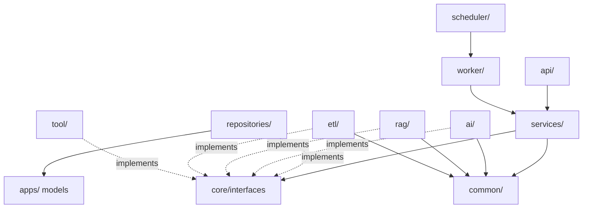

# 02 後端專案結構（Backend Folder Structure）

| 項目 | 內容 |
|------|------|
| 文件編號 | 02 |
| 版本 | v1.1 |
| 日期 | 2026-07-30 |
| 狀態 | Draft — 待審閱 |
| 相依文件 | 01_系統架構總覽（ADR-001、ADR-006、ADR-007） |
| 變更紀錄 | v1.1：新增 §4.1 DI 組裝模式定案（15 審查報告 F-02） |

---

## 1. 設計理念

資料夾結構直接體現 Clean Architecture 的分層與 ADR-006 的 Bounded Context：

1. **一個資料夾 = 一個明確職責**；看目錄就能推出程式該放哪，Convention over Configuration。
2. **依賴方向單一**：`api → services → (core interfaces) ← repositories / ai / rag / etl / tool`，由 import-linter 在 CI 強制。
3. **Django 元素被關進兩個地方**：`apps/`（Model / Admin / Migration）與 `repositories/`（ORM 查詢）。其他層看不到 Django。
4. **FastAPI 與 Celery 共用同一套 Service**：`worker/` 的 task 是薄包裝，邏輯全部在 `services/` 與 AI 子系統。

## 2. 完整目錄結構

```
backend/
├── pyproject.toml              # uv 管理；ruff / black / isort / mypy 設定集中於此
├── uv.lock
├── manage.py                   # Django CLI（migrate / createsuperuser / shell）
├── Dockerfile                  # multi-stage、non-root
├── .env.example                # 環境變數清單（不含真值）
│
├── config/                     # ── 組態與進程入口 ──
│   ├── settings/
│   │   ├── base.py             # Django settings 共用（INSTALLED_APPS、DB、i18n）
│   │   ├── dev.py / prod.py / test.py
│   │   └── app_settings.py     # Pydantic Settings：非 Django 的應用組態（LLM、Redis、MinIO…）
│   ├── asgi.py                 # FastAPI app 入口（檔首 import 期 django.setup()，見 ADR-001）
│   ├── celery_app.py           # Celery instance、佇列定義（default / etl / embedding）
│   └── logging.py              # structlog 設定：JSON、request_id / trace_id processor
│
├── api/                        # ── Interface Layer（FastAPI，薄層）──
│   ├── main.py                 # app factory：middleware、router 掛載、exception handler
│   ├── middleware/             # request_id、auth、tenant_context、rate_limit、audit
│   ├── deps.py                 # DI：CurrentUser、CurrentTenant、Pagination、RequireScope
│   ├── exception_handlers.py   # Global Exception Handler → 統一錯誤格式
│   ├── schemas/                # Pydantic Request/Response DTO（按 context 分檔）
│   └── v1/                     # /api/v1 routers（每檔只做：驗證→呼叫 Service→回傳）
│       ├── auth.py  users.py  tenants.py
│       ├── knowledge.py  documents.py
│       ├── chat.py             # 含 SSE endpoint
│       ├── prompts.py  models.py  tools.py  rag.py
│       ├── analytics.py  settings.py  admin.py
│       └── __init__.py         # v1 router 彙整
│
├── apps/                       # ── Django Apps = Bounded Context 的資料模型 ──
│   │                           #    只放 models / admin / migrations；Model 保持薄（欄位＋約束，無業務方法）
│   ├── identity/               # User、Tenant、Role、Permission、ApiKey
│   ├── knowledge/              # KnowledgeBase、Document、Chunk、Embedding、EtlJob
│   ├── ai/                     # ModelConfig、Prompt、PromptVersion、EvaluationRun
│   ├── conversation/           # Conversation、Message、MemorySnapshot
│   ├── tool/                   # ToolDefinition、ToolExecutionLog
│   └── platform/               # AuditLog、UsageLog、ScheduledJob、Notification、FeatureFlag
│       └── (每個 app：models.py、admin.py、migrations/)
│
├── core/                       # ── 共用核心（無外部依賴的內圈）──
│   ├── interfaces/             # typing.Protocol：Repository、LLMProvider、Retriever、
│   │                           #   EventPublisher、ToolRunner… 跨 Context 呼叫的唯一合法入口
│   ├── events/                 # Domain Event 定義（Pydantic、event_version）
│   ├── exceptions.py           # 業務例外階層（DomainError → NotFound / Conflict / QuotaExceeded…）
│   ├── tenant.py               # TenantContext（contextvars）：缺 context 即 raise（Fail Fast）
│   ├── uow.py                  # Unit of Work：transaction + RLS SET app.tenant_id
│   └── container.py            # DI 組裝：介面 → 實作 綁定
│
├── common/                     # ── 純工具（不含業務語意）──
│   ├── pagination.py  crypto.py  text.py  time.py  hashing.py
│
├── services/                   # ── Application Layer：Use Case 編排 ──
│   ├── identity/               # AuthService、UserService、TenantService、ApiKeyService
│   ├── knowledge/              # KnowledgeBaseService、DocumentService、IngestionService
│   ├── conversation/           # ChatService、ConversationService、MemoryService
│   ├── ai/                     # PromptService、ModelService、EvaluationService
│   ├── tool/                   # ToolService
│   └── platform/               # AnalyticsService、AuditService、QuotaService、NotificationService
│
├── repositories/               # ── Infrastructure：Django ORM 實作 ──
│   ├── base.py                 # TenantScopedRepository：強制注入 tenant filter、sync_to_async 包裝
│   └── (per context：identity.py、knowledge.py、conversation.py …)
│
├── ai/                         # ── AI Subsystem ──
│   ├── gateway/                # AIGateway：Model Routing、Fallback、Token Metering、Cost 計算
│   │   └── providers/          # 實作落在 gateway/ 之下（1C-1）：__init__.py 是 Protocol；
│   │                           #   mock.py；openai_compatible.py（embedding + chat，五家共用一張
│   │                           #   VENDORS 表，1C-5 的偏離見 13）；rerank.py（TEI + Jina，2B-4——
│   │                           #   **刻意不與 openai_compatible 共用**：rerank 沒有 OpenAI 相容的
│   │                           #   共通形狀，兩家的請求／回應欄位全不同，共用的紅利不成立）
│   ├── prompts/                # PromptBuilder、template 渲染（Jinja2 sandbox）、prompt cache
│   ├── memory/                 # MemoryManager：滑動視窗＋摘要壓縮策略
│   └── evaluation/             # 評測 runner、metrics（groundedness / faithfulness / recall）
│
├── rag/                        # ── RAG Pipeline ──
│   ├── pipeline.py             # RetrieveThenRerank 編排（可組態的 pipeline steps）
│   ├── retrievers/             # vector.py（pgvector）、fulltext.py（FTS）、hybrid.py（RRF 融合）
│   ├── reranker.py             # Rerank provider 呼叫（經 AI Gateway）
│   ├── compressor.py           # Context Compression
│   └── citation.py             # 引用組裝與驗證
│
├── etl/                        # ── ETL Pipeline ──
│   ├── pipeline.py             # Extract → Clean → Chunk 編排、狀態機
│   ├── loaders/                # pdf / docx / xlsx / csv / json / api / database / web
│   ├── cleaners/               # 去噪、去重（content hash）、格式正規化
│   └── chunkers/               # 策略：recursive / semantic / table-aware（含 chunk_version）
│
├── tool/                       # ── Tool Subsystem ──
│   ├── registry.py             # ToolRegistry：註冊、schema、版本、啟用狀態
│   ├── executor.py             # 執行：Permission → Timeout → Retry → Cache → Log
│   └── builtin/                # 內建工具（web_search、calculator、db_query…）
│
├── scheduler/                  # ── 排程定義 ──
│   └── beat.py                 # Celery Beat schedule（清理、歸檔、統計彙總、健康巡檢）
│
├── worker/                     # ── Celery Tasks（薄包裝）──
│   ├── etl_tasks.py            # ingest_document → IngestionService
│   ├── embedding_tasks.py      # embed_chunks（batch、idempotent）
│   ├── evaluation_tasks.py
│   └── maintenance_tasks.py    # 歸檔、清理、租戶級聯刪除
│
├── tests/
│   ├── unit/                   # Service / RAG / ETL 純邏輯（LLM 一律 mock）
│   ├── integration/            # Repository + 真 DB（testcontainers 或 test DB）
│   ├── api/                    # FastAPI TestClient：認證、權限、錯誤格式
│   ├── e2e/                    # docker compose 全鏈路（僅 CI nightly）
│   ├── factories/              # factory_boy：每個 Model 一個 factory
│   └── conftest.py             # tenant fixture、mock provider fixture
│
└── scripts/                    # 一次性維運腳本（seed、rls_setup、backfill）
```

## 3. 依賴方向與強制規則



import-linter contracts（CI 強制）：

1. `api` 不可 import `repositories`、`apps`（Controller 禁止碰 ORM）。
2. `services` 不可 import `apps.*.models`（只能經 repository）。
3. `ai / rag / etl / tool` 不可 import `api`、`services`（下層不知道上層）。
4. 跨 context 的 service 互相呼叫只能經 `core/interfaces` 的 Protocol。
5. `common` 不可 import 任何其他層（純函式庫）。

## 4. 關鍵慣例

### 4.1 DI 組裝模式（定案，全 repo 唯一模式）

**不引入 DI 框架**（dependency-injector 等，YAGNI）；統一使用「constructor injection + 集中式 factory」：

```python
# core/container.py —— 介面→實作綁定的唯一位置
@lru_cache                                    # 無狀態元件以 singleton 提供
def get_ai_gateway() -> AIGatewayProtocol:
    return AIGateway(providers=_build_providers(), quota=get_quota_service())

def get_chat_service() -> ChatService:        # 有請求態依賴者不加 lru_cache
    return ChatService(
        gateway=get_ai_gateway(),
        rag=get_rag_pipeline(),
        conv_repo=ConversationRepository(),   # Protocol 型別注入
    )
```

規則（違反即 review 打回）：

1. **Service / pipeline 建構子只接受 Protocol 型別**，內部禁止 import 具體實作或自行實例化 repository / provider（hidden coupling）。
2. 介面→實作綁定**只出現在 `core/container.py`**；新增服務 = 新增一個 factory 函式。
3. API 層：`api/deps.py` 以 `Depends(get_xxx_service)` 注入；endpoint 不自行組裝。
4. Worker 層：Celery task 呼叫**同一批** container factory（API 與 worker 共用組裝，無第二套）。
5. 測試：unit 直接建構 service 傳入 fake（不經 container）；api 測試用 FastAPI `dependency_overrides`；lru_cache 元件在 conftest 統一 `cache_clear()`。

### 4.2 其他慣例

- **Model 薄**：`apps/*/models.py` 只有欄位、Meta（index / constraint）、`__str__`；業務規則在 Service，查詢在 Repository。
- **Repository 一律 tenant-scoped**：繼承 `TenantScopedRepository`，內部自動帶 `tenant_id`；少數全域資料（如 ModelConfig 全域預設）使用顯式 `GlobalRepository` 並在 Code Review 特別審。
- **worker task 三行原則**：取 context → 呼叫 service → 回報結果；task 本身可重試（idempotent key）。
- **DTO 邊界**：`api/schemas` 的 Pydantic 模型不外洩到 Service 之下；Service 輸入輸出用 dataclass / domain object。

## 5. 優點 / 缺點 / 適用情境

**優點**：分層與 DDD 邊界一眼可見；FastAPI 與 Celery 完全共用業務邏輯；Django 被隔離在最外側基礎設施，未來替換 ORM 只動 `apps/` 與 `repositories/`。
**缺點**：檔案數多、小功能也要跨 3–4 層（api schema → service → repository），對單人快速原型略重；需要 import-linter 紀律否則層會被打穿。
**適用情境**：多人協作、長期維護、預期功能持續成長的產品；不適合拋棄式 PoC。

## 6. 未來演進方向

拆 Microservice 時：整個 context 的 `services/x` + `repositories/x` + `apps/x` + 對應 `api/v1` router 一起搬走，`core/interfaces` 的 Protocol 改為 HTTP/gRPC client 實作，上層無感。

## 7. Architecture Review

1. **SOLID**：符合——DIP 透過 `core/interfaces`；各資料夾單一職責。
2. **DDD**：符合——`apps/`、`services/`、`repositories/` 皆按 Bounded Context 分組。
3. **Clean Architecture**：符合——依賴向內、框架在外圈。
4. **DRY**：符合——共用邏輯集中 `common/`、`core/`。
5. **KISS / YAGNI**：層數為必要複雜度；未預建 microservice 目錄。
6. **可測試性**：高——`tests/` 四層分明、factory_boy、LLM mock fixture 內建。
7. **Technical Debt**：`sync_to_async` 包裝集中於 `repositories/base.py` 單點，未來遷移 async ORM 只改一處。
8. **Over Engineering 檢查**：未採 per-module 的 `domain/` 子資料夾（entity 與 model 分離），因 Django ORM 場景下多數 entity ≈ model，強行分離是形式主義；待某 context 邏輯複雜化再局部引入。

---

*下一份：03_前端專案結構.md（同屬 Stage 2）。*
