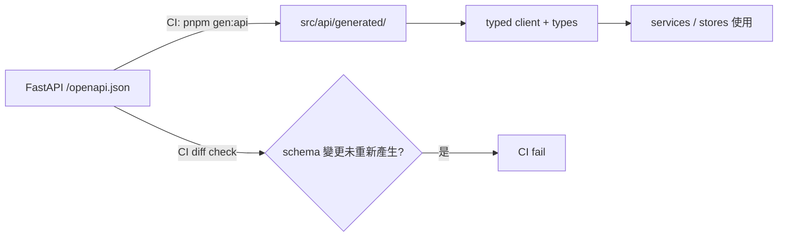

# 03 前端專案結構（Frontend Folder Structure）

| 項目 | 內容 |
|------|------|
| 文件編號 | 03 |
| 版本 | v1.1 |
| 日期 | 2026-07-30 |
| 狀態 | Draft — 待審閱 |
| 相依文件 | 01_系統架構總覽（ADR-004 SSE、ADR-007）、02_後端專案結構 |
| 變更紀錄 | v1.1：§6 補齊前端測試策略（vitest 單元層；15 審查報告 F-03） |

---

## 1. 設計理念

1. **前端不含業務規則**：權限判斷、Quota、資料驗證的最終裁決都在後端；前端只做展示層的 UX 判斷（按鈕顯隱等）。
2. **API 契約單一來源（G-11）**：後端 OpenAPI schema 自動產生 typed client 與 types，前端不手寫 API 介面，杜絕前後端 drift。
3. **feature-first 元件組織**：元件按功能域（chat / knowledge / prompt…）分組，跨域共用的才進 `ui/`。
4. **SSE 邏輯集中**：串流解析、reconnect、Last-Event-ID resume 全部封裝在一個 composable + service，元件不碰 EventSource 細節。

## 2. 完整目錄結構

```
frontend/
├── package.json                 # pnpm
├── vite.config.ts               # dev proxy → FastAPI；build 分包策略
├── tsconfig.json                # strict: true
├── eslint.config.js  /  .prettierrc
├── .env.example                 # VITE_API_BASE_URL 等
│
└── src/
    ├── main.ts                  # app 建立、plugin 註冊順序
    ├── App.vue
    │
    ├── api/                     # ── API 存取層 ──
    │   ├── generated/           # openapi-typescript 產生（禁止手改，CI 驗證同步）
    │   ├── client.ts            # fetch wrapper：baseURL、auth header、401 refresh、錯誤正規化
    │   └── sse.ts               # SSE client：EventSource 封裝、heartbeat 偵測、
    │                            #   Last-Event-ID resume、指數退避 reconnect
    │
    ├── types/                   # ── 型別 ──
    │   ├── models.ts            # re-export generated types（單一 import 入口）
    │   └── ui.ts                # 純前端型別（表格欄位、表單狀態）
    │
    ├── services/                # ── 前端服務層：編排 API + store ──
    │   ├── chatService.ts       # 發送訊息、串流事件 → store 更新、citation 對映
    │   ├── uploadService.ts     # 分塊上傳、進度、失敗續傳
    │   └── exportService.ts     # 對話 / 知識庫匯出
    │
    ├── stores/                  # ── Pinia（按 context 對齊後端）──
    │   ├── auth.ts              # token、user、permissions（記憶體為主，refresh token 走 httpOnly cookie）
    │   ├── tenant.ts            # 當前租戶、feature flags、quota 狀態
    │   ├── chat.ts              # conversations、串流中訊息 buffer
    │   ├── knowledge.ts         # KB、documents、ETL job 進度
    │   ├── prompt.ts  model.ts  tool.ts
    │   └── notification.ts      # in-app 通知
    │
    ├── composables/             # ── 可組合邏輯 ──
    │   ├── useChatStream.ts     # SSE 生命週期 hook（連線/中斷/resume/清理）
    │   ├── useAuth.ts  usePermission.ts   # v-permission 判斷來源
    │   ├── usePagination.ts  useDebounce.ts
    │   └── usePolling.ts        # ETL job 進度輪詢（SSE 不適用的低頻更新）
    │
    ├── router/
    │   ├── index.ts             # route 定義（lazy import views）
    │   └── guards.ts            # auth guard、permission guard、tenant guard
    │
    ├── layouts/
    │   ├── DefaultLayout.vue    # sidebar + header（主應用）
    │   ├── AuthLayout.vue       # 登入/註冊
    │   └── AdminLayout.vue      # 平台管理
    │
    ├── views/                   # ── 頁面（route 對應，薄，組裝 components）──
    │   ├── chat/                # ChatView、ConversationListView
    │   ├── knowledge/           # KnowledgeBaseListView、DocumentListView、DocumentDetailView
    │   ├── prompt/              # PromptListView、PromptEditorView（版本 diff）
    │   ├── model/  tool/
    │   ├── analytics/           # UsageDashboardView、CostDashboardView
    │   ├── admin/               # TenantAdminView、UserAdminView、AuditLogView
    │   ├── settings/
    │   └── auth/
    │
    ├── components/
    │   ├── ui/                  # 基礎元件（Button/Modal/Table/Toast…或封裝 UI 套件）
    │   ├── chat/                # MessageList、MessageBubble、CitationPanel、
    │   │                        # StreamingIndicator、ToolCallCard
    │   ├── knowledge/           # UploadDropzone、EtlProgress、ChunkPreview
    │   ├── prompt/              # TemplateEditor、VersionDiff、VariablePanel
    │   └── common/              # PageHeader、EmptyState、ConfirmDialog
    │
    ├── plugins/                 # i18n（vue-i18n，預設 zh-TW / en）、UI 套件、echarts 註冊
    ├── directives/              # v-permission（無權限即移除節點）
    ├── utils/                   # 純函式：format、token 計數顯示、file size
    └── assets/                  # styles（design tokens）、icons、fonts
```

## 3. 關鍵設計

### 3.1 OpenAPI Codegen 流程



後端 API 改動 → CI 自動比對 generated code 是否過期，過期即 fail，前後端契約永遠同步。

### 3.2 SSE 串流資料流

```
useChatStream → api/sse.ts (EventSource)
  onmessage(id, delta) → chatStore.appendDelta()
  onerror → 指數退避 reconnect（帶 Last-Event-ID）
  event: done → 以 server 最終 message 覆蓋本地 buffer（Single Source of Truth）
  event: error → 顯示可重試 UI，保留已收 partial 內容
```

### 3.3 認證與 Token 存放

Access token 存 Pinia（記憶體）；refresh token 走 httpOnly + SameSite cookie，杜絕 XSS 竊取。401 時 client.ts 統一 refresh 後重放原請求（single-flight，避免並發重複 refresh）。

## 4. 優點 / 缺點 / 適用情境

**優點**：型別安全端到端（DB → API → UI）；SSE 複雜度封裝單點；store 邊界與後端 context 對齊，心智模型一致。
**缺點**：codegen 流程需要 CI 配合，初期建置成本；feature-first 結構對超小型專案偏重。
**適用情境**：中大型管理後台 + 即時串流場景；與本案完全吻合。

## 5. 未來演進方向

- 使用者量大後：路由級 code splitting 已內建（lazy views），可再加 CDN 靜態部署。
- 若需嵌入式 Chat Widget（給租戶網站嵌入）：`components/chat` 已自包含，可抽成獨立 build target（library mode），不需重寫。
- Micro-frontend 非目標（YAGNI）。

## 6. 最佳實踐

- `strict: true` + `noUncheckedIndexedAccess`；ESLint 禁 `any` 洩漏到公開介面。
- 元件 props/emits 全型別化；views 不直接 fetch，一律經 services/stores。

### 6.1 前端測試策略（三層）

| 層 | 工具 | 範圍 | 要點 |
|----|------|------|------|
| Unit | **vitest** | composables / services / stores / utils 的純邏輯 | SSE 以 mock EventSource 測 `useChatStream` 狀態機（連線/delta/斷線/resume/done）；Pinia 用 `createTestingPinia`；API client 以 msw mock，**不打真後端** |
| Component（選配，可延後） | vitest + Vue Test Utils | 高複雜元件（MessageList、TemplateEditor、UploadDropzone） | 只測行為與 emit，不做 snapshot 全覆蓋 |
| E2E | Playwright | 登入、上傳到可問答、SSE 中斷恢復 | 對 staging / compose 環境，nightly + release 前 |

覆蓋率要求：composables 與 services ≥80%（這兩層是前端業務邏輯所在）；views/components 不設數字目標（以 E2E 關鍵路徑兜底）。vitest 掛入 CI PR 管線（見 12 §6.1）。

## 7. 潛在風險與改善建議

| 風險 | 緩解 |
|------|------|
| generated client 被手改 | 目錄標 read-only + CI diff check |
| SSE 在企業 proxy 失效 | usePolling fallback；heartbeat 逾時偵測自動降級 |
| store 膨脹成上帝物件 | 每 store 對齊單一 context；跨域邏輯放 services |

## 8. Architecture Review

1. **SOLID / 關注點分離**：符合——view（展示）/ service（編排）/ store（狀態）/ api（傳輸）四層清晰。
2. **DRY**：符合——types 與 client 皆由 OpenAPI 單一來源產生。
3. **KISS / YAGNI**：未引入 SSR（Nuxt）——後台系統無 SEO 需求；未引入 micro-frontend。
4. **可測試性**：高——services 與 composables 為純邏輯可單測；Playwright 覆蓋 E2E。
5. **Technical Debt**：UI 套件選型（Element Plus / Naive UI / shadcn-vue port）延後到 Phase 1 開工時定案，不影響結構。
6. **更好方案**：無實質更優替代；Nuxt 僅在需要 SEO / SSR 時才有優勢。

---

*下一步：確認 Stage 2 兩份文件後，進行 Stage 3（04_模組設計.md）。*
