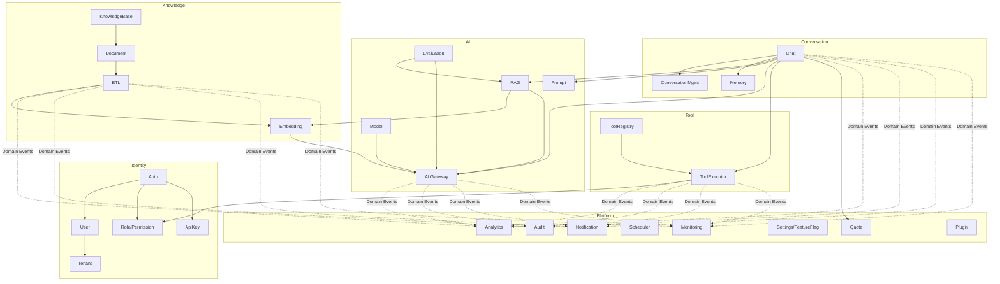

# 04 模組設計（Module Design）

| 項目 | 內容 |
|------|------|
| 文件編號 | 04 |
| 版本 | v1.2 |
| 日期 | 2026-07-30 |
| 狀態 | Draft — 待審閱 |
| 相依文件 | 01（ADR-006 Bounded Context）、02（資料夾對映） |
| 變更紀錄 | v1.1：新增附錄 B 例外階層與 Protocol 錯誤語意（15 審查報告 F-06）。v1.2（2A-4 落地）：§8.3 Audit 補上觸發面（預設全記＋豁免清單）、三種 outcome、before/after 的填法與登入的例外路徑 |

---

## 1. 設計理念

1. 模組按六個 Bounded Context 分組，每個模組對映 `services/` 下的一組 Service + `apps/` 下的 Model + `core/interfaces/` 的 Protocol。
2. **Interface 欄位列的是「其他 Context 可呼叫的公開介面」**（Python Protocol）；Context 內部的方法不列入，避免介面表膨脹。
3. Dependency 只列「跨 Context 依賴」與「基礎設施依賴」；同 Context 內互相呼叫不受限制。
4. 依賴鐵則：**Identity 不依賴任何人；Platform 只被事件觸發，不被同步依賴（Quota 除外）**。

## 2. 模組依賴總覽



---

## 3. Identity Context

### 3.1 Auth

| 面向 | 內容 |
|------|------|
| Responsibility | 登入/登出、JWT 簽發與驗證（access + refresh rotation）、密碼雜湊（argon2）、登入失敗鎖定、Session 撤銷（jti denylist in Redis） |
| Dependency | User、Role（載入 permissions claim）；Redis（denylist、鎖定計數） |
| Interface | `authenticate(credentials) -> TokenPair`、`verify_token(token) -> Principal`、`revoke(jti)` |
| Future Extension | OAuth2 / OIDC 外部 IdP（介面預留 `ExternalIdentityProvider` Protocol）、MFA、SSO/SAML |

### 3.2 User

| 面向 | 內容 |
|------|------|
| Responsibility | 使用者 CRUD、個人設定、密碼變更、停用/啟用、email 驗證 |
| Dependency | Tenant（user 隸屬租戶）、Notification（驗證信） |
| Interface | `get_principal(user_id)`、`list_users(tenant)`、`deactivate(user_id)` |
| Future Extension | 使用者群組（Group）、跨租戶帳號連結 |

### 3.3 Tenant

| 面向 | 內容 |
|------|------|
| Responsibility | 租戶生命週期（G-10）：建立（初始化預設 Role、KB、quota）→ 停權 → 刪除（發佈 `TenantDeletionRequested` 事件觸發級聯清理：DB / pgvector / MinIO / Redis）；租戶方案（plan）管理 |
| Dependency | 無跨 context 同步依賴；清理由 Platform worker 消費事件執行 |
| Interface | `create_tenant(cmd)`、`get_tenant(id)`、`get_plan(tenant_id) -> PlanLimits`、`export_tenant_data(id)`（可攜權） |
| Future Extension | Database-per-Tenant routing（ADR-002 演進）、自助註冊與計費整合（Stripe） |

### 3.4 Role / Permission（RBAC）

| 面向 | 內容 |
|------|------|
| Responsibility | 角色 CRUD（系統角色：Owner / Admin / Editor / Viewer + 自訂角色）；權限採 `resource:action` 字串（如 `knowledge:write`、`tool:execute`、`prompt:publish`）；資源級授權（特定 KB 的存取名單） |
| Dependency | 無 |
| Interface | `check(principal, permission, resource=None) -> bool`、`get_permissions(role)` |
| Future Extension | ABAC（屬性條件）、Permission 委派 |

### 3.5 ApiKey

| 面向 | 內容 |
|------|------|
| Responsibility | API Key 簽發（僅顯示一次、儲存 hash）、scope 限制、過期、輪替、用量歸屬 |
| Dependency | Role（key 綁 scope 子集）、Quota |
| Interface | `issue(tenant, scopes, ttl)`、`verify(key) -> Principal` |
| Future Extension | IP allowlist per key、HMAC request signing |

---

## 4. Knowledge Context

### 4.1 KnowledgeBase

| 面向 | 內容 |
|------|------|
| Responsibility | KB CRUD、KB 級設定（chunk 策略、embedding model 版本、檢索參數 default）、KB 版本（Knowledge Version：設定變更即產生新 version 標記，供重建與回溯） |
| Dependency | Quota（KB 數上限）、Role（資源級授權） |
| Interface | `create_kb(cmd)`、`get_kb_config(kb_id) -> KbConfig` |
| Future Extension | KB 匯入/匯出（可攜格式）、KB 間複製、公開 KB 市集 |

### 4.2 Document

| 面向 | 內容 |
|------|------|
| Responsibility | 文件上傳（G-09：大小上限、MIME 白名單、content hash 去重）、狀態機（uploaded → parsing → chunked → embedded → ready / failed）、版本（re-upload 產生新 version，舊 chunk 標記 superseded）、刪除（含 vector 與 MinIO 級聯） |
| Dependency | ETL（觸發 ingestion）、Quota（文件數/儲存量）、MinIO |
| Interface | `upload(kb_id, file) -> DocumentId`、`get_status(doc_id)`、`delete(doc_id)` |
| Future Extension | 資料夾階層、文件級 ACL、外部同步來源（Google Drive / SharePoint connector） |

### 4.3 ETL

| 面向 | 內容 |
|------|------|
| Responsibility | Extract（8 種 loader）→ Clean → Chunk 的 pipeline 編排與狀態回報；chunk_version 管理；失敗重試與部分成功處理（詳見 08） |
| Dependency | Document（狀態更新）、MinIO（原始檔）、Embedding（下游觸發） |
| Interface | `ingest(doc_id)`（Celery task 入口）、`re_ingest(doc_id, new_config)` |
| Future Extension | 自訂 pipeline steps（Plugin 掛載點）、串流式大檔處理 |

### 4.4 Embedding

| 面向 | 內容 |
|------|------|
| Responsibility | Chunk 批次向量化（經 AI Gateway）、embedding_version 管理、**重嵌入編排**（模型升級時：新舊版本並存 → 背景重算 → 原子切換 → 清理舊版）、embedding cache（content hash → vector） |
| Dependency | AI Gateway、pgvector |
| Interface | `embed_chunks(chunk_ids)`、`reembed_kb(kb_id, new_model)` |
| Future Extension | 多 embedding model 並存（不同 KB 不同模型）、量化（halfvec）降儲存成本 |

---

## 5. AI Context

### 5.1 Model（AI Model Management）

| 面向 | 內容 |
|------|------|
| Responsibility | 模型註冊表（provider、model name、能力標籤：chat/embedding/rerank、context window、單價）；租戶級模型啟用與預設；Model Routing 規則與 Fallback 鏈設定 |
| Dependency | Settings（API Key 加密儲存引用） |
| Interface | `resolve_model(tenant, purpose, requested=None) -> ModelConfig`、`list_available(tenant)` |
| Future Extension | 成本導向自動路由（cheap-first with quality floor）、A/B 模型實驗 |

### 5.2 AI Gateway

| 面向 | 內容 |
|------|------|
| Responsibility | 所有 LLM / Embedding / Rerank 呼叫的唯一出口：Provider adapter 選擇、串流轉發、timeout、retry（僅冪等呼叫）、fallback 鏈、**token 計量與成本記錄（每次呼叫寫 usage event）**、prompt cache 介接 |
| Dependency | Model、Quota（呼叫前檢查）、Redis（cache）；發佈 `LLMCallCompleted` 事件 |
| Interface | `stream_chat(req) -> AsyncIterator[Delta]`、`complete(req)`、`embed(texts)`、`rerank(query, docs)` |
| Future Extension | 拆為獨立服務（第一順位拆分對象）、語意快取（semantic cache） |

### 5.3 Prompt

| 面向 | 內容 |
|------|------|
| Responsibility | Prompt Template CRUD、**版本控制（draft → published → archived，發佈不可變）**、變數 schema 定義與驗證、Jinja2 sandbox 渲染、rollback（重新指向舊版本）、Prompt 測試（對測試集跑指定版本） |
| Dependency | Evaluation（prompt 測試執行）、AI Gateway |
| Interface | `render(prompt_key, version, variables) -> RenderedPrompt`、`get_active_version(tenant, key)` |
| Future Extension | Prompt A/B 分流、跨租戶共享模板庫 |

### 5.4 RAG

| 面向 | 內容 |
|------|------|
| Responsibility | 檢索編排：query 前處理 → vector search + FTS（hybrid, RRF 融合）→ rerank → context compression → citation 組裝；檢索參數可由 KB 設定覆寫；每次檢索記錄 trace（供 Evaluation 與除錯） |
| Dependency | Embedding（query 向量化，經 Gateway）、Knowledge（KB 設定）、AI Gateway（rerank/compression） |
| Interface | `retrieve(query, kb_ids, params) -> RetrievalResult`（含 chunks、scores、citations） |
| Future Extension | Multi-hop retrieval、GraphRAG、query rewriting |

### 5.5 Evaluation

| 面向 | 內容 |
|------|------|
| Responsibility | 評測資料集管理（golden Q&A）、離線評測（RAG recall/precision、groundedness、faithfulness）、線上抽樣評測（LLM-as-judge 抽 N% 對話）、報告與趨勢；Hallucination detection 規則 |
| Dependency | RAG、AI Gateway、Analytics（結果彙整） |
| Interface | `run_eval(dataset_id, config) -> EvalRunId`、`get_report(run_id)` |
| Future Extension | 迴歸評測掛 CI（prompt / 檢索參數變更自動跑）、人工標註工作流 |

---

## 6. Conversation Context

### 6.1 Chat

| 面向 | 內容 |
|------|------|
| Responsibility | 訊息處理主流程編排（quota → memory → RAG → prompt → LLM stream → tool loop → persist）、SSE 事件封裝、串流中斷處理（G-06：partial 持久化、resume buffer） |
| Dependency | RAG、Prompt、AI Gateway、ToolExecutor、Quota、Memory |
| Interface | `send_message(conv_id, content, options) -> AsyncIterator[ChatEvent]` |
| Future Extension | 多人共享對話、對話分支（fork）、附件即時問答（單檔臨時 RAG） |

### 6.2 ConversationMgmt

| 面向 | 內容 |
|------|------|
| Responsibility | 對話 CRUD、標題自動生成、釘選/封存、匯出（markdown/json）、保留政策執行（G-12：到期歸檔/刪除） |
| Dependency | 無跨 context 同步依賴 |
| Interface | `create/list/archive/export` |
| Future Extension | 對話搜尋（FTS）、資料夾整理 |

### 6.3 Memory

| 面向 | 內容 |
|------|------|
| Responsibility | 多輪記憶策略：滑動視窗（近 N 輪原文）＋ 漸進式摘要（舊輪次壓縮為 summary，背景 Celery 產生）；token budget 分配（system / memory / RAG context / user 輸入的預算表）；記憶快照版本化 |
| Dependency | AI Gateway（摘要生成） |
| Interface | `build_context(conv_id, budget) -> MemoryContext`、`update_after_turn(conv_id)` |
| Future Extension | 長期使用者記憶（跨對話 profile memory）、實體記憶（entity memory） |

---

## 7. Tool Context

### 7.1 ToolRegistry

| 面向 | 內容 |
|------|------|
| Responsibility | 工具註冊（name、JSON Schema 參數、版本、逾時/重試/快取政策宣告）、租戶級啟用、工具版本相容性檢查 |
| Dependency | Settings（工具憑證引用） |
| Interface | `list_tools(tenant, principal) -> list[ToolSpec]`（已過濾權限）、`get_tool(name, version)` |
| Future Extension | MCP server 掛載（外部 MCP 工具自動註冊為 Tool）、租戶自訂 HTTP tool |

### 7.2 ToolExecutor

| 面向 | 內容 |
|------|------|
| Responsibility | 執行鏈：Permission check → 參數 schema 驗證 → cache 查詢 → timeout 包裝執行 → retry（僅冪等工具）→ 結果正規化 → 執行紀錄；濫用偵測（單對話呼叫次數上限、循環偵測） |
| Dependency | Role（`tool:execute` + 工具級權限）、Redis（cache）、Audit |
| Interface | `execute(tool_call, context) -> ToolResult` |
| Future Extension | 沙箱執行（容器隔離高風險工具）、非同步長任務工具（回呼模式） |

---

## 8. Platform Context

### 8.1 Quota（G-05 補充模組）

| 面向 | 內容 |
|------|------|
| Responsibility | 租戶級配額定義與**強制執行**：token/月、訊息數/日、文件數、儲存量、並發串流數；計數器（Redis，含週期重置）＋ 對帳（DB usage_logs 日結校正）；超額行為依 plan：硬阻擋 / 降級模型 / 記錄後放行 |
| Dependency | Tenant（plan）；被 Chat / Document / AI Gateway 同步呼叫（唯一允許被同步依賴的 Platform 模組） |
| Interface | `check_and_reserve(tenant, resource, amount)`、`commit/release(reservation)` |
| Future Extension | 使用者級配額、計費系統整合 |

### 8.2 Analytics（Usage Statistics / Cost Tracking）

| 面向 | 內容 |
|------|------|
| Responsibility | 消費 usage 事件 → 彙總表（daily per tenant/user/model/kb）；成本計算（token × 單價，匯率與價目表版本化）；Dashboard API |
| Dependency | 事件驅動，無同步依賴 |
| Interface | `get_usage_summary(tenant, range, group_by)`、`get_cost_breakdown(...)` |
| Future Extension | 成本異常偵測、預算告警、對外帳單匯出 |

### 8.3 Audit

| 面向 | 內容 |
|------|------|
| Responsibility | 敏感操作全記錄（who/when/what/before-after/ip/request_id）：登入、權限變更、KB/文件刪除、prompt 發佈、設定變更、API key 操作；僅追加（append-only）、防竄改（hash chain 可選） |
| Dependency | 事件驅動 + middleware 自動記錄 |
| Interface | `query(filters) -> AuditPage`（唯讀） |
| Future Extension | SIEM 匯出（syslog/webhook） |

**2A-4 落地補充**（v1.2）：

- **觸發面是「預設全記、豁免要明講」**：middleware 記下每一個寫入型請求（POST/PUT/PATCH/DELETE），高頻非管理面的（token 輪換、對話 CRUD 與問答、`POST /rag/query`）列在明文豁免清單。方向是 fail-safe——新端點忘了宣告仍會留痕；反過來（宣告才記）漏一個就是完全沒有紀錄，而那沒有任何症狀。分類由守門測試逼每條寫入型路由二選一。
- **成功、被拒、失敗都記**（10 §3）：403 帶上被拒的 permission code；欄位見 05 §3.3 的 `outcome`/`status`/`permission`。401 不記——沒有租戶可歸屬（`tenant_id NOT NULL` + RLS）。
- **before/after 由 service 補**：middleware 看得到誰與何時，看不到欄位變化，也看不到建立類資源的 id（它在回應裡）。因此有一個請求層的稽核 context（`core/audit.py`），service 在自己的交易內往上填**白名單欄位**（黑名單漏一個就是明文外洩）。
- **登入是唯一由 service 自己記的事件**：那條路徑上沒有 principal，也沒有租戶 contextvar，middleware 拿不到 tenant_id。
- **記錄失敗不影響主流程**（旁路原則，同 Analytics 的 usage 落地）：稽核記不成只能失去這一列；反過來會在稽核表出問題的那天讓整個平台停擺。

### 8.4 Scheduler

| 面向 | 內容 |
|------|------|
| Responsibility | Celery Beat 排程管理：系統排程（歸檔、清理、統計日結、quota 重置、健康巡檢）＋ 租戶排程（定期 ETL 同步、定期評測）；排程執行歷史與失敗告警 |
| Dependency | Worker、Notification |
| Interface | `register_schedule(spec)`、`list_runs(schedule_id)` |
| Future Extension | Cron 表達式 UI、DAG 依賴（升級 Airflow/Temporal 的判斷點） |

### 8.5 Notification（G-07 補充模組）

| 面向 | 內容 |
|------|------|
| Responsibility | 通知通道抽象（in-app / email / webhook）、事件訂閱規則（ETL 完成、job 失敗、quota 80%/100%、評測完成）、去重與節流 |
| Dependency | 事件驅動 |
| Interface | `notify(event, recipients, channels)`、`get_inbox(user)` |
| Future Extension | Slack/Teams 通道、通知偏好設定 |

### 8.6 Settings / FeatureFlag（G-14）

| 面向 | 內容 |
|------|------|
| Responsibility | 三層設定：系統級（env）→ 租戶級（DB，含加密欄位存 provider API key，envelope encryption）→ 使用者級；Feature Flag（per-tenant 開關 + 百分比灰度），flag 狀態快取於 Redis、變更即時生效 |
| Dependency | 無 |
| Interface | `get(scope, key)`、`is_enabled(flag, tenant) -> bool` |
| Future Extension | 設定變更審核流、flag 排程開關 |

### 8.7 Monitoring

| 面向 | 內容 |
|------|------|
| Responsibility | 指標匯出（Prometheus /metrics）、health/readiness endpoint、SLO 計算來源；業務指標（串流 TTFT、RAG latency、tool 成功率）由各模組打點、此模組統一 registry |
| Dependency | 無（被動蒐集） |
| Interface | `/healthz`、`/readyz`、`/metrics` |
| Future Extension | OpenTelemetry tracing 全量導入（Phase 見 Roadmap） |

### 8.8 Plugin

| 面向 | 內容 |
|------|------|
| Responsibility | 擴充點（Hook Point）定義與插件載入：`etl.loader`、`etl.chunker`、`rag.retriever`、`tool.provider`、`llm.provider`、`notification.channel`；插件以 Python entry point 註冊、啟動時掃描、租戶級啟用 |
| Dependency | 各 Hook Point 所屬模組 |
| Interface | `register(hook, impl)`、`get_implementations(hook, tenant)` |
| Future Extension | 插件市集、沙箱化第三方插件（安全審查前不開放外部插件） |

---

## 9. 優點 / 缺點 / 適用情境

**優點**：每個模組單一職責、介面窄；Platform 模組事件驅動（Quota 除外），業務主流程不被橫切關注點拖慢；補充模組（Quota / Notification / FeatureFlag）補齊了 SaaS 營運缺口。
**缺點**：模組數 24 個，初期會有不少「薄殼」模組（如 Plugin、Monitoring 起步時很小）；事件驅動增加除錯間接性（以 trace_id 貫穿緩解）。
**適用情境**：與 Roadmap 配合——模組全部定義但**分階段實作**，Phase 1 僅實作核心 14 個（見 13_Roadmap）。

## 10. Architecture Review

1. **SOLID**：符合——介面隔離（每模組 Protocol 窄介面）、依賴反轉。
2. **DDD**：符合——模組即 Aggregate 邊界的管理單位；Ubiquitous Language 固定（Chunk、Citation、PlanLimits…）。
3. **Clean Architecture**：符合——依賴方向與 02 文件一致。
4. **DRY**：Quota 檢查集中單一模組，避免散落各處。
5. **KISS / YAGNI**：Plugin 模組僅定義 Hook Point 與 entry point 機制，不建市集；Scheduler 不引入 Airflow。
6. **可測試性**：高——所有跨模組依賴皆 Protocol，可注入 fake。
7. **Technical Debt**：Plugin 沙箱、Audit hash chain 列為選配，未做前第三方插件不開放。
8. **Over Engineering 檢查**：曾考慮每模組獨立 event bus topic——過度設計，統一以 Celery routing key 即可。
9. **更好方案**：無；模組粒度若再切細（如 Citation 獨立成模組）會增加無謂邊界。

---

## 附錄 B：例外階層與 Protocol 錯誤語意（F-06）

### B.1 業務例外階層（`core/exceptions.py`，全 repo 唯一）

```
DomainError(code, message, details)          # 基底；code 對映 09 附錄 A
├── NotFoundError                            # → 404
├── ConflictError / StaleWriteError          # → 409
├── PermissionDeniedError                    # → 403（資源類由 handler 轉 404）
├── QuotaExceededError(resource, reset_at)   # → 429
├── DomainValidationError(errors[])          # → 422（有別於 Pydantic 的 request 驗證）
├── ProviderError(provider, retryable)       # AI/外部依賴
│   ├── ProviderTimeoutError                 # retryable=True
│   ├── ProviderRateLimitedError             # retryable=True（退避後）
│   └── ProviderUnavailableError             # fallback 鏈耗盡 → 503
├── ToolError(tool_name)
│   ├── ToolTimeoutError / ToolExecutionError
│   └── ToolNotAvailableError                # 未啟用/無權/circuit open
├── EtlError(stage, retryable)               # 非同步流程用，不轉 HTTP
└── TenantContextMissingError                # 程式錯誤 → 500 + P1 告警（Fail Fast）
```

規則：HTTP 轉換**只發生在** `api/exception_handlers.py` 單點；`services/` 以下只 raise 上述例外，永不 raise `HTTPException`；`worker/` 捕捉後轉 job status + 通知，不吞例外。

### B.2 核心 Protocol 錯誤語意

| Protocol 方法 | 正常回傳 | 會 raise | 不會發生（呼叫方不需防） |
|---------------|----------|----------|--------------------------|
| `Repository.get(id)` | entity | NotFoundError | 回傳 None（get 語意 = 必存在；可缺用 `find() -> None`） |
| `Repository.*`（全部） | — | TenantContextMissingError | 跨租戶資料（隔離在基底保證） |
| `PermissionService.check()` | bool | —（判定不拋錯） | — |
| `QuotaService.check_and_reserve()` | Reservation | QuotaExceededError | 部分保留（all-or-nothing） |
| `AIGateway.stream_chat()` | AsyncIterator[Delta] | ProviderUnavailableError（開始前）；開始後錯誤以 `Delta(type=error)` 收尾，**不 raise**（串流語意） | 靜默中斷（必有 error 或 done 收尾） |
| `AIGateway.embed()` | vectors | ProviderTimeout/RateLimited/Unavailable | 部分結果（整批成功或整批拋） |
| `RagPipeline.retrieve()` | RetrievalResult（可為空清單） | ProviderError 僅當 query embedding 失敗；rerank/compression 失敗**不 raise**（降級，result 帶 degraded 標記） | 因 rerank 掛掉而失敗 |
| `PromptService.render()` | RenderedPrompt | NotFoundError（key/version 不存在）、DomainValidationError（變數不符 schema） | 渲染出含未替換變數的字串 |
| `ToolExecutor.execute()` | ToolResult（含失敗態） | —（工具失敗封裝在 ToolResult，**不 raise**——失敗是合法結果，要回給 LLM） | 例外穿透到 chat 主流程 |
| `EventPublisher.publish()` | None | —（outbox 落地即成功；投遞失敗由 relay 重試） | 因 broker 瞬斷而失敗 |

設計原則：**「失敗是流程一部分」的方法（tool、串流、檢索降級）以回傳值表達失敗；「失敗即不可續行」的方法才 raise**——AI 實作時不得偏離此表，新增介面需先補此表。

---

*下一步：確認本文件後，進行 Stage 4（05_資料庫設計.md）。*
