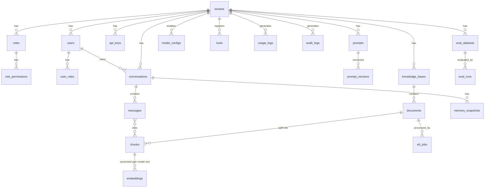

# 05 資料庫設計（Database Design）

| 項目 | 內容 |
|------|------|
| 文件編號 | 05 |
| 版本 | v1.6 |
| 日期 | 2026-07-30 |
| 狀態 | Draft — 待審閱 |
| 相依文件 | 01（ADR-002 / ADR-003）、04（模組對映） |
| 變更紀錄 | v1.1：embeddings.vector 改 **`halfvec(1536)`（day-1）**、HNSW ops 對應調整（F-01）。v1.2：新增 §5.5 編碼/Collation/連線池設定（原 Migration 策略移為 §5.6；F-07）。v1.3（1B-1 落地）：`etl_jobs` 新增 `doc_version` 與 `UNIQUE(document_id, doc_version, stage)`——08 §6 的冪等鍵需要它，原欄位表缺；§3 前言補上實體表名規則（新 app 用 Django 預設，本節表名為概念名）。v1.4（2A-4 落地）：§5.2 補到期分區的落地方式（月度任務、預設只 DETACH、保留期設定位置）；`audit_logs` 補三欄（`outcome`/`status`/`permission`）與兩項實作性質（`created_at` 由應用層給值、append-only 由 trigger 保證）——三欄是 10 §3「被拒也要記、且帶 permission code」的必然結果，原欄位表無處可放。v1.5（2A-5 落地）：§3.2 `documents` 補 `uploaded_by`（通知要知道寄給誰，三步走第一步）；§3.3 `notifications` 補 `dedupe_key`（唯一約束＝去重的真正保證）與 `updated_at`（收合的排序鍵）。v1.6（二次架構審計 P0 的旁支修正）：§3.2 的 `storage_key` 形狀由 `tenant-{slug}` 改為 **`tenant-{tenant_id}`**——這是 **1B-3 實作時的刻意偏離**（理由：slug 可變（租戶改名），而 key 一旦寫進 `documents.storage_key` 就不能再變；用 slug 的話，改名之後所有既有物件的 key 都對不上，症狀是「舊文件突然打不開」，且無法從 DB 反推當時的 slug），當時記在 `core/object_storage.py` 的模組 docstring 而沒有回寫本文件。01 §153（「MinIO 以 `tenant-{id}/` prefix 隔離」）自始就與實作一致，本次是 05 這一處單獨漂著。同時修正 `tests/factories/knowledge.py` 的 `DocumentFactory`（它一直停在舊形狀，於是任何拿 factory 文件去走物件儲存的測試都會撞 `CrossTenantObjectKeyError`），並補 `TestFactoryKeysMatchProduction` 把兩份字串釘在一起 |

---

## 1. 設計理念

1. **主鍵一律 UUID v7**（時間有序，避免 UUID v4 的 index 碎片；比 bigserial 利於未來分庫與資料匯出不撞號）。
2. **所有租戶資料表含 `tenant_id`**，複合索引一律以 `tenant_id` 為首欄；PostgreSQL RLS 為第二道防線。
3. **審計三欄位標配**：`created_at`、`updated_at`、`deleted_at`（soft delete）；業務查詢一律過濾 `deleted_at IS NULL`（Repository 基底內建）。
4. **高成長表用時間分區**（G-13）：`messages`、`usage_logs`、`audit_logs` 按月 RANGE partition。
5. **版本化資料不可變**：`prompt_versions`、`embeddings` 已發佈/已算出的 row 不做 UPDATE，只新增與標記。

## 2. ERD 總覽



## 3. 資料表定義

> 型別縮寫：`u` = uuid、`t` = text、`ts` = timestamptz、`jb` = jsonb、`i` = int、`n` = numeric、`b` = boolean。所有表省略標配三欄（created_at / updated_at / deleted_at，分區表與 log 表除外，log 表不可刪改故無 updated_at / deleted_at）。

> **實體表名的落地規則（2026-08-09 決定）**：新 app 一律用 **Django 預設**（`<app_label>_<model 小寫>`，例如 `knowledge_knowledgebase`、`knowledge_etljob`），不設 `db_table`。本節的表名是**概念名**，不是字面表名。已存在的 `identity_*` 對多字模型設過 snake_case 表名（`identity_user_role`），與新規則不一致——統一要走 rename migration，成本高於收益，故保留現狀。維運 SQL 以實際表名為準。

### 3.1 Identity

**tenants**

| 欄位 | 型別 | 說明 |
|------|------|------|
| id | u PK | |
| name / slug | t | slug unique，用於 URL 與 MinIO prefix |
| plan | t | free / pro / enterprise → 對映 PlanLimits |
| status | t | active / suspended / deleting |
| settings | jb | 租戶級非敏感設定 |

**users**：`id u PK`、`tenant_id u FK`、`email t`（unique within tenant：`UNIQUE(tenant_id, email)`）、`password_hash t`（argon2id）、`display_name t`、`status t`、`email_verified_at ts`、`last_login_at ts`、`preferences jb`。

**roles**：`id`、`tenant_id`（NULL = 系統內建角色）、`name`、`is_system b`。
**permissions**：`id`、`code t unique`（`resource:action`）、`description`。（全域字典表，無 tenant_id）
**role_permissions**：`role_id FK`、`permission_id FK`、複合 PK。
**user_roles**：`user_id FK`、`role_id FK`、複合 PK。
**resource_grants**（資源級授權）：`id`、`tenant_id`、`principal_type t`（user/role）、`principal_id u`、`resource_type t`（knowledge_base/tool/prompt）、`resource_id u`、`access t`（read/write/admin）；`UNIQUE(tenant_id, principal_type, principal_id, resource_type, resource_id)`。

**tenant_data_keys**（2C-2，10 §5 的 envelope）：`tenant_id u PK`、`wrapped_key bytea`（AES-256-GCM(KEK, DEK)，nonce 與密文一起存）、`kek_version i`、`created_at ts`。**一個租戶一列**——兩列的話，解密得決定「用哪一把」，而挑錯的症狀是「某些憑證解不開」。`kek_version` 目前恆為 1，先留欄位是因為輪替時要分辨這把 DEK 是用哪一代 KEK 包的（事後加欄位到已經有密文的表等於得先猜）。

**credentials**（2C-2）：`id u PK`、`tenant_id u FK`、`name t`（白名單識別字）、`ciphertext bytea`（以該租戶的 DEK 加密）、`hint t`（**末四碼**，只給人看；存前四碼會洩漏種類與環境如 `sk-live-`）、`created_at`／`updated_at`；`UNIQUE(tenant_id, name)`——換金鑰是覆寫不是新增。**無軟刪除**：撤銷就是撤銷，留著密文的唯一用途是還原一把使用者認為已作廢的金鑰。`model_configs.credential_ref` 指向的就是這裡的 `name`。

**api_keys**：`id`、`tenant_id`、`name`、`key_hash t`（SHA-256，明文不落地）、`prefix t`（前 8 碼供識別）、`scopes t[]`、`expires_at ts`、`last_used_at ts`、`created_by u`。

### 3.2 Knowledge

**knowledge_bases**：`id`、`tenant_id`、`name`、`description`、`config jb`（chunk 策略、檢索參數 default）、`embedding_model t`、`embedding_version i`、`knowledge_version i`（設定變更遞增）、`status t`、**`indexed_knowledge_version i`**（2B-6：現有 chunk 是用哪一版設定切出來的；與 `knowledge_version` 不相等即「需要重建」——後者在使用者按下儲存的那一刻就跳了，而 chunk 要等重建跑完才換）。

**kb_reindex_jobs**（2B-6，06 §2.2 的四步）：`id`、`tenant_id`、`kb_id`、`target_model t`、`target_embedding_version i`、`target_knowledge_version i`、`rechunk b`、`status t`（pending/rechunking/embedding/completed/failed）、`total_chunks i`、`embedded_chunks i`、`total_documents i`、`rechunked_documents i`、`rechunk_cursor u`、`started_at ts`、`switched_at ts`、`purged_at ts`、`finished_at ts`、`error jb`；**`UNIQUE(kb_id) WHERE status IN (pending, rechunking, embedding)`**（同一個 KB 不得有兩個進行中的重建——兩個 job 會各自往同一批 chunk 寫不同版本的向量，然後互相把對方切掉）。**目標存在 job 上而不是 KB 上**：存進 KB 就是「原子切換」提前發生，檢索會照一個一列都對不上的 `(model, version)` 去查。

**documents**

| 欄位 | 型別 | 說明 |
|------|------|------|
| id / tenant_id / kb_id | u | |
| filename / mime_type | t | MIME 白名單於應用層驗證 |
| storage_key | t | MinIO object key（**`tenant-{tenant_id}/kb/{kb_id}/{doc_id}`**，1B-3 落地修正） |
| content_hash | t | SHA-256，`UNIQUE(tenant_id, kb_id, content_hash)` 去重 |
| size_bytes | i | 計入儲存 quota |
| source_type | t | upload / api / database / web |
| source_meta | jb | 來源 URL、同步設定等 |
| status | t | uploaded → parsing → chunked → embedding → ready / failed |
| doc_version | i | re-upload 遞增 |
| error | jb | 失敗原因（結構化） |
| uploaded_by | u | 上傳者（可為 NULL）。**v1.5（2A-5 落地）新增**：ETL 失敗／完成通知要知道寄給誰。走三步走第一步（可為 NULL、不回填），舊文件的 NULL 退回寄 owner/admin——「沒有人收到」比「收件人不精確」糟得多 |

**chunks**

| 欄位 | 型別 | 說明 |
|------|------|------|
| id / tenant_id / document_id / kb_id | u | kb_id 反正規化，檢索免 join |
| seq | i | 文件內順序 |
| content | t | chunk 原文 |
| content_tsv | tsvector | GENERATED（FTS；中文採 pgroonga 或 zhparser，見 §5.3） |
| token_count | i | |
| chunk_version | i | chunk 策略版本 |
| doc_version | i | 對應文件版本 |
| meta | jb | 頁碼、標題路徑、表格標記 |
| superseded | b | 新版本產生後標記，重嵌入完成後清理 |

**embeddings**

| 欄位 | 型別 | 說明 |
|------|------|------|
| id / tenant_id / chunk_id | u | |
| model | t | embedding 模型識別 |
| embedding_version | i | |
| vector | **halfvec(1536)** | 維度依模型；day-1 即用 halfvec（fp16，儲存/記憶體減半；召回差異依 pgvector 實測可忽略，Phase 2 golden set 驗證納入）；來源精度 fp32 由 pgvector 寫入時自動轉換 |
| `UNIQUE(chunk_id, model, embedding_version)` | | 同 chunk 多模型/多版本並存，切換原子化 |

**etl_jobs**：`id`、`tenant_id`、`document_id`、**`doc_version i`**、`stage t`（extract/clean/chunk/embed）、`status t`（pending/running/succeeded/failed/retrying）、`attempt i`、`started_at / finished_at ts`、`stats jb`（頁數、chunk 數、token 數）、`error jb`、`celery_task_id t`；`UNIQUE(document_id, doc_version, stage)`。

> **`doc_version` 與唯一約束為 2026-08-09（1B-1）新增。** 原欄位表沒有它，而 08 §6 的冪等鍵是 `(doc_id, doc_version, stage)`——只有 `document_id` 的話，「這個階段跑過了嗎」得 join `documents` 取**當下**的 `doc_version`，而那個值會隨 re-ingest 改變。後果：新版本查到上一版**已成功**的 job 而判定為跑過，文件停在舊內容、狀態卻是 ready，且沒有任何錯誤。把版本固定在 job 自己身上才答得準。做成 DB 約束而不只是查詢慣例，是為了擋併發觸發（使用者連點兩次 reingest、重試與排程同時進來）產生兩個各自執行同一階段的 job。

### 3.3 AI

**prompts**：`id`、`tenant_id`（NULL = 系統模板）、`key t`（`UNIQUE(tenant_id, key)`）、`name`、`description`、`active_version_id u FK`。

**prompt_versions**：`id`、`prompt_id`、`version i`、`status t`（draft/published/archived）、`template t`、`variables_schema jb`（JSON Schema）、`model_hint jb`、`published_at ts`、`published_by u`、`change_note t`。**published 後不可變**（DB trigger 拒絕 UPDATE template）。

**model_configs**：`id`、`tenant_id`（NULL = 全域目錄）、`provider t`、`model_name t`、`capabilities t[]`（chat/embedding/rerank）、`context_window i`、`pricing jb`（input/output 單價、價目版本）、`params jb`（temperature 上限等）、`is_enabled b`、`fallback_chain jb`、`credential_ref t`（指向加密憑證，見 10_安全設計）。

**eval_datasets**：`id`、`tenant_id`、`kb_id`、`name`、`items jb` 或子表 `eval_items`（question、expected、citations）。
**eval_runs**：`id`、`tenant_id`、`dataset_id`、`config jb`（prompt version、檢索參數、model）、`metrics jb`（recall/precision/groundedness/faithfulness）、`status`、`started_at/finished_at`。

### 3.4 Conversation

**conversations**：`id`、`tenant_id`、`user_id`、`title`、`kb_ids u[]`、`model_config_id u`、`prompt_key t`、`status t`（active/archived）、`pinned b`、`message_count i`、`last_message_at ts`（列表排序用，反正規化）。

**messages**（**按月分區：PARTITION BY RANGE (created_at)**）

| 欄位 | 型別 | 說明 |
|------|------|------|
| id / tenant_id / conversation_id | u | PK = (id, created_at)（分區鍵需入 PK） |
| role | t | user / assistant / tool / system |
| content | t | |
| citations | jb | `[{chunk_id, doc_id, score, span}]`（讀多寫一、無獨立查詢需求 → jsonb 而非關聯表） |
| tool_calls / tool_results | jb | |
| model / prompt_version | t / i | 生成當下快照（可追溯） |
| usage | jb | prompt/completion tokens、cost、TTFT、latency |
| status | t | streaming / completed / interrupted / failed |
| error | jb | |
| created_at | ts | 分區鍵 |

**memory_snapshots**：`id`、`tenant_id`、`conversation_id`、`upto_message_id u`、`summary t`、`token_count i`、`version i`。

### 3.5 Tool / Platform

**tools**：`id`、`tenant_id`（NULL = 內建）、`name`、`version t`、`params_schema jb`、`policy jb`（timeout/retry/cache TTL/idempotent）、`is_enabled b`、`required_permission t`。
**tool_execution_logs**（高成長，按月分區可延後）：`id`、`tenant_id`、`conversation_id`、`tool_name`、`params_hash t`、`status`、`duration_ms i`、`error jb`、`created_at`。

**usage_logs**（**按月分區**）：`id`、`tenant_id`、`user_id`、`category t`（llm/embedding/rerank/storage）、`model t`、`prompt_tokens i`、`completion_tokens i`、`cost n(12,6)`、`conversation_id u`、`request_id t`、`created_at ts`。
**usage_daily**（彙總表，Analytics 日結寫入）：`tenant_id`、`date`、`user_id`、`model`、`category`、tokens、cost、call_count；`UNIQUE(tenant_id, date, user_id, model, category)`。

**audit_logs**（**按月分區、append-only**）：`id`、`tenant_id`、`actor_id u`、`actor_type t`（user/api_key/system）、`action t`（`resource.verb`）、`resource_type/resource_id`、`before jb / after jb`、`outcome t`（succeeded/denied/failed）、`status i`（HTTP 狀態碼，NULL = 非請求層記的）、`permission t`（被拒的 permission code，僅 denied 有值）、`ip inet`、`user_agent t`、`request_id t`、`created_at`。
- 後三欄（`outcome`/`status`/`permission`）為 **v1.4（2A-4 落地）新增**：10 §3 要求「被拒的請求也要記 audit 並帶上被拒的 permission code」，而 `before`/`after` 的語意是**資源狀態**——把結果與權限碼塞進去會讓稽核查詢說謊。
- `created_at` 由應用層給值（非 DB `DEFAULT now()`）：append-only 的表事後改不了，回填歷史資料時必須能指定時間。
- **append-only 由 DB trigger 保證**（`BEFORE UPDATE OR DELETE` 一律 raise），不是只靠 Repository 不提供寫法：稽核的價值全部來自「事後不能改」，而擋在 DB 上連維運腳本與 `manage.py shell` 都涵蓋得到。到期清理不受影響——那是 DETACH/DROP 整個分區（DDL），不是 DELETE。

**scheduled_jobs**：`id`、`tenant_id`（NULL = 系統）、`name`、`cron t`、`task t`、`params jb`、`is_enabled`、`last_run_at`、`next_run_at`。
**job_runs**：`id`、`scheduled_job_id`、`status`、`started_at/finished_at`、`error jb`。
**notifications**：`id`、`tenant_id`、`user_id`、`type t`、`title/body`、`channels t[]`、`read_at ts`、`meta jb`、`dedupe_key t`、`updated_at ts`。
- 後兩欄為 **v1.5（2A-5 落地）新增**。`dedupe_key` 上的唯一約束是去重的**真正**保證：service 先查再插只是省一次撞牆，兩個 worker 同時完成時各查各的都會查到「還沒有」。
- `updated_at` 是收合（「N 份文件已完成」）的排序鍵。不重用 `created_at`——拿它排序等於每收合一次就竄改一次建立時間，而「這則通知什麼時候第一次發生」是查問題時的錨點。
**feature_flags**：`id`、`key t unique`、`description`、`default_enabled b`。
**tenant_feature_flags**：`tenant_id`、`flag_key`、`enabled b`、`rollout_pct i`；複合 PK。
**quota_counters**（對帳快照；即時計數在 Redis）：`tenant_id`、`resource t`、`period t`（day/month）、`period_start date`、`used n`、`limit n`；複合 PK。

## 4. 索引策略

| 表 | 索引 | 目的 |
|----|------|------|
| 全部租戶表 | `(tenant_id, ...)` 複合 B-tree | 租戶隔離查詢 |
| users | `UNIQUE(tenant_id, email)`、`(tenant_id, status)` | 登入、列表 |
| documents | `(tenant_id, kb_id, status)`、`UNIQUE(tenant_id, kb_id, content_hash)` | 列表、去重 |
| chunks | `(tenant_id, kb_id) WHERE NOT superseded`（partial）、GIN`(content_tsv)` | 檢索候選、FTS |
| embeddings | **HNSW**`(vector halfvec_cosine_ops)`（m=16, ef_construction=64）＋ `(tenant_id, chunk_id)` | 向量檢索（halfvec 對應 ops，見 v1.1 變更） |
| messages | `(conversation_id, created_at)`、`(tenant_id, created_at)` | 對話載入、租戶查詢 |
| conversations | `(tenant_id, user_id, last_message_at DESC) WHERE deleted_at IS NULL` | 對話列表 |
| usage_logs | `(tenant_id, created_at)`、`(request_id)` | 對帳、追蹤 |
| audit_logs | `(tenant_id, created_at)`、`(tenant_id, resource_type, resource_id)` | 稽核查詢 |
| prompt_versions | `UNIQUE(prompt_id, version)` | 版本定位 |

原則：先寫 query pattern 再開 index；每季以 `pg_stat_user_indexes` 檢視無用索引；分區表索引建在分區上（PostgreSQL 自動）。

## 5. 關鍵設計說明

### 5.1 租戶隔離（RLS 第二道防線）

```sql
ALTER TABLE documents ENABLE ROW LEVEL SECURITY;
CREATE POLICY tenant_isolation ON documents
  USING (tenant_id = current_setting('app.tenant_id')::uuid);
```

- UoW 於交易開始 `SET LOCAL app.tenant_id = ...`；應用連線使用非 superuser 角色（RLS 才生效）。
- Repository 層 filter 為第一道；RLS 保證即使程式漏寫 filter 也不外洩。Migration / 維運腳本使用 bypass 角色並留 Audit。

### 5.2 分區與資料治理（G-13）

- `messages` / `usage_logs` / `audit_logs`：`PARTITION BY RANGE (created_at)` 按月；Celery Beat 月初預建下 3 個月分區。
- 保留政策（預設，租戶可依合約覆寫）：usage_logs 原始 13 個月（彙總表永久）；audit_logs 依法規 3–7 年（冷分區可 DETACH 轉歸檔儲存）；messages 依租戶方案。
- 刪除 = DETACH + DROP 分區，避免大量 DELETE 膨脹。
- **落地方式（v1.4，2A-4）**：月度的 `platform.maintain_partitions` 同時做兩件事——補未來 3 個月、摘掉過期的。**預設只 DETACH 不 DROP**（`partition_drop_after_detach=false`）：摘下來的分區不再被查詢掃到、空間仍在、錯了可以 ATTACH 回去；真的刪除是整套維運任務裡唯一不可逆的一步，要明示開啟。保留期在 `app_settings.partition_retention_months`（`表名:月數`），**沒列的表不動**——`messages` 的「依租戶方案」機制尚不存在，而沒有政策時的正確行為是不動，不是拿一個猜的預設值刪資料。過期判斷讀 `pg_get_expr(relpartbound)` 的真實上界，不解析分區名。

### 5.3 中文全文檢索（G-08）

**決策：pgroonga**（優於 zhparser：不需自訂詞典即有良好中日韓支援、支援複合查詢）。`chunks.content_tsv` 改為 pgroonga index（`USING pgroonga (content)`）。Trade-off：多一個 extension 依賴（Docker image 需含 pgroonga）；若部署環境受限（managed PG 不支援），fallback 為 zhparser + tsvector，Retriever 介面不變。

### 5.4 Soft Delete 與級聯清理

- Soft delete 僅適用「使用者可能後悔」的實體：KB、document、conversation、prompt。30 天後由清理 Job 硬刪。
- 硬刪級聯順序：embeddings → chunks → documents（DB FK `ON DELETE` 不設 CASCADE，由 worker 顯式分批刪，避免鎖表與 vector index 抖動）＋ MinIO 物件 ＋ Redis key。
- 租戶刪除：`TenantDeletionRequested` 事件 → 分批清理 worker → 完成後刪 tenants row（留 audit 摘要於系統區）。

### 5.5 編碼、Collation 與連線設定（F-07）

| 項目 | 決策 | 理由 |
|------|------|------|
| Encoding | `UTF8`（initdb 固定） | 唯一合理選項 |
| 預設 Collation | **`C`**（`LC_COLLATE=C, LC_CTYPE=C.UTF-8`） | 索引比較最快且跨平台確定性（glibc 版本升級不會壞索引）；中文「字典序」對業務無意義，排序需求由應用層處理 |
| 語言學排序（僅展示用） | 個別欄位 `COLLATE "zh-x-icu"`（ICU） | 只在真的要中文筆劃/拼音排序的 UI 欄位使用，不做全庫預設 |
| 中文檢索 | 與 collation 無關——pgroonga 自帶斷詞（§5.3） | collation 決策不影響 FTS |
| Timezone | 全庫 `UTC`，`timestamptz` 標配 | 顯示時區由前端處理 |
| 連線池 | PgBouncer **transaction mode**；起始值：`default_pool_size=20`、`max_client_conn=200`；Django **`CONN_MAX_AGE=300`**（ADR-001 spike B2 實測，見下）| transaction mode 下禁用 session 級功能（advisory lock、`SET`（RLS 的 `SET LOCAL` 在交易內，安全）、prepared statements 需關閉或 PgBouncer ≥1.21 的支援）——此限制寫入 repository 基底註解 |
| PG 記憶體起始值 | `shared_buffers=2GB`、`work_mem=32MB`、`maintenance_work_mem=512MB`（16GB 主機，見 01 附錄 A） | HNSW 建索引吃 maintenance_work_mem |

**`CONN_MAX_AGE` 取值依據（2026-08-01，ADR-001 spike B2）**：原訂 `0`（連線壽命全交 PgBouncer）。但 ADR-001 將 `close_old_connections()` 下沉至 `run_orm()` 後，`0` 的語意是**每次 ORM 呼叫都重建連線**——前面既已擺 transaction mode 的 PgBouncer 做 client 連線多工，Django 端再自行重接等於繞過連線池。原顧慮（Django 長連線耗盡 PG 連線）由 PgBouncer 的 `max_client_conn` / `default_pool_size` 治理，不需在 Django 端重複防守。

實測（50 租戶 × 2000 筆 = 10 萬列，uvicorn workers=4、threadpool=8，各跑兩次 40 秒）：

| `CONN_MAX_AGE` | rps | 平均延遲 |
|---|---|---|
| `0` | 154 / 165 | 335 / 329 ms |
| `300` | 734 / 662 | 59 / 65 ms |

**約 4.4 倍**，同設定重複執行的變異僅 ±5%——差距遠大於雜訊，結論可信。（首輪 spike 在較小資料集上量到 2.4 倍，方向一致。）故定為 `300`。

### 5.6 Migration 策略

- 單一系統：Django Migration；CI 檢查 `makemigrations --check`（禁止未生成的 model 變更）。
- 上線規則：**只做向後相容變更**（加欄位帶 default → backfill → 加約束，三步走）；大表加索引一律 `CREATE INDEX CONCURRENTLY`（Django `AddIndexConcurrently`）；分區表結構變更需演練腳本。
- 禁止：在 migration 內寫業務資料修補（用獨立 data migration 並可重跑）。

## 6. 優點 / 缺點 / 適用情境

**優點**：單一 PostgreSQL 承載 OLTP + 向量 + FTS，交易一致、維運面最小；版本化欄位（doc/chunk/embedding/prompt）支撐 AI 資產可回溯；分區與彙總表在 day-1 就防住高成長表。
**缺點**：單庫承載多種負載，重檢索期間影響 OLTP（以 read replica 演進緩解）；jsonb 欄位（citations、usage）犧牲部分可查性換 schema 彈性。
**適用情境**：文件 ≤ 百萬、embedding ≤ 千萬 row 級；超過後依 ADR-003 演進路徑分離向量庫。

## 7. Architecture Review

1. **SOLID / DDD**：表按 Bounded Context 分組，聚合邊界清楚（如 prompt→versions 由 Prompt 模組獨占存取）。
2. **DRY**：kb_id 於 chunks 反正規化、conversations.last_message_at 反正規化——是刻意的讀優化，非違反（寫入點單一）。
3. **KISS / YAGNI**：未做 citation 關聯表、未做 sharding、未預建 tool_execution_logs 分區（量到再做，改動成本低）。
4. **可測試性**：factory_boy 對映每表；RLS 有專屬 integration test（故意漏 filter 驗證被擋）。
5. **Technical Debt**：messages PK 含 created_at 使 FK 引用不便（citations 用 jsonb 正好迴避）；記錄之。
6. **Over Engineering 檢查**：audit hash chain 未預設啟用（選配）；UUID v7 需 PG16+ 或應用層生成——採應用層生成（`uuid7` lib），無版本綁定。
7. **更好方案**：無實質更優；TimescaleDB 對 usage_logs 是加分項但多一個依賴，彙總表已滿足需求。

---

*下一步：確認本文件後，進行 Stage 5（06_AI_Pipeline.md）。*
