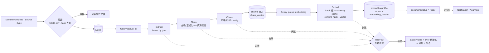
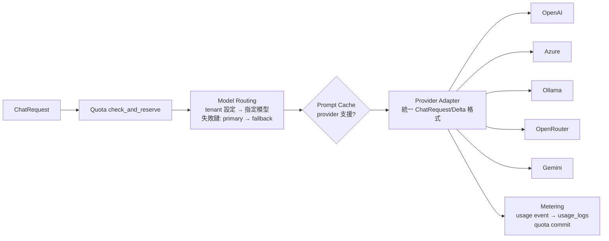

# 06 AI Pipeline（Ingestion / RAG / Generation / Memory）

| 項目 | 內容 |
|------|------|
| 文件編號 | 06 |
| 版本 | v1.4 |
| 日期 | 2026-08-14 |
| 狀態 | Draft — 待審閱 |
| 相依文件 | 01（ADR-003/004）、04（RAG / Embedding / Memory / Gateway 模組）、05（chunks / embeddings 表） |
| 變更紀錄 | v1.1：新增 §3.4 跨語言檢索指引（15 審查報告 F-08）。v1.2：新增 §3.5 Prompt Engineering 策略分級表；§4 增補 reasoning 模式與 structured output 的介面預留。v1.3：§2.1 的 Clean / Chunk 兩列補上 1B-5 的實作定案（語言偵測方式、正規化邊界、不可切塊型別、token 計數注入）。v1.4：§3.1 與 §3.3 併入 1D-5 的四項實作定案（2026-08-17）——引用標記改用「本輪第幾段」的短編號、Phase 1 的檢索門檻改為可選的相對門檻、condense 先做免呼叫模型的版本、幻覺引用只剔清單不改寫文字；並在 §3.1 前加註參數的落點（15 §4.1）。偏離的完整理由見 13 §3.5 |

---

## 1. 設計理念

1. **兩條 Pipeline 分離**：Ingestion（寫路徑，非同步、批次、可重跑）與 Query（讀路徑，同步、低延遲、可降級）。兩者只透過資料（chunks/embeddings）耦合。
2. **每一階段皆可組態、可替換**：pipeline step 以 Protocol 定義，KB 級設定選擇實作與參數（Plugin Hook Point 對齊）。
3. **版本化貫穿**：chunk_version / embedding_version / prompt_version / model 在每筆產出上留快照，任何回答可完整回溯「當時用了什麼」。
4. **降級優先於失敗**：Query 路徑每個增強步驟（rerank、compression）失敗時跳過而非中斷，保底為純向量檢索＋原始 context。

## 2. Ingestion Pipeline（寫路徑）



### 2.1 階段規格

| 階段 | 要點 |
|------|------|
| Extract | loader 依 MIME 分派（詳見 08_ETL）；產出統一中間格式 `ExtractedDoc`（blocks：paragraph / table / heading / image-caption，含頁碼與座標 meta） |
| Clean | 頁首頁尾去除、亂碼 block 丟棄、空白正規化（**只動空白與零寬字元**——改寫用字會讓 1D 的引用對不回原文）、語言偵測（py3langid + 書寫系統前置判定，信心不足記 `und`；寫入 meta，供檢索與 embedding 模型選擇）；PII 偵測僅標記不改寫（masking 政策見 10_安全設計）。丟棄率 > 20% 記 `quality_warning`（08 §4） |
| Chunk | 預設 `recursive`（結構感知：標題邊界優先，target 512 tokens、overlap 64；重疊不跨標題）；表格與程式碼**整塊不切**（附表頭上下文）；chunk 文字為 Markdown，meta 保留 page 與 heading_path。token 計數可注入——真正的切詞由模型決定，而模型屬 AI Gateway（1C）；KB 可選 `semantic`（embedding 相似度斷點，成本高、選配） |
| Embed | batch=64 併發受控；embedding cache（`sha256(content)+model` → vector，Redis + DB 雙層）重複內容零成本；單 chunk 失敗不阻斷整批（記錄後重試） |

### 2.2 重嵌入（Embedding 版本升級）

```
1. KB 設定新 model/version（舊版持續服務查詢）
2. 背景批次：對全部 active chunks 產生新版 embeddings（限速，避免擠壓即時流量）
3. 完成度 100% → KB.embedding_version 原子切換 → 查詢改用新版
4. 觀察期（可回退）→ 清理 Job 刪舊版 embeddings
```

## 3. Query Pipeline（讀路徑：RAG + Generation）

```mermaid
flowchart TB
    Q[User Query] --> PRE[Query 前處理<br/>正規化 · 語言偵測 ·<br/>condense（多輪改寫獨立問句）]
    PRE --> QE[Query Embedding<br/>經 Gateway，帶 cache]
    QE --> PAR{並行檢索}
    PAR --> VS[Vector Search<br/>pgvector HNSW · top 40<br/>filter: tenant + kb + !superseded]
    PAR --> FT[Full-text Search<br/>pgroonga · top 40]
    VS & FT --> RRF[Hybrid 融合<br/>RRF k=60 → top 24]
    RRF --> RR[Rerank<br/>cross-encoder 經 Gateway<br/>→ top 6~8 · score threshold]
    RR --> CC[Context Compression<br/>去重疊 · 依 token budget 裁切<br/>（extractive 優先，LLM 摘要選配）]
    CC --> PB[Prompt Builder<br/>system(prompt_version) + memory +<br/>context(帶 chunk 標記) + query]
    PB --> LLM[LLM stream 經 Gateway<br/>Routing · Fallback · Metering]
    LLM --> TC{Tool Call?}
    TC -->|是| TE[Tool Executor<br/>結果回填 → 續跑 LLM<br/>迴圈上限 5]
    TC -->|否| CIT[Citation 組裝<br/>回應中的 chunk 標記 → 引用驗證]
    TE --> LLM
    CIT --> RESP[SSE Response + persist]
    RESP --> MEMU[Memory 更新<br/>視窗推進 · 背景摘要]
    RR -.失敗.-> CC
    CC -.失敗.-> PB
```

### 3.1 階段規格與參數（預設值，KB 可覆寫）

> **參數的落點（2026-08-17，1D-5）**：本表的數字是**預設值**，實際生效值一律經
> `services/rag/params.py` 依「系統預設（`app_settings`）→ 租戶設定 → KB 覆寫」解析。
> 不得在 service 裡寫常數——理由與後台的統一設定畫面見 **15 §4.1**。

| 階段 | 預設 | 說明 |
|------|------|------|
| Query condense | 多輪時啟用 | 以近 N 輪對話將指代性問句改寫為獨立問句（小模型，低成本）；單輪跳過。**Phase 1 實作的是免錢版**（2026-08-17，1D-5）：不呼叫模型，改為檢索時把前 N 個問題接上一起查（`query_history_turns`，預設 1）。真 condense 每輪多一次 LLM 呼叫，排 Phase 2/3C——屆時有 golden set 才量得出它好多少 |
| Vector search | top_k=40, cosine | `ef_search` 調校見 11_NFR |
| FTS | top_k=40 | pgroonga 中文斷詞 |
| Hybrid | RRF k=60 → 24 | 免調權重、對分數尺度不敏感，勝過線性加權 |
| Rerank | top_n=6~8, threshold=0.3 | 全數低於門檻 → 回「知識庫無相關內容」而非硬答（hallucination 防線一）。**門檻在 Phase 1 不生效**（2026-08-17，1D-5）：0.3 是 cross-encoder 的分數尺度，而 1C-4 只有餘弦相似度——套上去不是品質變好，是每次都回「找不到」。Phase 1 改用可選的**相對門檻**（只留分數 ≥ 第一名 × ratio 的候選，`min_score_ratio` 預設 0＝關閉），它不吃尺度因此換打分方式也不失效。**2B-4 起絕對門檻具備生效條件**（2026-08-23）：真的 cross-encoder 接上後分數回到 0~1 尺度，`rag_rerank_threshold` 只在 rerank **真的跑完**時才套用（降級跳過 rerank 之後手上是 RRF 的融合分數，第一名 1/61 ≈ 0.016，套 0.3 會把候選全砍光——強制位置在 `services/rag/retrieval.py`）。兩種門檻可同時存在；開不開仍由資料決定 |
| Compression | budget 內 extractive | 相鄰 chunk 合併、重疊去除；LLM 摘要壓縮為選配（延遲+成本，預設關）。Phase 1 僅實作 §3.2 的預算硬上限（低分端先裁） |
| Generation | 依 model_config | system prompt 強制：僅依據 context 回答、引用標記 `[c:編號]`、無據回答需聲明。**編號是「本輪第幾段」（1、2、3…）而不是 `chunk_id`**（2026-08-17，1D-5）：一個 UUID 約 20 token，而模型每引用一次抄一遍、輸出 token 又比輸入貴數倍；且叫模型一字不差抄 36 個十六進位字元它會抄錯，而抄錯就被驗證當成幻覺剔掉——畫面上少一個**本來是真的**來源。編號只在該輪有效（比對的就是該輪清單），落地與回傳的仍是真 `chunk_id`，歷史無歧義。實作見 `rag/citation.py` |

### 3.2 Token Budget（context window 分配）

以 8k 可用預算為例（依模型 context window 動態計算，保留 completion 空間）：

| 區塊 | 配額 | 溢出處理 |
|------|------|----------|
| System + Prompt template | ~800 | 固定 |
| Memory（視窗+摘要） | ~1,500 | 觸發更激進摘要 |
| RAG context | ~4,500 | Compression 硬上限 |
| User query + 當輪 | ~700 | 超長輸入前端先擋 |
| 安全餘裕 | ~500 | |

### 3.3 Citation 與 Hallucination 防線

1. **檢索門檻**：rerank 分數全數低於 threshold → 誠實回覆無相關資料（可組態為仍回答但標示「非知識庫依據」）。**Phase 1 的形式見 §3.1 的 Rerank 條目**（相對門檻，預設關）。
2. **標記式引用**：LLM 在句尾輸出 `[c:編號]`（編號的形狀見 §3.1 的 Generation 條目）；後處理驗證該編號存在於**本次** context（幻覺引用直接剔除並記 metric）。

   **「剔除」只作用在引用清單，不改寫回答文字**（2026-08-17，1D-5）：字是逐字串流出去的，收不回來，而重寫持久化內容會讓「使用者看到的」與「資料庫存的」不一致——那是 09 §3.2 拆兩步後由 1D-4a 釘住的不變式。原始文字留著同時是 §3 第 3 點（groundedness 抽測）與 3B 評測的原料：要統計模型多常唬爛，靠的就是它。**畫面上的清理屬渲染**：前端把不在 `citations` 事件裡的標記略去。
3. **Groundedness 抽測**：線上抽樣 N%（預設 5%）由 Evaluation 模組以 LLM-as-judge 背景評分，趨勢進 Dashboard。
4. **SSE citation event**：串流結尾送 `event: citations`（結構化清單，形狀見 09 §3.2），前端 CitationPanel 呈現來源片段與頁碼。

### 3.4 跨語言檢索指引（F-08：中文問句 vs 英文文件）

| 決策點 | 定案 |
|--------|------|
| Embedding 模型硬性條件 | **必須是多語模型**（中英共享向量空間），跨語言召回主要靠這一層。候選：OpenAI `text-embedding-3-large`（API）／`bge-m3`（Ollama 自建，中文表現佳）；模型選型於 Phase 2 golden set 上實測定案，golden set **必含跨語言題組**（中問英答、英問中答各 ≥15 題） |
| Rerank 模型硬性條件 | 同樣必須多語；單語 reranker 會把跨語言的正確候選打低分，比沒有 rerank 更糟。**2B-4 落地（2026-08-23）**：自架 HuggingFace TEI 跑 `BAAI/bge-reranker-v2-m3`（MIT、568M、多語 cross-encoder），容器置於 compose 的 `gpu` profile 之後、預設不啟動（`make tei-up`）；第二個 adapter 是 Jina（證明 Gateway 沒綁死一家，且沒有 GPU 的機器有東西可用）。**不走 Ollama**——它至今沒有 rerank 端點，reranker 模型只能經 `/api/embed`，取不到 cross-encoder 分類頭的分數。選型理由與成本比較見 13 §4「2B 開工前定案」；跨語言驗證做在 `make verify-provider CAPABILITY=rerank`（中文問句、英文正解） |
| FTS 側的跨語言縮限 | pgroonga 是詞面比對，跨語言天然失效——**hybrid 融合在跨語言配對時自動退化為以 vector 為主**（RRF 天然容忍單路弱訊號，無需特判） |
| Query 翻譯增強（選配） | KB 設定 `cross_lingual_boost: true` 時，condense 階段順帶產生文件主要語言的翻譯問句、FTS 用翻譯句查（多一次小模型呼叫）；**預設關**，僅在評測證明該 KB 跨語言召回不足時開 |
| 語言偵測資料流 | 文件語言：ETL 寫入 `doc_meta.language`（08）；查詢語言：condense 階段偵測；兩者不一致即為跨語言配對，記入 rag_trace（觀測跨語言查詢佔比與品質） |
| 回答語言 | 與文件語言無關，**一律跟隨使用者問句語言**（system prompt 固定規則） |

### 3.5 Prompt Engineering 策略（PromptBuilder 指引）

前提不變：所有技術一律落在**版本化 prompt template**（CLAUDE.md 鐵則 5），不散落 Python 字串；模板變更走 review，行為變化可追溯。技術分三級——**預設**（主 pipeline 內建）、**選配**（KB config 開關，模式同 `cross_lingual_boost`）、**backlog**（需 Phase 2 golden set 評測數據才升級，與 §9 YAGNI 一致）。

| 技術 | 定位 | 說明 |
|------|------|------|
| Zero-shot 指令式 | 預設 | RAG 主 prompt 即此形態（§3.1 Generation 規則：僅依 context 回答、`[c:id]` 引用、無據需聲明）。指令放 system、外部資料只進 context 區塊——這個邊界同時是 injection 防護的前提（10_安全設計） |
| CoT——提示層 | 選配 | 模板加入「先推理再作答」指示；對多跳、比較、彙總型問題有效。代價：output token 增加、TTFT 變差（吃 11_NFR latency budget）。推理段**不回傳前端**，僅入 rag_trace 供除錯與評測 |
| CoT——模型原生 reasoning | backlog | 新一代推理模型（OpenAI o 系列、Claude extended thinking、DeepSeek-R1、Qwen3 等）由 API 參數開關，非提示詞技巧。需 Gateway 介面預留（§4 reasoning 條目）；RAG 已提供證據上下文，CoT 邊際效益需實測——golden set 過關才啟用 |
| Few-shot——靜態 | 選配 | 範例固定寫入 prompt template，隨 prompt_version 審查與回溯。佈局規則：放 system 之後、RAG context 之前的**穩定前綴**（維持 §4 prompt cache 命中） |
| Few-shot——動態 | backlog | 以 query embedding 從範例庫檢索 top-k 相似範例注入。可複用現有 embedding Gateway＋cache（DRY），範例庫本質上是一個小型 KB。代價：範例隨查詢變動會**破壞前綴穩定性、打掉 prompt cache**——採用時 token 佈局需重排（動態範例移至後綴段）並重估 cache 命中損失 |
| Self-consistency | 不採用（線上） | 同題多次取樣、多數決。成本與延遲 ×N，線上路徑不用；僅 Evaluation 模組離線評測可選用（提升 judge 穩定性） |
| ReAct | 已內建 | §3 的 Tool Call 迴圈（推理 → 呼叫工具 → 觀察結果 → 續推理，上限 5 輪）即 ReAct 模式；數學/精確計算類問題依 07_Tool架構 走 tool，不叫 LLM 心算。不另引入 agent framework |
| Structured Output | 選配 | provider 端 JSON schema 約束解碼，比「請輸出 JSON」的提示可靠。優先用於**內部呼叫**（condense 改寫、評測評分、meta 抽取）；`ChatRequest` 需帶 `response_format` 欄位（§4） |
| Query 擴寫強化：HyDE / Step-back / Multi-query fusion | backlog | condense 之上的檢索增強（假設性答案檢索／抽象化改寫／多重改寫各自檢索後 RRF 融合）。每項多至少一次 LLM 呼叫（延遲＋成本）；僅在 golden set 證明特定 KB recall 不足時**逐項**驗證引入，不預先實作 |

## 4. Generation：AI Gateway 細節



- **統一介面**：`stream_chat(ChatRequest) -> AsyncIterator[Delta]`；Delta 型別統一（text / tool_call / usage / done / error），上層不知道 provider 差異（含 tool calling 格式轉換）。
- **Timeout**：連線 10s、首 token（TTFT）30s、整體 120s；逾時觸發 fallback 鏈下一個模型（僅在尚未輸出任何 token 時才切換，避免拼接不一致）。
- **Retry**：只 retry 可安全重試的錯誤（429/5xx 且未開始輸出），退避 1s/2s/4s，最多 3 次。
- **Prompt Caching**：system + RAG context 放前綴、對話輪次放後綴，最大化 provider 端 cache 命中；Ollama 等無 cache 的 provider 自動忽略。
- **中斷處理（G-06）**：client 斷線 → server 繼續收完該回應（成本已發生）→ 完整持久化 → resume buffer（Redis, TTL 5min）供 `Last-Event-ID` 續傳。
- **Reasoning 模式（介面預留，功能屬 backlog，見 §3.5）**：`ChatRequest` 增 provider 無關欄位 `reasoning_effort: off|low|medium|high`（預設 off），Adapter 各自翻譯為該家參數，不支援的 provider 靜默忽略（同 prompt cache 的降級模式）。**Delta 契約定案：Adapter 丟棄 reasoning 內容，不新增 Delta 型別**（避免各 adapter 各行其是；除錯需要時再開 trace-only 通道）。計費：reasoning token **必須併入 output tokens metering**——漏計即租戶成本低估（multi-tenant 直接影響）。Timeout：reasoning 模型 TTFT 天然變長，啟用時 TTFT 上限隨 model_config 覆寫，不吃預設 30s。
- **Structured Output（選配，見 §3.5）**：`ChatRequest` 增 `response_format`（none / json_schema）欄位，Adapter 轉換為各 provider 的約束解碼參數；不支援的 provider 降級為提示詞指示＋後處理驗證。

## 5. Memory Pipeline

```
每輪結束（async）：
  message_count 視窗內（近 10 輪）→ 不動作
  超出視窗 → Celery: 將最舊溢出輪次併入 summary（增量摘要，非全量重算）
             → memory_snapshots 新增 version
查詢時（sync）：
  build_context = summary(最新 snapshot) + 視窗內原文輪次
  超出 memory budget → 縮視窗（10→6→4）→ 仍超 → 觸發即時摘要（罕見路徑）
```

取捨：增量摘要有語意漂移風險（摘要的摘要），以「摘要永遠附帶原始輪次範圍標記＋定期全量重算（每 50 輪）」緩解；不採 vector-based memory（對話內檢索），YAGNI——長對話場景出現後再加（介面已預留 `MemoryStrategy` Protocol）。

## 6. 快取策略總表

| 快取 | Key | 存放 | TTL | 失效 |
|------|-----|------|-----|------|
| Embedding cache | sha256(text)+model | Redis + DB | 永久 | 模型下架清理 |
| Query embedding | sha256(query)+model | Redis | 1h | — |
| 檢索結果 cache | hash(query+kb_ver+params) | Redis | 5min | KB 內容變更 bump knowledge_version 自然失效 |
| Rerank cache | hash(query+chunk_ids) | Redis | 5min | 同上 |
| Prompt 渲染 cache | prompt_key+version+vars_hash | Redis | 10min | 版本切換自然失效 |
| Provider prompt cache | provider 端 | — | provider 定 | 前綴穩定性設計保命中 |
| Tool cache | tool+params_hash | Redis | tool policy | 各工具宣告 |

設計原則：所有 cache key 帶版本成分（knowledge_version / prompt_version），**用版本遞增取代主動清除**，避免快取一致性地獄。

## 7. 可觀測性（Pipeline 專屬）

每次查詢產生 `rag_trace`（request_id 關聯）：各階段耗時、候選數、rerank 分數分布、壓縮率、最終 token 分配、citation 驗證結果。除錯與評測共用同一 trace，Dashboard 指標見 12_NFR。

## 8. 優點 / 缺點 / 適用情境

**優點**：讀寫路徑分離，各自可獨立調校與擴容；全鏈路版本快照使回答可回溯可重現；降級鏈讓增強步驟故障不影響基本可用性；快取以版本失效，一致性簡單。
**缺點**：完整鏈路（condense+檢索+rerank+生成）延遲組成多，需要 TTFT 預算管理（11_NFR 有 latency budget 表）；rerank 依賴外部模型，是讀路徑最脆弱環節（已有跳過降級）。
**適用情境**：知識密集、要求引用可信的企業問答。純閒聊路徑（無 KB）自動跳過檢索段，不付 RAG 成本。

## 9. Architecture Review

1. **SOLID**：符合——每階段單一職責、以 Protocol 替換。
2. **DDD**：RAG/Embedding/Memory 職責歸屬與 04 模組一致。
3. **Clean Architecture**：pipeline 不依賴 FastAPI/Celery，兩者皆可驅動。
4. **DRY**：embedding 與 query embedding 共用 Gateway 與 cache。
5. **KISS**：Hybrid 用 RRF 而非可調權重融合（少一個要調的參數）。
6. **YAGNI**：GraphRAG、multi-hop、semantic cache、vector memory、動態 few-shot、HyDE/Step-back/Multi-query、原生 reasoning 模式皆列為未來項不先建（§3.5 有分級與升級條件）。
7. **可測試性**：每階段可用固定輸入單測；評測資料集對整條 Query pipeline 做迴歸（Evaluation 模組）。
8. **Technical Debt**：condense 與摘要用小模型，其品質影響全鏈路——列入評測固定監控項。
9. **Over Engineering 檢查**：compression 預設 extractive 而非 LLM 摘要，是刻意的簡化。
10. **更好方案**：無結構性更優；參數層（top_k、threshold）需以評測資料集實測調校，文件值為起始點。

---

*下一步：確認本文件後，進行 Stage 6（07_Tool架構.md、08_ETL_Pipeline.md）。*
