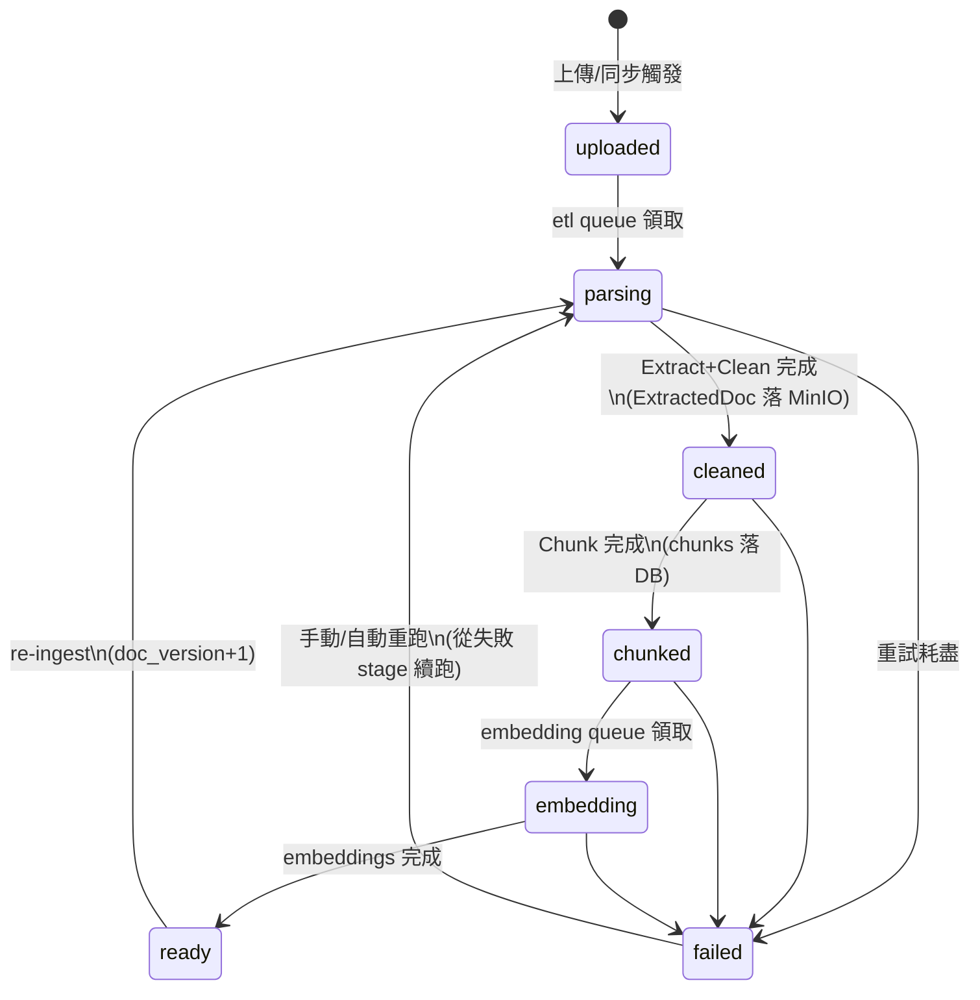
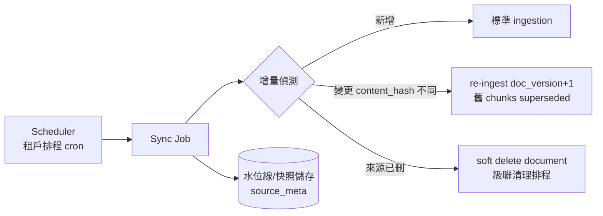

# 08 ETL Pipeline

| 項目 | 內容 |
|------|------|
| 文件編號 | 08 |
| 版本 | v1.1 |
| 日期 | 2026-08-14 |
| 狀態 | Draft — 待審閱 |
| 相依文件 | 04（ETL / Document 模組）、05（documents / chunks / etl_jobs 表）、06（Ingestion pipeline） |
| 變更紀錄 | v1.1：§3 的 PDF 選型由 pymupdf 改為 **pdfplumber**（AGPL §13 對多租戶 SaaS 會實際觸發，選型時未評估；1B-4c 決策）；xlsx 與新增的 Markdown loader 自 2D 提前至 1B-4b（13 §3.3）；§3 補上「標題來源」欄與 Markdown 一列；§4 補上語言偵測的實作方式 |

---

## 1. 設計理念

1. **Loader 只負責「來源 → 統一中間格式」**：下游（Clean / Chunk / Embed）完全來源無關；新增來源 = 新增一個 loader（Plugin hook `etl.loader`）。
2. **狀態機 + 冪等**：每階段完成即落地狀態，任何階段可安全重跑（以 doc_version + stage 為冪等鍵），失敗從斷點續跑而非從頭。
3. **資源隔離**：ETL 佔用 CPU/記憶體大，走專屬 Celery queue 與獨立 worker 進程，不與 embedding、default 佇列爭資源。

## 2. 整體流程

## 3. 來源與 Loader 規格

| 來源 | 函式庫/方式 | 要點 |
|------|-------------|------|
| PDF | **pdfplumber**（MIT；文字層 + `extract_tables`）；掃描頁 fallback OCR（可組態，預設關） | 保留頁碼/標題階層。**標題來源分兩層**：PDF 大綱（作者標記，可信）優先，無大綱才退回字級啟發式；`doc_meta.heading_source` 記下用了哪一種。無文字層視為失敗而非空文件 |
| Word (.docx) | python-docx | 標題階層 → heading blocks；表格 → table blocks（GFM） |
| Excel (.xlsx) | openpyxl（read_only + data_only） | 每 sheet 一節；表格保留表頭；大表按列窗切塊（表頭重複附帶，每塊 ≤ 50 列） |
| Markdown | markdown-it-py（CommonMark + table） | 結構已明說，不需啟發式；block 文字取原始碼片段，清單與引用整段保留。上傳端以副檔名區分 Markdown 與純文字（位元組相同，見 10 §99 的例外說明） |
| CSV | pandas（dtype 推斷關閉，全字串） | 同 Excel 表格處理；編碼偵測（utf-8/big5/cp950） |
| JSON | 內建 | 依 KB 設定的 record path 展開為紀錄；每紀錄一 block |
| API | 通用 HTTP connector | 認證（header/bearer/basic）、分頁遍歷、rate limit 禮貌延遲；回應 → JSON 流程 |
| Database | SQLAlchemy（唯讀連線） | 租戶提供唯讀憑證（加密存 Settings）；查詢白名單化（指定 table/query，禁任意 SQL）；增量同步（updated_at 水位線） |
| Website | httpx + trafilatura（正文抽取） | robots.txt 尊重、同網域深度限制、URL 正規化去重；**SSRF 防護：私網 IP / metadata endpoint 阻擋**（與 10_安全設計一致） |

統一產出 `ExtractedDoc`：`blocks[]`（type: paragraph/heading/table/code/caption、text、meta{page, heading_path, order}）+ `doc_meta`（語言、來源、抽取統計）。

**Markdown 是序列化形式，不是中間格式**（1B-4 決策）：中間格式仍是 `ExtractedDoc`，`etl/extract/markdown.py` 只在餵給下游／LLM 時把 blocks 寫成 Markdown。純 Markdown 沒有頁碼，而 1D 的引用要指得出頁——兩者因此不能互相取代。表格的 GFM 由 loader 產出（只有它看得到儲存格邊界）。

## 4. Clean / Chunk（下游規格）

已於 06_AI_Pipeline §2.1 定義，此處補充 ETL 側職責邊界：

- Clean：頁首頁尾模式偵測（跨頁重複行；門檻以 **token** 而非字元計，且需跨 ≥3 頁）、亂碼比率過高的 block 丟棄並記 stats、語言偵測寫入 doc_meta。**語言偵測**用 py3langid（BSD、離線模型），但假名/諺文的字元證據排在模型之前（漢字為主的日文會被位元組 n-gram 判成中文）；信心 < 0.5 記為 `und` 而不採用模型首選——06 §3.4 的跨語言統計依這個欄位分組。
- Chunk：策略由 KB config 決定；chunker 輸入是 `ExtractedDoc`（結構化），因此能做「標題邊界優先、表格不拆散」的結構感知切塊。
- 產出統計落 `etl_jobs.stats`：頁數、block 數、丟棄率、chunk 數、平均 token——**丟棄率 > 20% 自動標警示**（品質防線，通知使用者檢查來源）。

## 5. 同步型來源（API / Database / Website）

- 增量策略：Database 用 updated_at 水位線；API 用 provider 分頁 + 快照 diff；Website 用 sitemap/etag + content_hash。
- 同步失敗不影響既有資料（讀路徑永遠服務最後成功版本）。

## 6. 可靠性設計

| 機制 | 規格 |
|------|------|
| Retry | 每 stage 獨立重試 ≤3、指數退避（30s/2m/10m）；OOM/毒檔（parse crash）不重試、直接 failed |
| 毒檔防護 | Extract 在子進程執行（記憶體上限、超時 kill），單檔上限（預設 100MB / PDF 2000 頁）——防 zip bomb / 畸形檔打掛 worker |
| DLQ | 重試耗盡 → dead letter queue + Notification（含結構化 error：stage、原因、可否重跑） |
| 冪等 | 冪等鍵 `(doc_id, doc_version, stage)`；chunks 寫入前先刪同版本殘留（重跑安全） |
| 背壓 | etl queue 深度監控；租戶級並發上限（單租戶大量上傳不餓死其他租戶——公平佇列：per-tenant rate limit 進佇列） |
| 進度回報 | etl_jobs 狀態 + 百分比（頁級粒度）；前端 usePolling 呈現 |

## 7. 優點 / 缺點 / 適用情境

**優點**：Loader 邊界使新來源成本極低；階段落地 + 冪等使大文件失敗不需重頭；子進程隔離使毒檔只毀一個 task 不毀 worker；per-tenant 公平佇列防鄰居效應。
**缺點**：階段間以 MinIO/DB 落地中間產物，多一次 IO（換取斷點續跑，值得）；OCR、semantic chunking 等重功能為選配，預設品質對掃描件有限。
**適用情境**：企業文件庫批次匯入與定期同步。即時性要求（上傳後秒級可問）不在目標內——ready 延遲以分鐘級為 SLO（見 11_NFR）。

## 8. Architecture Review

1. **SOLID**：符合——loader 開放擴充；pipeline 編排對來源封閉。
2. **DDD**：ETL 隸屬 Knowledge context，狀態機即聚合不變量。
3. **DRY**：八種來源共用 Clean/Chunk/Embed 全部下游。
4. **KISS / YAGNI**：不引入 Airflow/Temporal（Celery + 狀態機足夠；DAG 需求出現才升級——判斷點在 04 §8.4 已標）；OCR 預設關。
5. **可測試性**：每 loader 以 fixture 檔案單測；狀態機轉移窮舉測試；毒檔 corpus 迴歸測試。
6. **Technical Debt**：Excel/CSV 的表格→chunk 語意化（表頭+列文字化）是簡化實作，複雜報表效果有限——記錄，待評測資料反映再優化。
7. **更好方案**：文件解析可改用外部服務（如 unstructured API）換品質，但引入外部依賴與成本——保留為 plugin loader 選項，預設自建。

---

*下一步：確認 Stage 6 兩份文件後，進行 Stage 7（09_REST_API設計.md）。*
