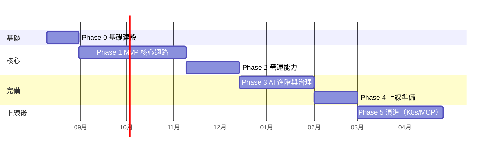

# 13 開發 Roadmap

| 項目 | 內容 |
|------|------|
| 文件編號 | 13 |
| 版本 | v3.3 |
| 日期 | 2026-08-27 |
| 狀態 | Draft — 待審閱 |
| 估算基準 | **1 位工程師 + AI（Claude Code）結對開發**；AI 加速 coding 與測試撰寫，但 review、整合、除錯與決策仍以人為瓶頸——時程按此重估；pw 數字保留作為工作量參考；不含需求變更緩衝（建議整體 +20%） |
| 變更紀錄 | v1.1：估算基準改為 1 人 + AI；時程重估（27→29 週）；2C 裁切（Django Admin 頂替、自訂角色延後）；新增人機協作開發規則；R4 改寫。v1.2：§9.1 補非開發 lead time（F-10）。v1.3：人機協作規則重編為 §1.2（原誤植 §2.1，編號順序錯誤）。v1.4：新增 §3.1「1A 前置條件」（RLS 有三個漏做即靜默失效的前置項）與 §3.2「1A 同步改動：log 的租戶綁定」，兩者皆出自 Phase 0 結案程式審查（見 15 §8）；版本欄同步更正（原停在 v1.1 而變更紀錄已到 v1.3）。v1.5：Phase 0 DoD 的認證併發數改為「待分機環境判定」——單機量測法的絕對值跨 session 漂移 34–48%，無法裁決 150（08-05）與 100（08-07）孰為真（依據見 11 §1.4）。v1.6：§2 新增 Phase 0 結案紀錄（2026-08-07 通過閘門，含依據與三項不阻塞的未結項）。v1.7：§3.1 末段兩項處置在 1A-1 實作時被推翻並改寫——PgBouncer 佔位符不新增（owner 一律不經連線池）、不預先建立 bypass 角色（owner 受 FORCE RLS 管，跨租戶作業延到 2A）；兩項都有強制測試。v1.8：§2 Phase 0 未結項①（CI 真實跑一次）結案並記下它兌現的方式——CI 自 1A-3 起連三次全紅無人察覺，根因是 workflow 缺 `make gen-jwt-keys`；§3.2 補上 1A-3/1A-5 的落地結果。v1.9：§3 新增「1A 結案」小節（**暫行**——Phase 1 的 DoD 是整期的，1A 單獨驗不了，1B–1D 完成後回頭修訂），含子項、驗收依據、帶進 1B 的四個已知缺口，以及過程中發現的兩個非原訂範圍問題。v2.0：新增 §3.3「1B 的範圍偏離紀錄」（PDF 解析器改 pdfplumber、xlsx/Markdown 自 2D 提前、Markdown 的定位、1B-4~1B-6 的子項切分），並同步 §4 的 2D 內容。v2.1：§3 新增「1B 結案」小節（**暫行**，同 1A 的理由），含驗收依據、帶進 1C 的五個缺口，以及過程中發現並修掉的七個非原訂範圍問題。v2.2：新增 §3.4「1C-3 落地紀錄」——1C 尚未結案（1C-4／1C-5 未做），但 embedding worker 把文件的終點狀態從 `chunked` 改成 `ready`，那是 1D 的前提，因此先記；同步更新 1B 結案表的缺口①（已結）與④（部分處理：`acks_late` 本就涵蓋 worker 被砍，補上逐租戶的恢復指令，全域掃描仍排 2A）。v2.3：§3.5 新增「1D-5 的決定」——六項與 06／09 原文不同的定案（短引用編號、Phase 1 不套絕對門檻改用可選的相對門檻、免錢版 condense、`citations` 事件形狀與四個新欄位、幻覺引用只剔清單不改文字、檢索參數收進單一來源），每項標出待改的文件；另記 1D-5 不做的五個缺口。相關產品決定「統一參數管理畫面」記於 15 §4.1。v2.4：§3 新增「1D-5 結案」小節（**暫行**，同 1A／1B 的理由）——含六項開工前決定的落地與文件同步結果、帶進 1E 的六個缺口，以及過程中發現並修掉的五個非原訂範圍問題（其中兩個是 smoke 自 1C-5 起就在打真 API、且與 `make start` 搶同一個 Celery 工作籃）；§3.5 的「不做」清單同步修訂——`kb_ids` 驗證於實作時推翻，改為建立時擋。v2.5：§3 的 1D-5 結案「驗收依據」補齊 `make test`／`make smoke` 的實測數字（2026-08-19），該結案自此成立。v2.6：§2 的 Phase 0 未結項②（新人 30 分鐘上手計時）與對應的 DoD 條目作廢——單人開發，無新人可測；`14` §Maintainability 的同一條同步作廢。v2.7：§3 的 1D-5 結案表後新增「結案後記」——CI 自 5b25444 起連紅四次（run 57–60）無人察覺（ruff cache 假綠 + `sqlparse` CVE 漂移），結案數字不改但補上前提；防線三件（`lint-backend` 的 ruff `--no-cache`、`make ci-status`、CLAUDE.md push 後必盯 CI）；版本欄同步更正（原停在 v2.4 而變更紀錄已到 v2.6，同 v1.4 修過的漂移）。v2.8：§3 新增「1E 結案＋Phase 1 閘門認定」小節——Phase 1 **有條件通過閘門**（DoD ①「50 頁 PDF → 5 分鐘 ready → 問答 → 正確引用」實測 4.2 秒／③隔離矩陣綠燈；②TTFT p95 維持未結，量測前提不存在）；1A／1B／1D-5 三張結案表的「暫行」狀態同日解除（內容未被推翻，數字不改）；記 1D-5 六缺口的處置、Reka UI＋青綠山水設計系統的範圍追加（03 §8.5）、帶進 Phase 2 的六個缺口。v2.9：§4 新增「2A 結案」小節——六個子項全數落地、Phase 2 DoD 第一項（雙租戶下 quota 硬擋）達標；記下五項開工前核可的範圍偏離、§3.1 v1.7 未結項（跨租戶 bypass 角色）的裁決（**不建**，改以無 RLS 的 `identity_tenant_directory` 列舉 id ＋ 逐一進 `tenant_context`）、2A-5 後八個 commit 的全面審查產出，以及帶進 2B 的八個缺口；05→v1.5、09→v1.3 同步 2A-5 的三處欄位/回應。v3.0：§4 新增「2B 開工前定案：rerank 的落地方式」——rerank 走**自架 TEI + `bge-reranker-v2-m3`**（免費、多語、每次提問都要打的一段不適合按次計費），Ollama 因無 rerank 端點而**走不通**（非取捨），雲端 API 僅留 Jina 作第二個 adapter 的驗證對象；併記硬體前提（RTX 5060 8 GiB、TEI 的 Blackwell 映像為實驗性）、降級鏈只有「TEI → 跳過」兩層、以及 06/11/02/12 待同步的段落。v3.1：§4 新增「2B 子工作包切分」（2B-0…2B-6，人類核可）與「**2B-0 結案**」——golden set 與離線評測腳本落地、純向量 baseline 於任何檢索改動**之前**落檔；並記下一項實測推翻的計畫值：主指標由 `recall@10` 改為 `recall@1` + `mrr`（DRCD 在純向量下 recall@5 起即 1.000，原指標只有退步空間）。v3.2：§4 新增「**2B-4 結案**」——自架 TEI（`bge-reranker-v2-m3`）＋ Jina 兩個真 adapter 落地，第三次評測給出的結論是**贏的是 rerank 不是 hybrid**（手寫 recall@1 0.4375 → 0.7917、DRCD 0.9417 → 0.9917；而 `hybrid+rerank` 與 `vector+rerank` 在 144 題上逐題名次完全相同，hybrid 的邊際貢獻為零）。**DoD ② 的認定與預設值的去留留給人類裁決**（字面是「hybrid 優於純向量」，而勝出的是完整檢索鏈）；併記 WSL2 上 TEI 拿得到 GPU 卻退成 CPU 的實測定位與處置。v3.3：§4 新增「**2B-5 結案**」——KB config 的**寫入端驗證**與三個呼叫端共用的單一份參數宣告、`rag_trace`（06 §7 的六項，一次查詢一筆、不記 chunk 內文）、評測報告 `schema_version` 升 2 並記下 rerank 分數分布（2B-4 缺口①的條件到此備齊，**第四次評測尚未跑**）；DoD ② 與預設值的裁決**仍在人類手上**，本包未動任何預設值 |

---

## 1. 階段總覽

總時程：**約 29 週（不含 Phase 5）**；每 Phase 結束有明確 Definition of Done（DoD）驗收閘門，未過不進下一階段。

### 1.1 人機協作下的時程邏輯

1 人 + AI 不等於「人數減半、時程加倍」：AI 使 coding / 測試撰寫 / 樣板工作大幅加速（估 2–3×），但**人的 review、跨模組整合判斷、除錯決策不可平行化**——因此 coding 密集的 Phase 1 只比原估多 2 週，而非翻倍；review 密集、風險決策多的 Phase 3 增加 1 週；Phase 2 因功能裁切（見 §4）反而縮短。

### 1.2 人機協作開發規則（全 Phase 適用）

1. **驗收測試先行**：每個工作包開工時，AI 先依 DoD 產出驗收測試 → 人 review 測試（成本遠低於 review 實作）→ AI 實作至測試通過。人的 review 焦點是「測試是否驗對了東西」。
2. **E2E smoke suite 於 1A 同步建立**（5 分鐘內跑完：登入→上傳→ready→問答→引用），每次任務結束必跑——防 AI 跨 session 開發的迴歸盲區。
3. **AI 任務卡**：每個任務以固定格式下達（見 CLAUDE.md）：對齊的工作包、需讀的文件、DoD 測試位置、**禁區**（本次不准碰的目錄）。
4. 一次任務 = 一個工作包（或其子項），完成即停、人 review 後才續——不允許 AI 連續自主推進多個工作包。

---

## 2. Phase 0：基礎建設（3 週，~7 pw）

| 面向 | 內容 |
|------|------|
| 開發內容 | Monorepo 建立（backend/frontend）；Docker Compose 全套（PG+pgvector+pgroonga、Redis、MinIO）；Django+FastAPI 骨架（ADR-001 落地：django.setup、threadpool repository 基底、UoW、TenantContext）；CI 全管線（lint/type/test/import-linter/migration check/image build）；structlog + request_id；前端 Vite 骨架 + codegen 管線 |
| 技術重點 | **ADR-001 橋接是本階段唯一高風險項**——先做穿刺驗證（spike）：併發壓測 threadpool 模式確認可行，再鋪全量 |
| 相依性 | 無（起點） |
| 優先順序 | P0——一切的地基 |
| 交付成果 | `make up` 一鍵起環境；hello-world 端點走完 API→Service→Repository→DB 全鏈路含測試；CI 綠燈 |
| **結案** | ✅ **2026-08-07 通過閘門。** 依據：`make up` 一鍵起環境實跑、159 passed / 1 skipped（skip 為 RLS 絆線，屬 1A）、`make lint` 全綠（ruff + mypy strict + import-linter 4/4）、前端 28 passed（含 typecheck）、`openapi-check` 無漂移、image build 出 non-root(uid 10001) 且 CMD 帶齊日誌旗標、ADR-001 橋接於 50–200 併發三輪零失敗且吞吐 411–484 rps。 **未結項**： ① ~~CI 真實跑一次~~ ✅ **2026-08-09 結案**（run `31311098166`，四個 job 全綠：quality / tests / frontend / image+trivy）。**代價值得記下**：CI 從 1A-3 起連三次推送全紅而沒有人發現，根因是 workflow 從未執行 `make gen-jwt-keys`——金鑰在 1A-3 引進、缺檔即 Fail Fast，而 `backend/.secrets/` 在 gitignore 內，本機因為金鑰早已存在而完全看不出來。教訓有兩層：**未結項不是「之後有空再看」，它會在下一個工作包就兌現**；而「CI 設定的階段清單」只驗指令在不在、不驗跑不跑得起來，因此補了 `test_ci_pipeline.py::test_jobs_that_build_the_app_generate_jwt_keys`（逐 job 沿 workflow → Makefile → pnpm 展開，凡會跑 pytest 或建 app 的 job 都必須先產金鑰）。 ② ~~新人 30 分鐘上手未實際計時演練~~ ❌ **2026-08-19 作廢**——本專案是單人開發，不會有新人，這條驗收項沒有受測對象。 ③ 絕對容量認證待分機環境——**仍未結**（見下方 DoD 說明）；註：1A-5 已移除負載產生腳本（打的是 spike 端點），取得分機環境時要連同壓測腳本一起重建。 **遺留給 1A 的前置條件見 §3.1、§3.2**；程式審查的 19 條未處理項見 **15 §8** |
| DoD | ~~新人 clone 後 30 分鐘內能跑起全環境並通過測試~~（2026-08-19 作廢，理由見上方未結項②）；橋接壓測報告，量測方法與數字依 **11 §1.4**。個人開發階段適用該節「單機量測法」的已知偏離（CPU 綁核心 + 伺服器端 `duration_ms`）。**認證併發數待分機環境判定**：原訂 200 併發在此硬體下未達成，而單機量測給出的上限隨 session 漂移——2026-08-05 量到 150（p95 268ms）、2026-08-07 同一份程式碼量到 100（p95 293ms；150 為 396ms），50 併發兩次吻合而 100 以上分歧 34–48%，本方法無法裁決（見 11 §1.4「2026-08-07 重量」）。**此項不阻塞 Phase 0 結案**：橋接可行性（本 DoD 的實際目的）已由三輪零失敗、吞吐 411–484 rps 證實，缺的是絕對容量認證，而那本來就要等分機環境 |

## 3. Phase 1：MVP 核心迴路（10 週，~22 pw）

> 目標：單一租戶內走通「上傳文件 → 可問答 → 有引用」的完整價值迴路。

| 工作包 | 內容 | 估算 |
|--------|------|------|
| 1A Identity 基礎 | JWT 登入/refresh rotation、User CRUD、系統角色 RBAC（自訂角色延後）、tenant 建立（隔離機制全量：filter+RLS+跨租戶測試矩陣）；**E2E smoke suite 骨架同步建立（§1.2）**；**spike 面移除（ADR-002 結案條件：`tenant_middleware`、`api/v1/spike.py`、`apps/spike/`、`ENABLE_SPIKE_ENDPOINTS` 同一 commit 刪除）** | 4 pw |
| 1B Knowledge + ETL 基礎 | KB/Document CRUD、上傳（單請求版）、PDF/docx/txt 三種 loader、recursive chunker、狀態機+重試+冪等 | 5 pw |
| 1C Embedding + 檢索 | AI Gateway 骨架（OpenAI + Ollama 兩個 provider 先行）、embedding worker、pgvector HNSW、**純向量檢索先行**（hybrid 留 Phase 2） | 4 pw |
| 1D Chat 迴路 | Conversation/Message、SSE 全協定（含 resume）、Prompt Builder（版本機制簡化版：僅 draft/published）、citation 標記與驗證、Memory 視窗版（摘要留 Phase 3） | 6 pw |
| 1E 前端 MVP | 登入、KB/文件管理（含 ETL 進度）、Chat UI（串流+引用面板） | 3 pw |

- 相依：1A → 全部；1B → 1C → 1D → 1E 可部分並行。
- 技術重點：SSE 協定完整度（不留技術債，resume day-1 做齊）；tenant 隔離測試矩陣即使單租戶也先行（之後不補）。
- DoD：E2E 通過「上傳 50 頁 PDF → 5 分鐘內 ready → 提問 → 串流回答含正確引用」；TTFT p95 < 3.5s（純向量版）；隔離矩陣綠燈。

#### 1A 結案（2026-08-09）

> ⚠️ **暫行紀錄，1B–1D 完成後回頭修訂。** Phase 1 的 DoD 是**整期**的（上傳 → ready → 問答 → 引用），1A 單獨驗不了它——smoke suite 的第 2–5 步現在還是 skip。所以下表記的是「1A 的內容做完了、且沒有把後面幾包的地基弄壞」，不是「Phase 1 的 DoD 達成」。
>
> **2026-08-21 回頭修訂：暫行狀態解除。** Phase 1 閘門已於「1E 結案＋Phase 1 閘門認定」小節認定（有條件通過）；本表內容經 1B–1E 全程檢驗未被推翻，數字不改。

| 面向 | 內容 |
|------|------|
| 子項 | 1A-P1~P3 DB 角色拆分（§3.1 的三個前置條件）／1A-2 Identity 資料層與 RLS／1A-3 JWT 登入、refresh rotation 與租戶身分來源／1A-4 權限判定與使用者管理／1A-5 spike 面移除與 E2E smoke 骨架 |
| 驗收依據 | `make test` 295 passed（unit + integration + api）；`make lint` 全綠（ruff + format + mypy strict 98 files + import-linter 5/5）；`make smoke` 1 passed / 4 skipped（skip 皆為 1B–1D 的功能）；前端 28 passed 含 typecheck；`make openapi-check` 無漂移；**CI run `31311098166` 四個 job 全綠**（首次完整跑完，含 trivy） |
| 對照工作包內容 | JWT 登入 + refresh rotation ✅／User CRUD ✅／系統角色 RBAC ✅（自訂角色依原訂延後）／tenant 建立 ✅（`manage.py create_tenant`，與 API 走同一條 Service）／隔離機制全量 ✅（Repository filter + RLS policy + 雙租戶矩陣）／E2E smoke 骨架 ✅／spike 面移除 ✅（ADR-002 結案，見 01） |
| 帶進 1B 的已知缺口 | ① smoke 第 2–5 步是 `skip`，reason 標明等哪個工作包——**1B 起每包要把對應那步換成實作**，不是等最後一起補。② 11 §4.2 的正式 `/healthz` 尚未建；`orm_runtime_knobs()` 目前沒有 HTTP 呼叫端，unit 層守門仍在，建端點時要把「不洩 DB 拓撲」的 API 層測試補回來（`tests/api/test_api_errors.py` 有註記）。③ 負載產生腳本隨 spike 面刪除，重建時機見 §2 未結項③。④ 15 §8 的 C-09、C-19 因檔案刪除自動失效，C-03 已於 1A-2 落實，表格狀態待下次 living-document 更新 |
| 過程中發現並修掉（非原訂範圍） | ① **租戶 contextvar 不會被還原**：原本由 spike middleware 的 `finally` 負責，刪除後沒有接手者——而新的設定點在 route 層 `Depends`，那裡拿不到涵蓋整個請求的 `finally`。同一個 context 連續處理兩個請求時前者的租戶會留給後者，在 RLS 之下是跨租戶讀取。改由請求層 middleware 收尾（`clear_current_tenant_id()`）。② **CI 自 1A-3 起連三次全紅無人察覺**（workflow 缺 `make gen-jwt-keys`），詳見 §2 未結項① |

### 3.1 1A 前置條件：RLS 生效的三件事

1A 的「隔離機制全量：filter+RLS」有三個**漏做即靜默失效**的前置項（Phase 0 結案程式審查發現，2026-08-07）。列在這裡而不是留在程式註解裡，是因為它們的共同症狀是「policy 建好了、查詢正常回傳、測試全綠，隔離卻不存在」——沒有任何一項在漏做時會報錯。

| # | 前置項 | 為什麼不能留到事後 |
|---|--------|-------------------|
| 1A-P1 | **DB 角色拆分**：應用連線改用非 superuser、非 `BYPASSRLS` 的角色（05 §5.1）。目前 `docker/compose.yml` 的 `POSTGRES_USER` 同時是 initdb superuser、schema owner 與應用連線帳號 | superuser 與表的 owner 都**預設豁免** policy。角色若仍是 owner，另需 `FORCE ROW LEVEL SECURITY`，否則 `ENABLE ROW LEVEL SECURITY` 等於沒開。而 `POSTGRES_USER` 只在 initdb 生效，改它要 `make clean` 重建資料卷——愈晚做成本愈高 |
| 1A-P2 | **測試連線設計**：pytest 需 `CREATE DATABASE`（非特權角色沒有這權限），而 RLS 測試要驗的是**應用角色**的行為，兩者不能是同一條連線 | 若測試整程以特權角色跑，1A 的「跨租戶測試矩陣」會在 RLS 完全失效的情況下全綠——那比沒有測試更糟，它會主動背書一個不存在的保護 |
| 1A-P3 | **`statement_timeout` 的套用對象**：`make db-timeouts` 目前對 `DB_USER` 下 `ALTER ROLE`，而該角色同時跑 migration。拆分後只套在應用角色上 | 5s 上限會砍掉大表的 `AddIndexConcurrently` 與 HNSW 建索引，症狀是 migration 中途 `canceling statement due to statement timeout`，而那已經是半套 schema |

一併要收的兩處（**v1.7 修正：原文的處置在實作時被推翻，理由如下**）：

1. **PgBouncer 佔位符不新增**（原文為「需加入新角色」）。應用角色沿用既有的 `__DB_USER__`，只換值（`lumina` → `lumina_app`）；owner/migration 角色**一律不經 PgBouncer**，走直連埠。三個理由各自獨立成立：transaction pooling 下 `CREATE DATABASE` 不可行（連線池綁定固定 dbname）；migration 取的 advisory lock 與 `CREATE INDEX CONCURRENTLY` 在 transaction mode 下語意會壞，且壞法零星難重現；`userlist.txt` 是明文密碼且 chmod 644 的共享 volume（`docker/compose.yml` 開頭已標為 production 待處理項），特權憑證進去等於擴大那個已知風險的爆炸半徑。這也是 Rails/Django + PgBouncer 的一般部署慣例（migration 走直連 DSN、應用走 pooler）。反向情境只有一種：PG 沒有可達的直連路徑（例如只給 pooler endpoint 的託管服務），那時才為管理連線開一個 `pool_mode=session` 的獨立 database 條目——本專案的 15432 直連埠早已存在且 pytest 在用。強制機制：`tests/unit/test_pgbouncer_render.py::test_owner_role_is_not_reachable_through_the_pool`。
2. **不建 bypass 角色**（原文為「拆分時一併落地」）。`core/uow.py` docstring 的「Migration 與維運腳本走 bypass 角色」已改寫為陳述現況：owner 建的表一律 `FORCE ROW LEVEL SECURITY`，policy 對 owner 同樣生效，**repo 內沒有任何 BYPASSRLS 角色**。真正需要跨租戶讀寫的作業（backfill、DLQ 重放）第一次出現在 2A，屆時再依 05 §5.1 建立顯式 bypass 角色並加 Audit。提前建一個「沒人用但看得到全部租戶資料」的角色，風險是純增加的。

**強制機制**：`tests/integration/test_infra_postgres.py::test_rls_enabled_tables_are_actually_enforced` 在沒有任何表啟用 RLS 時 skip，一旦有表啟用即斷言「連線角色非 superuser、非 `BYPASSRLS`、且表已 FORCE」。因此 1A 若先開 RLS 而漏了上述前置，得到的是紅燈而不是靜默失效。

已在 Phase 0 先行落地、1A 不需重做的相關項：巢狀交易換租戶的守門（`core/uow.py` 的 `CrossTenantTransactionError`）。`set_config(..., true)` 是**交易**區域而非 savepoint 區域的，子交易內換租戶後不會還原，外層後續語句會在 RLS 之下被當成內層租戶。

### 3.2 1A 同步改動：log 的租戶綁定（✅ 1A-3 落地，1A-5 驗證）

**換認證來源會讓每筆 log 的 `tenant_id` 靜默消失。** 這不是前置條件（不影響 1A 能否開工），但必須與認證改造**同一個工作包**完成，否則觀測能力會在沒有任何徵兆的情況下退化。

現況：`api/main.py` 的 `request_context_middleware` 在**進入時**對 tenant contextvar 取一次快照，再 `bind_request_context(tenant_id=...)`。這能成立的唯一原因是 spike 的租戶來源也在 middleware 層，且排在它之前。

1A 之後：租戶改從已驗證的 JWT claim 取得，而 FastAPI 的慣用形狀是 `Depends`——那在 **route 內**執行，比所有 middleware 都晚。快照那時還是空的，於是每筆 log 只有 `request_id`、沒有 `tenant_id`。

**為什麼不會有紅燈**：唯一覆蓋這件事的測試（`tests/api/test_request_logging.py::test_tenant_id_is_bound_when_present`）是靠 spike 的 `X-Tenant-Id` middleware 驅動的，而那正是 1A 要刪掉的東西——測試會跟著改或刪，缺口不會浮現。而 12 §1.1 把 `tenant_id` 列為標準欄位，「單一租戶錯誤暴增」這類查詢全靠它。

處置：把租戶改成**在 emit 時**讀 contextvar 的 structlog processor（掛進 `config/logging.py` 的 `_shared_processors`），這樣不論由哪一層、哪種機制設定租戶都一樣有效。同時補一條**不依賴 spike 標頭**的測試——以 route-level dependency 設定租戶，斷言 log 帶得到 `tenant_id`；那條測試在 spike 面刪除後仍然有效。

**結果（2026-08-09）**：processor 於 1A-3 隨認證改造落地，middleware 同時從 `BaseHTTPMiddleware` 改為純 ASGI（`call_next` 會把下游丟到另一個 task，contextvar 回不到父 task）。1A-5 刪除 spike 面後，`tests/api/test_request_logging.py` 全檔的載具改為自掛路由，該處置的預測完全成立：靠 `X-Tenant-Id` 驅動的那幾條測試確實跟著消失，而 route-dependency 那條照樣綠。

#### 1B 結案（2026-08-14）

> 與 1A 的結案紀錄同樣是**暫行**：Phase 1 的 DoD 是整期的（上傳 → ready → 問答 → 引用），1B 單獨驗不了它——smoke 第 3 步現在斷言 `chunked`，第 4、5 步仍是 skip。下表記的是「1B 的內容做完了、且沒有把後面幾包的地基弄壞」。
>
> **2026-08-21 回頭修訂：暫行狀態解除**（同 1A，見「1E 結案＋Phase 1 閘門認定」）。

| 面向 | 內容 |
|------|------|
| 子項 | 1B-1 Knowledge 資料層與 RLS／1B-2 KB/Document CRUD 與權限碼／1B-3 單請求上傳與物件儲存／1B-4 三種 loader 與子行程隔離／1B-4b xlsx + Markdown loader／1B-4c PDF 解析器換 pdfplumber（大綱與表格）／1B-5 Clean 與 recursive chunker／1B-6 ETL 狀態機、Celery 佇列、冪等與 chunks 落地（含 DLQ 落地、re-ingest 端點、worker 納入一鍵啟停） |
| 驗收依據 | `make test` **549 passed / 0 failed**（unit + integration + api）；`make lint` 全綠（ruff + format + mypy strict 151 files + import-linter **7/7**）；`make smoke` **3 passed / 2 skipped**（skip 皆為 1D）；前端 28 passed 含 typecheck；`make openapi-check` 無漂移；手動驗證 `make start` 三服務就緒、worker 實際消化佇列、`make stop` 無殘留 |
| 對照工作包內容 | KB/Document CRUD ✅／單請求上傳 ✅／PDF·docx·txt 三種 loader ✅（**另加 xlsx 與 Markdown**，見 §3.3）／recursive chunker ✅／狀態機 + 重試 + 冪等 ✅（冪等鍵 `(doc_id, doc_version, stage)` 以 DB 唯一約束強制）／斷點續跑 ✅（cleaned 中間產物落物件儲存）／re-ingest ✅（09 §2.3 的端點，doc_version+1 + superseded） |
| 帶進 1C 的已知缺口 | ① ~~smoke 第 3 步停在 `chunked`，1C 落地時推到 `ready`~~ ✅ **1C-3 結案**；② `superseded` 舊 chunk 的清理 job（重嵌入完成後硬刪）→ 2A；③ DLQ 的**通知**與 per-tenant 公平佇列 → 2A；④ **enqueue 失敗沒有補償** → **1C-3 部分處理**：`acks_late` 本來就涵蓋「worker 中途被砍」（訊息回佇列），真正的缺口只有「送不出去，訊息根本不存在」；已補**逐租戶**的恢復指令 `manage.py requeue_stuck_documents`，自動化的全域掃描仍排 2A（理由見 §3.4）；⑤ `_chunk_config_from` 的 KB 參數覆寫路徑尚無測試 |
| 過程中發現並修掉（非原訂範圍） | ① **`make stop` 會永久卡在 flock**——`acquire_lock` 的 fd 被背景子行程繼承，而 flock 綁的是 open file description，服務跑著就永遠有人持有它（子行程改 `9>&-`）。② **Celery worker 缺 `django.setup()`**：smoke 因為 fixture 顯式設了 `DJANGO_SETTINGS_MODULE` 而看不出來，`make start` 起的 worker 直接 `ImproperlyConfigured`。③ **上傳第一次要 16 秒**：`autodiscover_tasks(force=True)` 讓 API 行程載入整個 ETL 堆疊；改 `force=False` 後仍有 10 秒，真正的大頭是 **boto3 建 client 15.6 秒**（WSL2 掛載磁碟），改為啟動時背景預熱。④ smoke 偶發在建租戶失敗：`token_urlsafe` 產生以 `-` 開頭的密碼被 argparse 當旗標。⑤ `test_logging.py` 兩條紅燈（`6b16b3a` 把 dev 指令搬進 `DEV_CMD` 後測試讀到字面值）。⑥ **失敗訊息外洩**：第三方例外的字串會經 `DocumentOut.error` 回到租戶手上（botocore 夾 endpoint 與 bucket 名），改成只有自家例外的訊息落地。⑦ 物件不存在被當成可重試，實際上永久失敗 |

### 3.3 1B 的範圍偏離紀錄（2026-08-12～14）

四項偏離，每一項都在實作中被證實有必要或由人類明確決定。**列在這裡而不是留在 commit 訊息裡**，是因為它們改變的是後續工作包的前提。

| # | 偏離 | 原訂 | 實際 | 理由與代價 |
|---|------|------|------|-----------|
| 1 | PDF 解析器 | 08 §3：pymupdf | **pdfplumber（MIT）** | PyMuPDF 是 AGPL-3.0／商業雙授權，§13 的網路使用條款對多租戶 SaaS 會實際觸發（租戶透過網路操作即需提供整份原始碼），08 §3 選型時未評估。pdfplumber 逐字元同樣給得出字級、表格偵測內建；代價是純 Python、大檔較慢——ETL 的 SLO 是分鐘級，且抽取跑在有逾時的子行程裡。**執行期相依自此無 AGPL** |
| 2 | loader 範圍 | xlsx 排 2D、Markdown 未列 | **1B-4b 提前做掉** | 產品決定（2026-08-12）。上傳白名單一併擴充，否則兩個 loader 沒有路徑到得了。Markdown 是白名單裡唯一看副檔名的型別——它與純文字的位元組相同，副檔名決定的是「交給哪個 loader」而不是「收不收」 |
| 3 | Markdown 的定位 | 未定義 | **序列化形式，不是中間格式** | 中間格式仍是 `ExtractedDoc`：純 Markdown 沒有頁碼，而 1D 的引用要指得出頁。chunk 內容存 Markdown，meta 仍帶 page 與 heading_path |
| 4 | 工作包切分 | 1B 一包 | **1B-4／4b／4c／5／6** | 抽取、loader 擴充、解析器換裝、Clean+chunker、狀態機+Celery 各自一次 review。切開的理由是解析器換裝需要與舊版對照，混在大 diff 裡看不出品質差異 |

**1B 的終點狀態是 `chunked` 而不是 `ready`**：`ready` 要等 1C 的 embedding。smoke 第 3 步因此斷言 `chunked`，1C 完成時往前推一格（該測試的 docstring 已標明）。**已於 1C-3 推到 `ready`**（見 §3.4）。

**帶進 1C 的已知缺口**：① DLQ 只落地到 `document.error`（`retryable` 分毒檔與環境問題兩類），**通知**屬 2A；② `superseded` 的舊 chunk 需要清理 job（重嵌入完成後硬刪），排 2A；③ 語言偵測對拉丁語系以外的小語種未驗證，Phase 2 golden set 一併評估；④ ETL 尚未有 per-tenant 公平佇列（08 §6 的背壓），單一租戶大量上傳會排擠他人——2A 的 quota 一併處理。

### 3.4 1C-3 落地紀錄（2026-08-16）

1C 尚未結案（`1C-4` 純向量檢索、`1C-5` OpenAI／Ollama adapter 未做），本節只記 embedding worker 這一段，因為它**改變了後續工作包的前提**：文件的終點狀態從 `chunked` 變成 `ready`，而 1D 的檢索只認 `ready`。

| 面向 | 內容 |
|------|------|
| 落地內容 | `EmbeddingService`（batch=64、逐批落地、失敗分兩類）／`embedding` 佇列與 `worker/embedding_tasks.py`／ETL 完成後自動交棒／狀態機補上 08 §2 的 `cleaned` 與 `embedding` 兩個中間態／smoke 第 3 步推到 `ready` |
| 驗收依據 | `make test` 632 passed；`make lint` 全綠（ruff + format + mypy strict + import-linter 8/8）；`make smoke` 3 passed / 2 skipped（skip 皆為 1D） |
| 範圍決定 | **不含 embedding cache**（06 §6 的 Redis + DB 雙層）：跨文件去重的價值要等真 provider（1C-5）才量得出來，而同一份文件內的去重已由 `chunks_without_embedding` 涵蓋。**不含真 provider**：1C-5。 |

**過程中發現並修掉（非原訂範圍）**：

1. **`prompt_tokens` 在 log 裡被遮成 `***`**。`config/logging.py` 的敏感 key 是子字串比對，而 `token` 在清單內——任何含 token 的欄位名都會被遮掉。用量計數是 2A 計費的原料（06 §4），而那個欄位存在的唯一理由就是那個數字。已加**逐項列舉**的例外清單（`prompt_tokens` / `total_tokens` / `token_count` 等），刻意不用「以 `_tokens` 結尾」這種規則——規則會在 `refresh_tokens` 上失效，而失效的方向是洩漏。
2. **舊訊息會把 re-ingest 中的文件標成 ready**。文件在 `chunked` 時排了 embedding，使用者接著 re-ingest（那時 `chunked` 允許重跑），`doc_version` 變 2 而新版 chunk 還沒切出來；舊訊息進來看到「這一版沒有 chunk 要算」就標 ready——一份零向量、狀態卻是完成的文件。已加狀態守門（`_EMBEDDABLE_STATUSES`）。
3. **`cleaned` 中間態原本沒有實作**（08 §2 有、1B 把 extract/clean/chunk 全壓在 `parsing`）。補上之後 `cleaned` 一併納入「進行中」，否則使用者在切塊那幾秒按重跑會讓兩個 job 寫同一份文件。

**為什麼恢復是逐租戶的 CLI 而不是 Celery Beat**：全域掃描要能列舉租戶，而 `identity_tenant` 自己就有 RLS（`id = current_tenant`），列舉它需要 BYPASSRLS 角色——§3.1 v1.7 已明文決定那個角色等 2A 才建（提前建一個「沒人用但看得到全部租戶資料」的角色，風險是純增加的）。Celery Beat 本身也還不存在（新行程、部署、單一實例鎖）。因此 1C-3 只補「不需要動這兩個決定」的那一半：`manage.py requeue_stuck_documents --tenant <slug>`，可由外部排程逐租戶呼叫。**自動化的全域掃描仍是 2A 的工作項。**

**帶進 1C-4／1C-5 的已知缺口**：① embedding cache 未做（見上表）；② `superseded` 舊 chunk 的清理 job 仍排 2A，而 1C-3 之後那些舊 chunk 確定不會再被算向量，清理的價值變成純儲存空間；③ 全域的停滯掃描排 2A（見上一段）。

### 3.5 1D 的範圍偏離紀錄

1D 是 Phase 1 最大的一包（6 pw），切成五個子項（1D-1 資料層／1D-2 CRUD／1D-3a
stream_chat／1D-3b PromptBuilder／1D-4a 端點與生成／1D-4b resume 與 stop／1D-5 RAG 編排
與 citation）。以下是與原文件不同的決定，各自的理由記在對應的 commit 與程式碼註解。

| # | 項目 | 原文件 | 實際 | 理由 |
|---|------|--------|------|------|
| 1 | 發送訊息的端點形狀 | 09 §2.4：單一 `POST` 直接回 SSE | **拆兩步**：`POST` 建立回合回 201、`GET .../stream` 讀串流 | 正確性而非形式：單一 POST 同時做建立與串流，網路閃斷時 client 分不出請求送達與否，重送即兩則訊息、兩次生成、兩次帳單，而該端點原未標冪等鍵。拆開後 resume 與初次串流共用同一條路徑，G-06 天然成立 |
| 2 | 前端 SSE client | 03 §2：`EventSource` 封裝 | **fetch + ReadableStream** | `EventSource` 不能帶自訂 header，而憑證是 `Authorization: Bearer`（09 §1.2）——與 GET/POST 無關，該路徑本來就走不通。代價：自動重連與 `Last-Event-ID` 要自己維護 |
| 3 | 系統 prompt 的儲存與 RLS | 05 §3.3：`tenant_id IS NULL` = 系統模板 | 同上，但**讀寫條件不對稱**＋owner 專用 policy | 讀放行 NULL、寫只准自己的租戶：一個租戶寫得出系統模板就等於改得動所有人的 prompt（Phase 5 有 `/prompts` 寫入端點）。seed 由 owner 專用 policy 放行 |
| 4 | 記憶視窗 | 06 §5：視窗 + 摘要 | 1D-4a **只做視窗**（近 10 輪原文） | 摘要壓縮屬 Phase 3C。沒有摘要時的正確行為是「記得最近的」，而不是把全部塞進 context |
| 5 | Redis client | `core/redis.py`：只用同步 client | SSE 串流路徑**加一個 async client** | 該規則的理由是「service 層是同步的」，而 SSE 是 transport 層：讀取端要等下一個事件，跑在 threadpool 上就是一條串流佔一條執行緒，與 11 §26 的 200 併發串流相矛盾 |

**1D-4a 帶進 1D-4b 的已知缺口（四項均於 1D-4b 結案）**：① graceful shutdown（11 §196）→ `api/background.py` 的登記表 + `drain()`，由 lifespan 在關機時呼叫；被取消的生成會留下 `error(retryable)` 事件與 `interrupted` 狀態。② `Last-Event-ID` → 已接上；壞值回 422，緩衝區過期回 409 `RESUME_EXPIRED`。③ `stop` 端點 → `POST .../stop` 回 202，旗標放 Redis（跨行程）；中止以 `done(finish_reason="stopped")` 收尾而不是 `error`——使用者自己按的停止不是失敗，送 error 會讓前端顯示一個紅色的失敗訊息。④ G-06 → 已有測試釘住（斷線後仍完整持久化，且緩衝區補得回中間那一段）。

#### 1D-5 的決定（2026-08-17，開工前定案）

1D-5 把「檢索 → context → 引用」接起來。以下六項與 06／09 的原文不同，**每一項都要
同步修訂對應文件**（欄位「文件待改」列出哪一份）。

| # | 項目 | 原文件 | 實際 | 理由 | 文件待改 |
|---|------|--------|------|------|----------|
| 1 | 引用標記 | 06 §3.1：`[c:chunk_id]`（UUID） | **`[c:1]`＝本輪第幾段** | 兩個各自成立的理由。**錢**：一個 UUID 約 20 token，模型每引用一次抄一遍，而輸出 token 比輸入貴數倍；八段 context ＋ 五次引用約佔 240 token，短編號只剩三十幾。**準**：叫模型一字不差抄 36 個十六進位字元，它會抄錯——抄錯就被驗證當成幻覺剔掉，畫面上少一個**本來是真的**來源。編號只在該輪有效（比對的就是該輪清單），落地與回傳仍是真 `chunk_id`，歷史無歧義 | 06 §3.1、§3.3 |
| 2 | 檢索門檻 | 06 §3.1：rerank 分數 < 0.3 即回「無相關內容」 | Phase 1 **不套絕對門檻**，改為可選的**相對門檻**（只留分數接近第一名的），**預設關閉** | 0.3 是 cross-encoder 的尺度，Phase 1 只有餘弦相似度——套上去不是品質變好，是每次都回「找不到」。相對門檻不吃尺度，換打分方式也不失效；但它仍會砍東西，所以預設關。絕對門檻等 2B 接上 **`bge-reranker-v2-m3`（MIT，可自架，免費）** 之後才有意義；該模型 06 §3.4 已指名 | 06 §3.1 |
| 3 | 追問改寫（condense） | 06 §3.1：多輪時以小模型改寫成獨立問句 | **免錢版**：檢索時把前 N 個問題接上一起查（`query_history_turns`，預設 1） | 真 condense 是每輪多一次 LLM 呼叫。「那病假呢？」單獨查會命中一組無關內容，接上前一問即可解決最常見的一類。真 condense 排 Phase 2/3C——那時有 golden set，量得出它好多少 | 06 §3.1 |
| 4 | `citations` 事件形狀 | 09 §3.2：`data:` 是裸陣列 | `data: {"items": [...]}`；每筆多 `marker`／`snippet`／`heading_path`／`doc_version` | 裸陣列與 SSE 緩衝區的事件形狀不合（`StreamBuffer` 的 data 是物件），且其餘六種事件全是物件。四個欄位各有用途：`marker` 讓前端把 `[c:1]` 換成可點的上標；`snippet` 是 06 §3.3 要求的來源片段，**同時是一張當時的照片**（文件之後被改或刪，這則回答仍看得出依據）；`heading_path` 是 Markdown／xlsx 唯一說得出位置的東西（無頁碼）；`doc_version` 讓 re-ingest 後仍指得出當時的版本。後三者的資料本來就在手上 | 09 §3.2 |
| 5 | 幻覺引用的處置 | 06 §3.3：「直接剔除」 | 只從**引用清單**剔除，**回答文字一字不改** | 字是逐字串流出去的，收不回來；重寫持久化內容會打破 1D-4a 釘住的「串流看到的 = 存下來的」。原始文字留著也是 3B 評測的原料（模型多常唬爛）。畫面上的清理屬**渲染**：前端把不在 `items` 裡的標記略去（1E） | 06 §3.3 |
| 6 | 檢索參數的落點 | 06 §3.1：「KB 可覆寫」 | 全部參數收進 `services/rag/params.py`，三層覆寫（系統 → 租戶 → KB） | 2026-08-17 產品決定，見 **15 §4.1**。1D-5 之前 `top_k=40` 同時寫在 `RetrievalService` 的常數與 `/rag/query` 的預設值，兩份會漂 | 無（實作面） |

**1D-5 不做、記為缺口**：真 condense（Phase 2/3C）／絕對門檻與 rerank（2B）／~~建立對話時
驗證 `kb_ids` 是否存在（會動到 1D-2 已驗收的測試，且長命對話本來就要容忍 KB 中途被刪——
現行行為是跳過該 KB、照常回答、log 警告）~~ **→ 實作時推翻，改為建立時擋**（兩者不是同一
件事，理由見下方結案表）／引用點擊跳原文並標黃（1E／2D）／groundedness 抽測（3B）。

**1D-4b 的兩個決定值得記**：中止旗標**必須跨行程**——11 §45 的部署形狀下，停止請求幾乎不會落回產生它的那個行程，放在記憶體裡的旗標只停得了剛好接到請求的那一台，而使用者按了停止、帳單繼續跑；因此有一條測試直接盯著那個 Redis key。以及 `RESUME_EXPIRED` **對映 HTTP 409**，與 `STREAM_INTERRUPTED` 相反——它發生在還沒送出任何位元組的時候，那時回一個真正的狀態碼是可能的，也是必要的。

#### 1D-5 結案（2026-08-18）

> ⚠️ **暫行紀錄，1E 完成後回頭修訂**（理由同 1A／1B）。1D-5 之後 smoke 的五個步驟第一次
> 全部是實作，Phase 1 DoD 的**功能面**（上傳 → ready → 問答 → 引用）因此第一次驗得到；
> 但 DoD 還有 TTFT p95 < 3.5s 與 1E 的前端，兩者都不在這一包裡。下表記的是「1D 的內容做完
> 了、且沒有把 1E 的地基弄壞」。**1D 的五個子項至此全數完成**，工作包層級的結案與 Phase 1
> 的 DoD 一併在 1E 之後認定。
>
> **2026-08-21 回頭修訂：暫行狀態解除**（同 1A／1B，見「1E 結案＋Phase 1 閘門認定」）。

| 面向 | 內容 |
|------|------|
| 子項 | 1D-5 一包，內含：檢索編排（`rag/pipeline.py` 的查詢組合、跨 KB 合併、context 裁切）／context 組裝（`ai/prompts` 的 `build_user_turn`，context 進 user role）／引用組裝與驗證（`rag/citation.py`）／檢索與切塊參數的單一來源（`services/rag/params.py` + `app_settings` 的可調參數區）／`citations` SSE 事件與落地（含中斷的回答）／smoke 第 4、5 步由 `skip` 換成實作 |
| 驗收依據 | `make test-unit` **520 passed**（2026-08-18）。1D-5 新增／改動的測試：unit `test_rag_pipeline.py` 17、`test_citation.py` 14、`test_rag_params.py` 9、`test_dev_launcher.py` +2（smoke 環境守門）；api `test_chat_citations.py` 16、`test_conversation_endpoints.py` +5（`kb_ids` 驗證）；e2e smoke 第 4、5 步；`make lint` 後端全綠（ruff + format 249 files + mypy strict **223 source files** + import-linter **9/9**）。~~**`make test` 全層與 `make smoke` 待補**~~ ✅ **2026-08-19 補齊**：`make test` **1085 passed**（unit + integration + api，4:16）、`make smoke` **5 passed**（五步全為實作）、`make lint` 全綠含前端（eslint + vue-tsc）、`make fe-test` **28 passed**、`openapi-check` 無漂移。當日缺的只是 Docker Desktop 沒開，程式本身未改動——補跑前後 working tree 一致。**本結案至此成立** |
| 對照工作包內容（1D 全包） | Conversation/Message ✅（1D-1 資料層與 messages 月分區、1D-2 CRUD 與 cursor 分頁）／SSE 全協定含 resume ✅（1D-3a 串流、1D-4a 端點與生成、1D-4b `Last-Event-ID`／stop／graceful shutdown）／Prompt Builder 簡化版 ✅（1D-3b，僅 draft/published）／**citation 標記與驗證 ✅（1D-5）**／Memory 視窗版 ✅（近 10 輪原文；摘要依原訂延後 3C） |
| 六項開工前決定的落地 | 全部照 §3.5 落地，**對應文件同步改完**：06 升 v1.4（§3.1 的參數落點聲明、condense／rerank 門檻／Generation 三個條目、§3.3 的短編號與「只剔清單不改文字」）、09 升 v1.2（§3.2 的 `citations` 事件形狀與三條規則）、15 升 v1.3（§4.1 的「已落地」欄）。唯一與 §3.5 不同的是 `kb_ids` 驗證——原記為「不做」，見下一列⑤ |
| 帶進 1E 的已知缺口 | ① **前端必須把不在 `items` 裡的 `[c:n]` 標記略去**：後端刻意不改回答文字（§3.5 第 5 項），渲染層不清的話畫面上會出現裸標記，而那看起來像壞掉。② 引用點擊跳原文並標黃 → 1E／2D。③ 租戶層 `/settings` 與**統一設定畫面**仍缺（2C）：`params.py` 目前只有系統與 KB 兩層，中間那層是空的（15 §4.1）。④ **TTFT p95 < 3.5s 尚未量測**——mock provider 量不出真實延遲，要等真 provider 與分機環境（§2 未結項③），而它是 Phase 1 DoD 的一項。⑤ `usage.rag` 的三個數字（`context_chunks`／`citations`／`dropped`）已落地但**沒有任何報表**，3B 的評測才會用到；它同時是「短編號比 UUID 準」這個判斷的唯一量測。⑥ 真 condense、絕對門檻與 rerank、groundedness 抽測仍照 §3.5 排在 Phase 2/3C、2B、3B |
| 過程中發現並修掉（非原訂範圍） | ① **smoke 自 1C-5 起一直在打真的 Gemini**：`config/settings/test.py` 的強制假 provider 只對 in-process 的測試套件有效，而 smoke 的 API 與 worker 兩個子行程跑在 `config.settings.dev` 之下，會照實讀 repo 根的 `.env`——金鑰在 1C-5 寫進去之後就生效了，而沒有任何測試會因此變紅（違反 CLAUDE.md「LLM 測試禁止呼叫真實 API」）。改為在 `tests/e2e/conftest.py` 顯式覆寫（金鑰設空字串而不是 `pop`，否則 pydantic 仍從 `.env` 讀得到），並加兩條 unit 守門。② **smoke 與 `make start` 搶同一個 Celery 工作籃**：兩邊都用 Redis DB 0，`make start` 起的 worker（真 provider）會撿走 smoke 的嵌入任務，於是寫入端與查詢端落在不同模型上，`UNIQUE(chunk_id, model, embedding_version)` 對不上、**檢索永遠回零筆**；而文件照樣 `ready`、API 全部 200，smoke 只說「沒有引用」。改為 smoke 專用 DB 15、xdist 上限由 15 降到 14。**1D-5 實際被咬了一次**。③ 切塊參數（`target_tokens`／`overlap_tokens`）原本住在 `ChunkConfig` 的 dataclass 預設值——留著的話「統一參數管理」對切塊那半邊是假的，依 15 §4.1 搬進 `app_settings`。④ `/rag/query` 的 `top_k` 預設值寫死在 schema 上：client 每次都會送出那個數字，於是 **KB 的覆寫在這個端點永遠不會生效**，而它存在的理由正是「看檢索準不準」；改為 `None` = 用該 KB 生效中的值。⑤ **`kb_ids` 驗證由「不做」改為「做」**：建立對話時打錯一個 id 會安靜毀掉整場對話（每一輪都跳過、每一次都答「找不到相關內容」，使用者只會覺得 AI 很笨），唯一線索是 log 裡的 `rag_kb_unavailable`。**只在建立時擋（全有或全無，404 而非 403 以防枚舉），生成時仍容忍**——填錯是當下就錯，被刪是後來才變的，後者整輪失敗會讓那場對話從此每次發言都失敗 |

**1D-5 結案後記（2026-08-19，1E-1 期間查明）**：CI 自 5b25444（1D-5 的 commit）起連紅四次（run 57–60）無人察覺——①`test_rag_params.py` 的 import 排序違規被本地 `.ruff_cache` 的舊判定遮住，本機 `make lint` 連續綠、CI（無 cache）誠實紅；②`sqlparse` 被新登錄 3 個 HIGH CVE，屬 trivy 弱點 DB 日更的時間性漂移，與程式碼無關。**結案表的驗收數字不改**（當時確實實測，被誤導的只有 ruff 那一格的可信度），此後記是讓「lint 全綠」這句話從此帶著它的前提。防線三件已落地：`lint-backend` 的 ruff 加 `--no-cache`（代價 <2s）、新增 `make ci-status`（輪詢至終局、紅燈列出失敗步驟）、CLAUDE.md Git 規則增列「push 之後必跑 `ci-status` 盯到終局」。1A 未結項①的教訓（「未結項會在下一個工作包兌現」）至此第二次應驗——那次防的是步驟缺漏，這次補的是內容紅燈。

#### 1E 結案＋Phase 1 閘門認定（2026-08-21）

> Phase 1 至此**有條件通過閘門**：DoD 三項中兩項實測達標，TTFT p95 一項維持未結
>（量測前提不存在，非品質未達——見下表）。1A／1B／1D-5 三張結案表的「暫行」
> 狀態同日解除。

| 面向 | 內容 |
|------|------|
| 子項 | 1E-1 認證與骨架（登入頁、401 refresh、路由守衛）／1E-2 知識庫與文件管理（上傳、ETL 進度輪詢、重跑）／1E-3 Chat UI（SSE 串流、引用面板、續傳、裸 `[c:n]` 略去） |
| 驗收依據（2026-08-21 全套重跑） | `make lint` 全綠（ruff `--no-cache` + mypy strict + import-linter **9/9**＋前端 eslint + vue-tsc）；`make test` **1085 passed**（unit + integration + api，4:01）；前端 vitest **152 passed** 含 typecheck；`pnpm build` 成功；`make smoke` **5 passed**（五步全為實作） |
| 對照工作包內容（1E 全包） | 登入 ✅（1E-1）／KB/文件管理含 ETL 進度 ✅（1E-2）／Chat UI 串流＋引用面板 ✅（1E-3） |
| **Phase 1 DoD 認定** | ① **「上傳 50 頁 PDF → 5 分鐘內 ready → 提問 → 串流回答含正確引用」✅ 實測 4.2 秒**（預算 300 秒）。方法：一次性 e2e（reportlab 產 50 頁中文 PDF、200 條條文、52KB）走 smoke 同一套子行程環境上傳計時到 `ready`，再建對話提問——8 筆引用全部指回該文件。**前提**：provider 是 mock（同 smoke 的釘法），解析、切塊、狀態機、兩段佇列交棒、檢索與引用組裝是真路徑，embedding／生成的**延遲**不是；真 provider 下 embedding 會變慢，但距 300 秒有 70 倍餘裕。該測試**跑完即刪、不併入 smoke**——smoke 的 ETL 止血點是 60 秒（驗迴路活著），DoD 預算是 300 秒（驗效能達標），混用會讓兩邊的紅燈都失義。② **TTFT p95 < 3.5s ❌ 維持未結**——mock provider 量不出真實延遲，要等真 provider 與分機環境（§2 未結項③）；這是「量測前提不存在」，不是「量了沒過」。③ **隔離矩陣綠燈 ✅**——雙租戶矩陣含在 `make test` 的 1085 之內 |
| 1D-5 帶來六缺口的處置 | ① 裸 `[c:n]` 略去 ✅（1E-3 的 `renderAnswer`，segments 資料非 HTML）；② 引用面板 ✅、**點擊跳原文並標黃 → 2D**（`CitationPanel.vue` 內有註記）；③ 統一設定畫面 → 2C（不變）；④ TTFT → 本表 DoD ②；⑤ `usage.rag` 報表 → 3B（不變）；⑥ 真 condense／rerank／groundedness → Phase 2/3C、2B、3B（不變） |
| 範圍追加紀錄（非 13 原訂） | **UI 底層自 Naive UI 全面遷移 Reka UI（headless）＋「唐宋青綠山水」設計系統＋晝夜模式**（b9f2cd5，2026-08-21）——使用者於 1E-3 後拍板，理由與選型定案記於 03 §8.5（v1.3）。功能、API、資料流程零改動；**此後前端一律用自家元件（tokens.css 語意層），不再引入現成 UI 套件** |
| 帶進 Phase 2 的已知缺口 | ① 引用點擊跳原文並標黃（2D）；② 租戶層 `/settings` 與統一設定畫面（2C，15 §4.1——可調參數不散落、集中單一設定頁）；③ TTFT p95 量測（真 provider＋分機環境，§2 未結項③）；④ `usage.rag` 報表（3B）；⑤ ETL 失敗**通知**、`superseded` 舊 chunk 清理 job、per-tenant 公平佇列（皆 2A，承 1B）；⑥ 瀏覽器層 E2E 未建——smoke 是 API 層，前端只有元件級 vitest，Playwright 之類的真瀏覽器迴路待 Phase 2 評估是否值得 |

## 4. Phase 2：多租戶營運能力（5 週，~13 pw）

| 工作包 | 內容 | 估算 |
|--------|------|------|
| 2A 營運基座 | Quota（reserve/commit + Redis 計數 + 對帳）、usage_logs 分區 + Analytics 彙總與 Dashboard API、Audit middleware、Notification（in-app + email） | 5 pw |
| 2B 檢索升級 | pgroonga FTS + RRF hybrid、rerank 接入（含降級鏈）、KB 級參數覆寫、re-ingest/reindex 流程。**rerank 的模型與部署形式已於開工前定案（自架 TEI + `bge-reranker-v2-m3`），見下方「2B 開工前定案」** | 4 pw |
| 2C 管理面（裁切版） | API Key、Settings + 憑證加密（envelope）、**稽核與用量的檢視畫面**（`/audit-logs`、`/analytics/*` 的 API 已於 2A 就位，兩頁共用同一套管理面版型與導覽，分開做會做兩次）。**平台管理面以 Django Admin 頂替**（租戶 CRUD/DLQ 重放先用 Admin + 腳本，`/admin` API 延後至 Phase 5）；**自訂角色 + 資源級 grant UI/邏輯延後至 Phase 5**（`resource_grants` 表先建，前期客戶用四個系統角色） | 1.5 pw |
| 2D Loader 擴充 | ~~xlsx~~（1B-4b 已做，見 §3.3）／csv/json + Website loader（含 SSRF 防護全量）、大檔分塊上傳 | 2.5 pw |
| 基礎 HA | Redis Sentinel、DB 備份 pgBackRest + PITR、首次還原演練 | (併入日常) |

- 相依：2A 是商業化前提；2B 依賴 1C；其餘可並行。
- 裁切原則：**營運介面可後補（成本線性），隔離與計量機制不可後補（成本十倍）**——tenant_id/RLS/quota/audit 照做，管理 UI 用 Django Admin 紅利頂住。
- DoD：雙租戶隔離下 quota 強制生效（超額被擋）；hybrid 檢索評測優於純向量（建立首版 golden set ≥100 題）；還原演練報告（RTO 達標）。

#### 2A 結案（2026-08-23）

> 2A 是 Phase 2 DoD 三項中的第一項（「雙租戶隔離下 quota 強制生效」）的落點，
> 已達標。**2A-5 之後另有八個 commit 的全面程式審查**（涵蓋範圍不限 2A），
> 其產出併記於本表末兩列——它們與 2A 同一個 CI 綠燈，分開記會讓數字對不上。

| 面向 | 內容 |
|------|------|
| 子項 | **2A-1** usage_logs 落地與計價（月分區、價目表、Beat）／**2A-2a** Quota 核心（五資源限額、Redis reserve/commit/release、429 硬擋、`/tenants/current/quota`）／**2A-2b** 日結對帳、`superseded` chunk 清理、per-tenant 公平佇列、Beat 納入一鍵啟停／**2A-3** Analytics（`usage_daily` 每小時 rollup、`/analytics/usage`、`/analytics/costs`）／**2A-4** 稽核（`audit_logs` 月分區 append-only、middleware 自動留痕、`/audit-logs`、到期分區摘除）／**2A-5** 通知（`notifications` 收件匣、事件接線、email 通道 + Mailpit） |
| 驗收依據（2026-08-23 全套重跑） | `make lint` 全綠（ruff `--no-cache` + format + mypy strict + import-linter **9/9** ＋前端 eslint + vue-tsc）；`make test` **1455 passed**（unit + integration + api）；前端 vitest **168 passed（含 tests/types 的型別層，vue-tsc 無錯）**；`make smoke` **5 passed（五步全為實作）**；`make openapi-check` 無漂移。各子項的驗收測試先行、全紅→全綠：2A-1 46 條、2A-2a 32 條、2A-2b 34 條、2A-3 14 條、2A-4 48 條、2A-5 60 條 |
| 對照工作包內容（§4 表列四項） | Quota（reserve/commit + Redis 計數 + 對帳）✅ 2A-2a/2b／usage_logs 分區 + Analytics 彙總與 Dashboard API ✅ 2A-1/2A-3／Audit middleware ✅ 2A-4／Notification（in-app + email）✅ 2A-5 |
| **Phase 2 DoD 進度** | ① **雙租戶隔離下 quota 強制生效 ✅**（2A-2a 的 429 硬擋，雙租戶矩陣含在 `make test` 內）；② hybrid 檢索評測優於純向量 → **2B-4 已量到數據，認定待人類裁決**（完整檢索鏈壓倒性勝出，但 hybrid 那一路的邊際貢獻為零——見下方「2B-4 結案」）；③ 還原演練報告 → 基礎 HA（未排期） |
| 開工前定案的範圍偏離（人類核可） | ① **價目表暫住 `app_settings` 可調參數區**（05 §3.3 的 `model_configs` 與整個 Model 管理模組都還不存在），格式 `model:prompt/completion`，model_configs 落地時只搬儲存位置、介面不變；② **免費方案起始值**（token 1M/月、訊息 200/日、文件 100、儲存 1GiB、並發 2，全可調）、存量資源走 DB 聚合、embedding tokens 不計入 token/月、**超額只做硬擋**（降級/放行延後）；③ **報表讀彙總表不掃分區**（即時數字歸 `/tenants/current/quota`），彙總維度**缺 kb**（`usage_logs` 無 `kb_id`，chat 是跨 KB 對話）→ 3B 需要時補欄位；④ 稽核**寫入型請求預設全記＋明文豁免清單**（fail-safe 方向：新端點漏宣告仍會被記）、成功與失敗都記、403 帶被拒的 permission code；⑤ 到期分區**預設只 DETACH 不 DROP** |
| §3.1 v1.7 未結項的裁決（跨租戶作業） | 1A 當時決定「bypass 角色等 2A 第一次真的需要跨租戶讀寫時再建」。**2A 的結論是不建**：維運 job 需要的只是「有哪些租戶」，而那份名單住在 `identity_tenant_directory`（登入前就要查、天生無 RLS、不含任何客戶資料）。因此 `TenantDirectoryRepository.active_tenant_ids()` 回傳 id 清單，job 拿到之後**仍逐一進 `tenant_context`** 工作；DDL（分區維護）走 owner 連線。整個 repo 至今**沒有任何 BYPASSRLS 角色**，在請求路徑上呼叫 `active_tenant_ids()` 視為設計錯誤（寫在 docstring，1B 的「只准 slug 換 id」約定就此有紀錄地放寬一格） |
| 文件同步 | 05 → **v1.5**（§5.2 到期分區落地方式、`audit_logs` 三欄與兩項實作性質〔v1.4，2A-4〕；§3.2 `documents.uploaded_by`、§3.3 `notifications.dedupe_key`／`updated_at`〔v1.5，2A-5〕）；04 → **v1.2**（§8.3 Audit 的觸發面、三種 outcome、before/after 填法、登入的例外路徑）；09 → **v1.3**（§2.6 `/notifications` 回應含 `unread_count`）；15 → **v1.4**（§4 稽核 hash chain 維持選配，記下觸發條件） |
| 承 Phase 1 的三筆缺口（皆結） | ETL 失敗**通知** ✅ 2A-5（1B 缺口①、1C 缺口③、Phase 1 缺口⑤的共同落點）／`superseded` 舊 chunk 清理 job ✅ 2A-2b（僅 ready 文件、先向量後 chunk）／per-tenant 公平佇列 ✅ 2A-2b（worker 端讓位重排，上傳永不因佇列滿失敗）／全域停滯掃描 ✅（補償掃描每 15 分鐘，1C-3 只補了逐租戶 CLI 的那一半） |
| 2A-5 後的全面審查（八個 commit，非原訂範圍） | ① **RLS 的另外半邊**：三張共用表把「全租戶共用」寫進 `USING`，而 `FOR ALL` policy 的 DELETE 只檢查 `USING`——「大家都讀得到」順帶變成「任何租戶都刪得掉」；policy 拆 per-command。② **published prompt 不可變**可經 `published → archived → 改內容` 兩步繞過。③ **物件儲存的租戶前綴**原本只是 docstring 宣告，`put/get/delete` 現在每次比對 `TenantContext`（`storage_key` 會持久化，寫壞會一直錯下去）。④ **refresh 輪換原子化**（Lua）＋寬限窗，修「多分頁同時喚醒 → 隨機被登出」；`change_password` 的舊密碼失敗併入登入失敗計數。⑤ **別名解析下的重複計費**：embedding 的「算過了沒」用請求的模型名查、向量存 provider 回報的名字，真 provider 下每次重跑都整份重算。⑥ **三個卡死的出口**（parsing/cleaned/embedding 停滯放行、硬崩潰的 streaming 訊息回收、SSE 讀取端在緩衝區消失時收尾）。⑦ **輸入上限**：`MessageCreateIn.content` 無長度限制、上傳無 body size middleware。⑧ JWT `iat` 缺 leeway 造成隨機 401（WSL2 高載下時鐘回跳實測到）。⑨ unit 層不該連 Redis（公平閘帶進來的依賴，CI quality job 才會紅）|
| 帶進 2B 的已知缺口 | ① **KB 軟刪除的級聯清理 worker 仍不存在**——117c5dd 只修掉 quota 那半邊（存量聚合排除已刪 KB 底下的文件），文件列與物件仍留著，待排工作包；② 通知／稽核／用量三張**前端畫面** → 2C（共用同一套管理面版型）；③ embedding **中途失敗批次的 tokens 不入帳**（偏少算，2A-1 記、2A-2b 對帳未處理）；④ `usage_daily` **缺 kb 維度** → 3B；⑤ 價目表搬家（見上）；⑥ 稽核 **hash chain** 維持選配（15 §4）；⑦ 超額的**降級/放行**策略未做（目前只有硬擋）；⑧ 承 Phase 1 未動的：TTFT p95 量測（真 provider＋分機環境）、租戶層 `/settings`（2C）、引用點擊跳原文（2D）、`usage.rag` 報表（3B）、瀏覽器層 E2E（Phase 2 評估） |

#### 2B 開工前定案：rerank 的落地方式（2026-08-23）

> 2B 的四項內容裡，「rerank 接入」是唯一**必須先決定模型與部署形式才估得出工**的一項
> （其餘三項沿用既有機制）。此處只記定案，不動工——工作包順序不變（CLAUDE.md §開發流程）。

| 決策點 | 定案 | 理由 |
|--------|------|------|
| 模型 | **`bge-reranker-v2-m3`**（BAAI，MIT，568M 參數，多語 cross-encoder） | 06 §3.4 早已指名。多語是**硬性條件**：單語 reranker 會把跨語言的正確候選打低分，比不 rerank 更糟 |
| 部署形式 | **自架 HuggingFace TEI**（text-embeddings-inference），用它的 `/rerank` 端點，開發機 GPU 推論 | 免費（模型 MIT + 服務 Apache），且有現成 rerank 端點不必自寫推論服務。更關鍵的是**用量形狀**：rerank 與 embedding 不同，是**每一次提問都要打一次**，付費 API 的帳單隨查詢量線性長，而本專案不商業化 |
| 為什麼不是 Ollama | **走不通，不是取捨** | Ollama 至今沒有 rerank 端點（`ollama/ollama#10467` 仍開著）；reranker 模型只能經 `/api/embed`，取不到 cross-encoder 分類頭的分數——那正是 rerank 的全部內容 |
| 為什麼不是雲端 rerank API | 不做主線；Jina 留作「第二個 adapter」的驗證對象（證明 gateway 沒綁死一家，且沒 GPU 的機器有東西可用） | Cohere Rerank v3.5 $1／1000 次查詢（一次＝1 問句 + ≤100 段）；Jina reranker v2 multilingual 新 key 送 1000 萬 token、之後 $0.02／1M。以每日 500 次查詢估算，Cohere ≈ **$15／月**，自架僅電費 |
| 硬體前提 | 開發機 **RTX 5060 / 8 GiB VRAM**（桌面已佔約 1.8 GiB），模型 fp16 約 **1.2 GiB** | 容量充裕，但**這張卡不再兼放本地 LLM**。TEI 的 Blackwell（sm_120）映像 `ghcr.io/huggingface/text-embeddings-inference:120-1.9` 為**實驗性**，起不來時自 build（`--build-arg CUDA_COMPUTE_CAP=120`）；WSL2 需先裝 nvidia-container-toolkit。此為 2B 唯一有失敗風險的一步 |
| adapter 形狀 | **不能共用 `ai/gateway/providers/openai_compatible.py`** | rerank 沒有 OpenAI 相容的共通形狀（TEI／Cohere／Jina／NVIDIA 各一套 request/response）。1C-5「五家共用一個 adapter」的紅利在這裡不成立——2B 的實工是「獨立 adapter ＋ Gateway 的 `rerank(query, docs)`」，估工時別按 embedding 的經驗打折 |
| compose 位置 | `tei` service 掛 GPU，**置於 profile 之後，預設不啟動** | 沒有 GPU 的機器（CI、他機）不得因為 `make up` 起不了 TEI 而卡住 |
| 設定預設值 | `ai_rerank_provider` 預設 **`mock`**（設定分組獨立於 embedding／chat，同 1D-3a 的理由） | 同 1C-1：漏設環境變數時要得到的是假分數，而不是一筆真帳單或一個起不來的服務 |
| 降級鏈 | **只有兩層：TEI → 跳過 rerank**（退回 RRF 融合後的順序）。逾時或失敗即跳過，結果打 `degraded` 標記，逾時上限 **1.2s** | 04 §「rerank/compression 失敗不 raise」＋11 §4 的預算。**刻意不做「本機掛了自動改打雲端」**：rerank 是可跳過的增強步驟，跳過比讓使用者等一個外部服務更符合設計，也避免在無人察覺時開始花錢 |
| 絕對門檻 | rerank 接上後，06 §3.1 的 **0.3 絕對門檻第一次生效**；相對門檻 `min_score_ratio` 保留（可同時存在） | 1D-5 的定案本就寫著「絕對門檻等 2B 接上 rerank 之後才有意義」（§3.5 第 2 項），此處兌現 |
| 測試 | `MockRerankProvider`；**TEI 不進 CI** | CLAUDE.md 鐵則：LLM 測試一律 Mock。GPU 只在開發機上有，CI 綠燈不得依賴它 |
| 待同步文件（2B 開工時一併改） | **06** §3.4（Rerank 模型硬性條件 → 具體到 TEI + `bge-reranker-v2-m3`）、§3.1（Rerank 條目的門檻生效條件）；**11** §4（rerank < 800ms 的量測對象改為本機 TEI；1.2s 跳過寫進降級表）；**02** §3（`ai/gateway/providers/` 下 rerank adapter 的檔案位置）；**12**（TEI 容器的健康檢查與 GPU 記憶體觀測） | 依 §3.5 慣例：此處只記決定，文件於實作時同步 |

#### 2B 子工作包切分（2026-08-23，人類核可）

> 上表的 2B（4 pw）依「先量再改」的順序切成七包。**2B-0 先做**是刻意的：DoD ② 的句子
> 是「優於純向量」，沒有事前基準線就拿不出「優於」的證據，只能事後補一個看起來不錯的
> 數字。

| 子項 | 內容 | 估算 |
|------|------|------|
| **2B-0** | golden set + 離線評測腳本，**先量純向量 baseline** | 0.5 pw |
| **2B-1** | pgroonga FTS 檢索路（`chunks` partial 索引、`search_fts`、查詢詞彙化） | 0.75 pw |
| **2B-2** | RRF 融合與 hybrid 編排（k=60 → 24），第二次評測 | 0.5 pw |
| **2B-3** | Rerank 的 Gateway 形狀 + Mock + 降級鏈 + 0.3 絕對門檻生效（不含 GPU） | 0.75 pw |
| **2B-4** | TEI 容器與真 adapter（+ Jina 第二家），第三次評測。**2B 唯一有失敗風險的一步** | 0.5 pw |
| **2B-5** | KB config 寫入端驗證 + `rag_trace` | 0.25 pw |
| **2B-6** | KB reindex 流程（06 §2.2 四步） | 0.75 pw |

相依是一條直線（2B-1 → 2B-2 → 2B-3 → 2B-4）；2B-6 與 DoD ② 無關，排最後，塞車時最先砍。

#### 2B-0 結案（2026-08-23）

> 2B-0 不改任何檢索程式，只建立**量尺**：題組、評測腳本，以及改動之前的分數。
> 它同時是 3B 的前置（§5「3B 依賴 2B 的 golden set」）。

| 面向 | 內容 |
|------|------|
| 子項 | 指標與題組解析（`rag/metrics.py`、`rag/goldenset.py`）／評測 CLI（`scripts/eval_retrieval.py`、`make eval-retrieval`）／決定性取樣器（`scripts/sample_corpus.py`、`make eval-sample`）／資料（DRCD 1,200 段 120 題、自家文件快照 299 段 24 手寫題）／純向量 baseline 兩份 |
| 驗收依據（2026-08-23） | `make lint` 全綠（ruff + mypy strict 295 檔 + import-linter **9/9** + 前端 eslint/vue-tsc）；`make test` **1527 passed**（2A 結案時 1455，+72 全為 2B-0 的驗收測試）；`make smoke` **5 passed**。驗收測試先行 72 條（unit 61 + integration 11）全紅 → 全綠 |
| baseline（`gemini-embedding-2`、`top_k=40`） | **DRCD**：recall@1 0.9417／recall@5–20 1.0000／MRR 0.9653（120 題有 113 題排第一，最差名次 3）。**手寫**：recall@1 0.4375／recall@5 0.8125／recall@10 0.9375／MRR 0.6046（名次分布橫跨 1–24） |
| 開工前定案的落地 | ① **公開題組為主**（DRCD，CC BY-SA 3.0）+ 手寫題補真實文體與跨語言 ✅——問句出自人手而非 LLM 生成，後者會沿用段落原文字詞、天然偏袒 FTS，而「hybrid 是否較好」正是這份題組要回答的問題；② **baseline 先於任何檢索改動落檔** ✅；③ 語料**凍結快照**、取樣決定性（種子 20260823）✅ |
| **實測推翻的計畫值：主指標** | 原定 `recall@10`。DRCD 在純向量下 recall@5 起即 **1.000**——該指標只有退步空間、沒有進步空間，用它證明 DoD ② 在數學上不可能成立。**改為主指標 `recall@1` + 次指標 `mrr`，判定規則是主指標上升且次指標不退步**（只看 recall@1 會把「第一名多對幾題、其餘整體往後掉」記成勝利）。連帶：**兩份題組分工不同**——手寫題組是量進步的尺，DRCD 已近天花板，實質上是**迴歸護欄**（2B-1 的中文斷詞若打壞原本答對的題目，會第一個在它身上出現） |
| 落地方式的三個決定 | ① **語料一段 = 一個 chunk，不走 chunker**（切塊器會把正解段落切成數塊，recall 的分母與命中對不齊）；② 評測**走 `RetrievalService`**（問答用的同一條路），不另寫一份查詢；③ 報告帶題組與語料的 sha256，指紋或 embedding 模型不同即**拒絕比較** |
| 帶進 2B-1 的缺口 | ① 手寫題僅 **24 題**，每題權重 4.2%，若要當主要依據應擴到 ~50 題（14 §2 的「golden set 初期規模小」已列為誠實清單第 4 項）；② baseline 報告 441 KB（每題記 40 個命中 chunk id，為租戶越界留證）；③ 評測租戶 `lumina-eval` 的 1,499 個 chunk 常駐開發庫，未納入任何清理流程；④ 承 2A 的八個缺口不變 |

#### 2B-4 結案（2026-08-24）

> 2B 唯一有失敗風險的一步（要 GPU，而 TEI 的 Blackwell 映像官方標為實驗性），也是
> **DoD ② 第一次驗得到**的地方——前面三包做的是量尺、FTS 與形狀，判決要等真的
> cross-encoder 上線。

| 面向 | 內容 |
|------|------|
| 子項 | ① TEI 容器（compose 的 `gpu` profile、`make tei-up`／`tei-down`／`tei-logs`、模型權重掛 volume、healthcheck 等的是「模型載入完成」）；② **兩個真 adapter**（`ai/gateway/providers/rerank.py`：主線 TEI ＋ 第二家 Jina，共用 `_RerankClient` 的規則但**不併進 `openai_compatible`**）；③ Gateway 接線（`_rerank_provider`：TEI 免金鑰、Jina 缺金鑰即 Fail Fast）；④ `make verify-provider PROVIDER=tei CAPABILITY=rerank`（跨語言、0~1 尺度、單次耗時三件事，同時是 11 §1.1 的量測工具）；⑤ 評測**四模式全開通** ＋ `require_real_providers` 補上 rerank 那道 mock 守門 ＋ rerank 報告強制記 `rerank_provider`／`rerank_model`；⑥ 文件同步 06 §3.1／§3.4、11 §1.1／§4.2、12 §1、02 §3 |
| 驗收依據（2026-08-24） | `make lint` 全綠（ruff + mypy strict + import-linter **9/9** + 前端 eslint／vue-tsc）；`make test` **1684 passed**（2B-3 結案時 1616，+68 全為 2B-4 的驗收測試）；`make smoke` **5 passed**；`make verify-provider PROVIDER=tei CAPABILITY=rerank` ✓——中文問句配英文正解排第一（0.9940，其餘三段 0.0000），單次 161ms（首次含暖機）／95ms（第二次），預算 800ms |
| **第三次評測** | 見下表（同題組、同語料、同 embedding 模型，四個模式各跑一次） |
| **實測的結論：贏的是 rerank，不是 hybrid** | 後兩列不是抄錯——144 題**逐題的正解名次完全相同**。FTS 確實換掉了候選（手寫 5/24 題、DRCD 8/120 題的 24 段候選集合不同），只是換進來的那幾段從來沒有擠掉正解，cross-encoder 把它們打回去了。也就是說在這兩份題組上，hybrid 的邊際貢獻是**零**（2B-2 沒有裁判時是**負**）。`vector+rerank` 那一格因此不是多跑的：少了它，0.7917 會被記成 hybrid 的功勞，而它一分也沒出 |
| **DoD ② 的認定：待人類裁決** | DoD ② 的字面是「hybrid 檢索評測優於純向量」。實測把這句話拆成了兩半：**06 §3.1 的完整檢索鏈**（RRF → rerank）對純向量 baseline 是壓倒性的勝出（手寫 recall@1 0.4375 → 0.7917，MRR 0.6046 → 0.8941；DRCD 0.9417 → 0.9917），但**hybrid 這一路本身**在兩份題組上都沒有貢獻。依 CLAUDE.md「設計文件與實作衝突時停下並回報」，此處只記數據，不自行改寫 DoD 的句子 |
| 預設值**維持不動**（待同一次裁決） | `rag_retrieval_mode` 仍是 `vector`、`ai_rerank_provider` 仍是 `mock`。理由：兩個 `+rerank` 模式若成為預設，漏設 provider 的人會拿**字元重疊比例**當 cross-encoder 用，而那比不 rerank 更糟；接上 rerank 因此是一個要用手做的決定（`make tei-up` ＋ `AI_RERANK_PROVIDER=tei` ＋ 模式）。hybrid 的程式與測試全部留著——「邊際貢獻為零」是**這兩份題組上**的結論，而識別符密集的語料（產品型號、錯誤碼）正是 FTS 該贏的地方 |
| 實測踩到的兩件事 | ① **WSL2 上 TEI 拿得到 GPU 卻用不到**：`text-embeddings-router` 的 RPATH 指死 `/usr/local/cuda/compat`，載到映像自帶的一般 Linux 使用者態驅動，而 WSL2 的 CUDA 走的是宿主注入的 shim ＋ `/dev/dxg`——於是 `CUDA_ERROR_NO_DEVICE`，TEI **安靜地退成 CPU**（容器健康、分數也對，只是每次幾秒，全部撞上 1.2s 的預算被跳過）。處置是用空的 tmpfs 蓋掉那個目錄，並補一條獨立的 compose 測試（「有沒有保留 GPU」那條照樣綠燈，所以它擋不住這個）。② healthcheck 靠 `start_period: 60m` 而不是 `retries` 撐過第一次下載——權重 2.2 GiB，`retries` 用完的那一刻容器被標 unhealthy，`make tei-up --wait` 於是失敗，儘管下載還在正常進行 |
| 帶進 2B-5 的缺口 | ① **絕對門檻 0.3 仍預設關閉**：條件已具備（分數回到 0~1 尺度），但報告不記 rerank 分數，因此沒有分布可裁決；驗證腳本上看到的分離度很大（0.9940 vs 0.0000），而那是 4 段的玩具樣本，不足以定門檻。② hybrid 的去留與 rerank 是否進預設，見上兩列。③ 手寫題仍只有 24 題（承 2B-0 缺口①）。④ 評測租戶 `lumina-eval` 的 1,499 個 chunk 仍常駐開發庫（承 2B-0 缺口③）。⑤ **Jina adapter 從未打過真的 API**（沒有金鑰）——它只有 `MockTransport` 的形狀測試，而形狀是照文件寫的。⑥ TEI 不進 CI 也不進 smoke（GPU 只在開發機上；且 rerank 失敗是降級，「TEI 沒開」在 smoke 的輸出裡與「rerank 正常」長得一模一樣）。⑦ 承 2A 的八個缺口不變 |

**第三次評測（2026-08-24；`gemini-embedding-2`、`top_k=40`、RRF k=60 → 24、TEI 的
`bge-reranker-v2-m3`）**

| 模式 | 手寫 24 題 recall@1／MRR | DRCD 120 題 recall@1／MRR |
|------|--------------------------|---------------------------|
| `vector`（2B-0 baseline） | 0.4375／0.6046 | 0.9417／0.9653 |
| `hybrid`（2B-2b） | 0.4167／0.6209 | 0.9250／0.9544 |
| `vector+rerank` | **0.7917／0.8941** | **0.9917／0.9944** |
| `hybrid+rerank` | **0.7917／0.8941** | **0.9917／0.9944** |

#### 2B-5 結案（2026-08-27）

> 2B 的最後一包**與 DoD ② 無關**（那是 2B-1~2B-4 的事），它做的是「讓下一次裁決有
> 資料可用」：2B-4 的缺口①之所以卡住，正是因為報告不記 rerank 分數；而 KB config
> 這半邊是 15 §4.1「寫入時驗證、讀取時容忍」欠了一整個 Phase 的另一半。

| 面向 | 內容 |
|------|------|
| 子項 | ① **參數宣告收成單一份**（`services/knowledge/kb_config.py` 的 `SECTIONS`／`ParamSpec`／`read_param`）——寫入端驗證、`services/rag/params.py`、`services/knowledge/ingestion.py::_chunk_config_from` 三個呼叫端共用同一份上下限與 `default_attr`（後者是 `app_settings` 的**欄位名**而不是預設值本身，否則 env 覆寫會對那個參數靜默失效）；② **寫入端驗證**（`validate_kb_config`）：未知的區塊／未知的鍵／型別／範圍逐欄位回報，422 + `errors[]`，`field` 用 `config.<區>.<鍵>` 與 FastAPI 的 `loc` 同形；**不補預設值也不夾制**（補了就把該 KB 凍結在今天的預設值上；夾了就是收 1000000、存 200、回 200 OK）；③ KB CRUD 吃 `config`：建立與更新走**同一條**驗證、驗證在寫任何欄位**之前**（否則被拒的 config 會留下「name 改了、config 沒改」的半套狀態）、`{}` 是「清空覆寫」的明確語意、`config` 進 `KnowledgeBaseOut`（讀不回來的話設定畫面只能自己記一份）；④ `knowledge_version` **只在切塊區的值變動時**遞增（2B-6 的 reindex 判定），比值而不是比「這次有沒有送那一區」——設定畫面每次儲存都會送回整份 config，「有送就遞增」等於每按一次儲存就要求重建整個知識庫；設定變更同時寫稽核 before/after；⑤ **`rag_trace`**（`rag/trace.py`）：一次查詢**一筆**，涵蓋 06 §7 明列的六項（各階段耗時、逐路候選數與**融合前的原始分數**、rerank 分數分布、壓縮率、最終 token 分配、citation 驗證結果），**只記 id 與分數、不記 chunk 內文**，逐路上限 `MAX_RECORDED_CANDIDATES=20`；⑥ 接線：`/rag/query` 當場寫出並在回應補 `degraded` 與 `trace` 摘要（**逐欄位列，不把 `as_dict()` 原樣丟出去**），問答那條路帶到 `ChatService` **收尾**才寫（引用的驗證結果要等模型講完；兩處各寫一筆會讓「有多少 % 的查詢降級了」的分母憑空變兩倍）；⑦ 評測報告 `schema_version` 1 → **2**：逐題 `scores` ＋ 整份 `rerank_scores` 分布（**正解與非正解分開**，含 p05／p95 與「可用區間」並直接印在 summary 上），rerank 模式缺分數或分數與段落數對不起來即 `EvaluationError`；⑧ 文件同步 06 §7、09 §2.5、15 §4.1 |
| 驗收依據（2026-08-27） | `make test` **1858 passed**（10:34，unit + integration + api）；`make smoke` **5 passed**；`make lint` 全綠（ruff + format + mypy strict + import-linter **9/9** + 前端 eslint／vue-tsc）；`make fe-test` **168 passed**（含 typecheck）。本包新增五個驗收測試檔共 **83 條**（unit 37：`test_kb_config_write.py` 27＋`test_eval_rerank_scores.py` 10；api 27：`test_knowledge_config_endpoints.py` 17＋`test_rag_trace_correlation.py` 10；integration 19：`test_rag_trace.py`），另擴充 `test_eval_runner.py`。契約：`openapi.json` 與 `frontend/src/api/generated/schema.ts` 已重新產生，重跑產生器後內容未再變動（`make openapi-check` 在**未提交**狀態下必然紅——它比對的是 HEAD，需 commit 後由 CI 認定） |
| 三處**釘在一起**的測試 | 這一包的價值幾乎全在「兩份東西不准漂」，因此每一處都有一條測試而不是一句註解：`TestBoundsAreShared` 釘住上下限只有一份、且每個 `default_attr` 指得到真的設定欄位（指錯的症狀是那個參數永遠回同一個值，而那個值看起來很正常——它是別人的預設值）；`RagParams` 的欄位名與 `SECTIONS["retrieval"]` 的鍵逐字相同（不同的話，寫得進去、存得起來、設定畫面看得見，然後完全不生效）；`test_rag_trace_correlation.py` 釘住 trace 的 citation 數字與 `messages.usage.rag` 是同一份（漂掉時 3B 的報表與除錯會互相矛盾，而沒有人知道該信哪一份） |
| 帶進 2B-6 的缺口 | ① **絕對門檻 0.3 仍預設關閉**——2B-4 缺口①的**條件到此才備齊**（報告有分布了），但**第四次評測尚未跑**：要 TEI 起著跑一次 `vector+rerank` 才拿得到裁決用的數字（`make tei-up` ＋ `AI_RERANK_PROVIDER=tei`）。② hybrid 的去留與 rerank 是否進預設，**仍待人類裁決**（承 2B-4，DoD ②；預設值維持 `vector` + `mock` 不動）。③ `rag_trace` **只進 log**：12 §1.1 的 Loki 保存與 Dashboard 指標未落地，`/rag/query` 回的那份是回應內的摘要，不是查詢介面。④ 06 §129 的**跨語言配對記入 trace 未做**——它依賴 condense 階段的查詢語言偵測，而目前的 condense 是 1D-5 的免錢版（排 3C）。⑤ 前端**尚無** KB 設定畫面（2C 的統一設定畫面）：`config` 讀得到、寫得進，但目前只有 API。⑥ 租戶層 `/settings`（三層覆寫的中間層）仍未做 → 2C。⑦ 承 2B-4 的③⑤⑥（手寫題仍 24 題、Jina adapter 從未打過真 API、TEI 不進 CI 也不進 smoke）不變；**2B-4 缺口④（評測租戶的 1,499 個 chunk 常駐開發庫）已於 §4.1 的 F-12 結案**（`make eval-clean`）。⑧ 承 2A 的八個缺口不變 |

### 4.1 二次架構審計的處置（2026-08-24）

兩輪獨立的全系統架構審查（Opus 5 第一輪 12 項發現；Fable 5 第二輪逐項驗證 ＋ 脫離
第一輪思路重查）在 `9e61072` 上完成。第二輪的判定：第一輪 12 項**0 誤判**，1 項嚴重度
高估（F-05），並補上 1 項第一輪未發現的 High（H1）。兩輪的共同結論是**不需要重構**，
需要的是補上少數缺口。

**P0 三項於 2026-08-24 落地**（不對齊任何原訂工作包——它們是既有程式碼的缺口，不是
新功能；依 §1.2 的規則，範圍與這一節的紀錄由人類核可後才動工）：

| 項目 | 內容 | 落地 |
|------|------|------|
| **H1：已刪除文件的 chunk 仍會被檢索並引用** | 檢索的兩路（向量的 ORM 條件、FTS 的手寫 WHERE）都只認 `superseded`，**沒有一路認得 `deleted_at`**——而軟刪除的可見性規則實作在 `DocumentRepository.get_queryset`，chunk 不繼承它。症狀是使用者刪掉文件、API 回 204、列表消失、額度釋放，然後那份文件的內容與**檔名**繼續出現在後續問答的 context 與 `citations` 裡，點進去 404 | `DocumentService.delete()` 在同一交易內呼叫現成的 `supersede_for_document()`（兩路 partial index 逐字認得 `superseded`，標記即下架），既有的每日 `cleanup_chunks` 自動接手硬刪。新增 `tests/integration/test_deleted_document_visibility.py` 4 條 |
| **F-02＋M1：軟刪除承諾了不存在的清理者** | 三處 docstring 都寫著「30 天後由清理 job 硬刪」，而那個 job 從 1B 起就不存在。**KB 級刪除是量最大也最容易漏的一種**：`KnowledgeBaseService.delete` 刻意不逐列標記底下的文件，所以它們連 `deleted_at` 都沒有 | 新增 `PURGE_DELETED_TASK`（`platform.purge_deleted`，maintenance 佇列，每日 04:30 排在 `cleanup_chunks` 之後）＋ `DeletedKnowledgePurgeService`／`DeletedConversationPurgeService` 兩支（分兩支是 bounded context，組合點在 worker 的 task）。順序：向量 → chunk → etl_job → 物件 → 文件 → KB（另一路 摘要／訊息 → 對話）。保留窗與批次上限收進 `retention_purge_after_days`／`retention_purge_batch_size`。新增 `tests/integration/test_retention_purge.py` 11 條 ＋ beat 註冊 1 條 |
| **F-06：README 與程式碼狀態不符** | README 的狀態段停在「下一步為 1E」（實際已到 2B-4）；鐵則 2 引用不存在的 `core/interfaces/` | 狀態段改為一行摘要 ＋ **指向本檔為單一事實來源**（逐包流水帳在 README 漂了三個工作包沒人更新，而這種錯誤沒有測試擋得住）；鐵則 2 在 README 與 CLAUDE.md 同步改寫，並明記「沒有 `core/interfaces/` 抽象層」是刻意取捨；三處「30 天後清理」docstring 改為指名新的 service |

**P1 五項於 2026-08-25 落地**（同樣不對齊原訂工作包）：

| 項目 | 內容 | 落地 |
|------|------|------|
| **F-03：配額熱路徑的重複交易** | `limits()` 每次呼叫都開一組 `tenant_context + unit_of_work`，而 `start_turn` 連呼三次 `check_and_reserve`、上傳路徑兩次——同一份限額表在同一個請求裡查三到四遍。**TTFT 量測前要先做**，否則量到的是一個會變的數字 | 新增 `core/request_cache.py`（請求級 memo，**不是快取層**：沒有 TTL、不跨請求；沒有請求邊界時一律不快取，Celery task 走的還是原路徑）。邊界由 `RequestContextMiddleware` 開。`limits()` 回傳副本，避免呼叫端就地修改污染後續查詢 |
| **F-04：背景生成無全域上限** | 每租戶的 `streams` 額度是**公平性**機制，租戶數不設限，所以 N×2 沒有上界。超載的症狀不是有人被擋下，是全部一起變慢 | `api/background.ensure_capacity()` ＋ 新例外 `ServerBusyError`（**RATE_LIMITED 而非 QUOTA_EXCEEDED**：後者是「重試無用」，這裡原封不動重送就會成功）。**擋在建立回合之前**——擋在後面的話被拒的請求已經寫了兩則訊息、扣了三種額度。上限走設定（`api_max_concurrent_generations`，起始值 64 待壓測校正；≤0 = 不設限的退路） |
| **F-01：部署形狀不存在** | compose 只有五個資料層服務、`prod.py` 僅一行、全 api/v1 無 healthz | `docker/compose.app.yml`（api/worker/beat 共用 image，顯式帶 `DJANGO_SETTINGS_MODULE`＝審計 L4）＋ `GET /healthz`／`/readyz`（11 §3.2 的兩支，**liveness 不碰依賴**：那會讓一次 DB 抖動把健康的容器輪流殺掉）＋ `make deploy-up/-migrate/-down/-logs/-shutdown-drill`。不變量由 `tests/unit/test_deployment_shape.py` 釘住，其中最要緊的是 **`stop_grace_period`（35s）> drain 上限（30s）**——兩個數字寫在兩個檔案裡，小於的話 drain 會被 SIGKILL 打斷 |
| **F-09：`ALLOWED_HOSTS = ["*"]`** | 目前無讀者（Django 不對外服務 HTTP），但 2C 掛 Django Admin 的 PR 在 urls.py 上，不會有人來 review 這一行 | 走 `DJANGO_ALLOWED_HOSTS`（逗號分隔）；**production 缺值即拒絕啟動**，開發預設 `localhost,127.0.0.1`——不給「安全的預設」，因為漏設的那一刻正是這條防線唯一有用的時候 |
| **F-05：commit/release 可能復活無 TTL 的 key** | `INCRBY`/`DECRBY` 會建立不存在的 key，而建出來的沒有 TTL | `_keep_expiry()` 以 **`EXPIRE ... NX`** 補（無條件 `EXPIRE` 會把每次收尾變成續命，月額度的 key 永遠不到期——比原問題更糟）。`QuotaReservation` 帶著預留當下的 TTL：收尾那一刻期別可能翻頁了，重算會得到新期別的值而 key 是舊的 |

**過程中被既有守門抓到的兩件事**（都是真矛盾，不是誤報）：① `test_every_v1_router_is_mounted` 擋下把 health router 放進 `api/v1/` 卻不掛 `/api/v1` 的做法——已移到 `api/health.py`；② 容器內 `REPO_ROOT`（`parents[3]`）等於 `/`，JWT 金鑰路徑推導出 `/backend/.secrets/`，啟動即 Fail Fast——compose 顯式帶 `JWT_*_KEY_PATH`。這是「路徑推導假設了原始碼樹的形狀」，只有部署時才遇得到。

**關機演練的涵蓋範圍要說清楚**：`make deploy-shutdown-drill` 驗到的是「SIGTERM 傳得到應用（看得到 lifespan 收尾）、容器在寬限期內自己退出」。**「drain 真的等了進行中的生成」不在其中**——那由 `tests/unit/test_background_drain.py` 涵蓋（等待、逾時、取消、上限值四條），而端到端把兩者串起來需要一個可控延遲的 provider，MockProvider 沒有這個旋鈕。

**P2 四項於 2026-08-25 落地**（審計的建議至此全數處理完畢）：

| 項目 | 內容 | 落地 |
|------|------|------|
| **F-07：ChatService 是交會點** | 814 行、建構子七個協作者、全 repo 唯一同時 import `ai/`／`rag/`／`platform/` 的地方（全 services 跨 context import 14 條、5 條在此檔）。時機的判斷是「**3A 前**小幅切分」——Tool 系統會把工具定義、可用性判斷與 schema 全部加進「組請求」那一段，而那正是最長的部分 | 切出 `TurnBudget`（118 行：三種資源的預留與結算，含「被擋時自我清理」）與 `TurnComposer`（191 行：system prompt → 歷史 → 檢索 → context）。chat.py **814 → 665 行**，不再 import `rag.pipeline` 與 `ai.prompts`。`compose()` **收欄位而不是收 `TurnStarted`**——反過來 import 會讓兩個模組互相依賴。**既有注入口全部保留**：F-07 是重構不是改介面，換掉注入口會讓「這次有沒有改變行為」無從判斷 |
| **F-11＋L3：HTTP rate limit** | 之前只有三支 middleware。L3：登入失敗計數以 `tenant+email` 為鍵且每次失敗重設 TTL，所以知道 slug 與 email 的人可以**持續鎖住任何帳號** | `RateLimitMiddleware`（per-IP 固定時窗）。**兩個桶**：認證端點 20/分（擋暴力破解與 L3 的鎖定型 DoS）、其餘 300/分。**預設不採信 `X-Forwarded-For`**——那是 client 送的標頭，採信等於讓任何人自報假 IP，而限流會**安靜地**失效（計數器照樣在動，只是每個 key 都是 1）。**fail open**（與系統其他地方相反，刻意）：限流是保護機制不是安全邊界，讓它在 Redis 抖動時關掉整個網站，是用一個確定的故障換一個可能的攻擊。掛在追蹤 context **內**、body 上限**外**，由 `test_middleware_order.py` 釘住 |
| **L1：`StreamBuffer.drop()` 沒有呼叫端** | docstring 從 1D-4b 起就寫著這是「200 併發下的記憶體差別」，而它一個呼叫端都沒有——每條串流的完整回答都在 Redis 躺滿 5 分鐘，其中 4 分多鐘沒有讀者 | 新增 `settle()`：終局事件之後把 TTL 縮到 `stream_settled_ttl_seconds`（預設 60）。**縮短而不是刪掉**——`drop()` 會把「斷線後回來續傳」變成 409 `RESUME_EXPIRED`，那是把成本問題換成使用者看得見的錯誤。`drop()` 留著給「失敗重跑」用（entry id 必須遞增）。**必須在最後一個 `append()` 之後**呼叫（append 每次都把 TTL 推回 5 分鐘），由測試釘住 |
| **F-12：評測租戶常駐開發庫** | `lumina-eval` 的語料跑完沒有人清 | `manage.py purge_eval_knowledge` ＋ `make eval-clean`（`EVAL_ARGS=--dry-run` 可先看）。**只刪 `eval-*` 知識庫、不刪租戶**（下次評測還要用它）；級聯走 P0-2 的 `DeletedKnowledgePurgeService`，不寫第二份順序邏輯。**實跑清掉 1,499 個 chunk**——正是審計引用的數字 |

**尚未處理**：

- **F-01 的餘項，全部屬 Phase 4**：反向代理／TLS 終結、多 replica 與滾動更新、secrets manager、以及 **`api` 容器不該帶 owner 資料庫憑證**——它不需要 DDL 權限，只是因為 `config/settings/base.py` 在 import 期無條件 `_required_env("DB_ADMIN_PASSWORD")` 而必須帶著。拆法（讓 admin alias 變成可選、或分成兩份 settings）留到 Phase 4 與反向代理一起做，本次刻意不動：它要改的是設定結構，而那會牽動 migration／pytest 建庫兩條路徑。
- **`rate_limit_per_minute` / `api_max_concurrent_generations` 的值待壓測校正**——文件值是起始點（§1.2）。
- 兩輪都**明確不建議**的事：Microservices、CQRS、`core/interfaces/` 抽象層、platform 拆分。

## 5. Phase 3：AI 進階與治理（7 週，~16 pw）

| 工作包 | 內容 | 估算 |
|--------|------|------|
| 3A Tool 系統 | Registry + Executor 執行鏈全量（circuit breaker、cache、濫用防護）、內建工具 2–3 個、前端 ToolCallCard | 4 pw |
| 3B Evaluation | 資料集管理、離線評測（recall/groundedness/faithfulness）、nightly CI 門檻、線上 5% 抽測 | 4 pw |
| 3C Memory/成本進階 | 漸進式摘要 + 全量重算、context compression、model routing 規則、prompt caching 前綴優化、成本熔斷 | 3 pw |
| 3D 安全強化 | injection 偵測（記錄→攔截漸進）、紅隊測試集 harness、PII 遮罩政策、API/DB/Web 同步 loader（含排程同步） | 4 pw |
| 3E 觀測全量 | OTel tracing、六 Dashboard、三級告警 + runbook、Locust 基準入 CI | (DevOps+1 pw) |

- 相依：3B 依賴 2B 的 golden set；3A/3C/3D 可並行。
- DoD：評測門檻在 CI 生效（故意劣化 prompt 會 block）；紅隊集通過率基線建立；告警演練（人為注入故障全部按預期觸發）。

## 6. Phase 4：上線準備（4 週，~10 pw）

負載測試（目標規模 ×1.5 壓測 + 瓶頸修正）→ 外部滲透測試與修補 → DR 全流程演練（異地重建計時）→ 文件（API docs、租戶 onboarding 手冊、維運 runbook 完備）→ 私測租戶 beta（2–3 家，2 週回饋修正）→ **GA**。

DoD = 14_Production_Checklist 全項通過 + beta 租戶簽核。

## 7. Phase 5（上線後演進，依商業觸發）

K8s 遷移（12 §7 步驟）、MCP 工具整合、Plugin 對外、Feature Flag 灰度全量、advanced RAG（GraphRAG/multi-hop 依評測數據決定）、SOC 2 準備。**每項有量化觸發條件（11 §2、12 §7），不預先執行。**

---

## 8. 風險登記冊（G-16）

| # | 風險 | 機率 | 衝擊 | 緩解 | 應變 |
|---|------|------|------|------|------|
| R1 | ADR-001 橋接壓測不達標 | 中 | 高 | Phase 0 先行 spike | 熱路徑改 raw asyncpg 查詢（Repository 介面不變）；最壞情境評估 SQLAlchemy 遷移（介面已隔離，衝擊限 repositories/） |
| R2 | 中文檢索品質不足 | 中 | 高 | golden set 早建（Phase 2）、pgroonga+rerank 雙保險 | 更換 embedding 模型（版本化機制支援無痛切換）；引入外部檢索服務 |
| R3 | LLM provider 政策/價格變動 | 高 | 中 | Provider 抽象 + 多 provider day-1（OpenAI+Ollama） | fallback 鏈切換；BYOK 轉嫁 |
| R4 | **單人瓶頸**：review/整合/決策全集中一人；請假、生病、burnout 即全案停擺 | 高 | 高 | 驗收測試先行降低 review 負擔；smoke suite 防迴歸；一切決策記錄於文件（bus factor 文件化）；可持續節奏優先於衝刺 | 時程 +30%；3C 後移；必要時外包 review（安全與 DB 變更優先） |
| R5 | 評測集品質低導致調參無據 | 中 | 中 | 列常設任務、每 sprint 增補；beta 租戶真實問題回流 | 購買/委製標註 |
| R6 | 安全事件（injection 繞過） | 低 | 高 | 權限兜底原則（10 §8）使爆炸半徑=單使用者權限 | 事件 runbook、工具全域 kill switch（FeatureFlag） |

## 9. 里程碑與驗收摘要

| 里程碑 | 時點 | 對外意義 |
|--------|------|----------|
| M0 地基完成 | +3w | 可全速開發 |
| M1 MVP 可演示 | +13w | 內部/種子用戶演示 |
| M2 可商業試用 | +18w | 多租戶+計量，可簽 beta 客戶 |
| M3 功能完備 | +25w | 工具+評測+治理齊備 |
| **M4 GA** | **+29w** | 正式上線 |

### 9.1 非開發 Lead Time（F-10：不寫程式但吃日曆的事，需並行啟動）

| 事項 | 啟動時點 | 說明 |
|------|----------|------|
| Beta 租戶招募 | **M2 前 4 週**（≈ +14w） | 找 2–3 家願意試用的租戶、談資料範圍與回饋節奏；等 M2 才開始找會讓 Phase 4 的 beta 期空轉 |
| 維運學習曲線 | 貫穿 Phase 0–2 | pgvector/pgroonga 調參、pgBackRest、PgBouncer transaction mode 陷阱——**明文計入整體 +20% 緩衝**，不另列工時；首次遇到即寫成 runbook 條目 |
| 外部滲透測試排程 | M3 前 4 週 | 廠商檔期通常要提前 3–4 週預約 |
| 法務文件（服務條款、DPA、隱私政策） | Phase 3 期間 | GA 前置條件，非工程項但常成為隱形阻塞 |

## 10. Architecture Review

1. **相依性順序**：價值迴路優先（先能用→再能賣→再治理），每階段結束都是可運行系統，無「大爆炸整合」。
2. **YAGNI**：hybrid、摘要、tool、評測全部推遲到其前置價值驗證之後；K8s 在 GA 後。
3. **風險前置**：最高技術風險（R1 橋接）放 Phase 0 spike，最高品質風險（R2 中文檢索）的度量工具（golden set）提前到 Phase 2。
4. **Technical Debt 管理**：Phase 1 的簡化（純向量、視窗 memory、兩 provider）全部在後續 Phase 有明確補齊點，不會成為永久債。
5. **更好方案**：若增聘第二位工程師，Phase 2 與 3 可部分並行縮短 3–4 週，且 R4（單人瓶頸）大幅緩解——這是時程投資報酬率最高的單一變因；目前估算按 1 人 + AI 保守值。

---

*同階段文件：14_Production_Checklist.md（最終文件）。*
