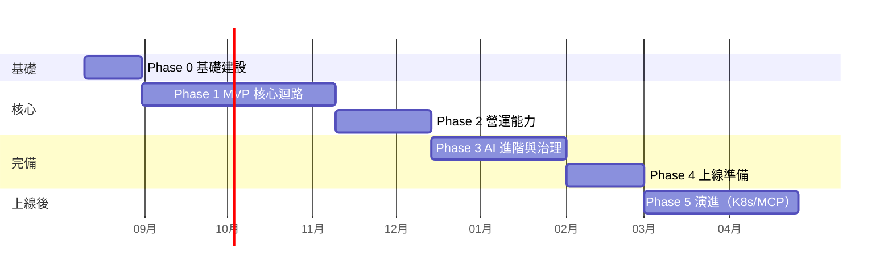

# 13 開發 Roadmap

| 項目 | 內容 |
|------|------|
| 文件編號 | 13 |
| 版本 | v1.6 |
| 日期 | 2026-07-30 |
| 狀態 | Draft — 待審閱 |
| 估算基準 | **1 位工程師 + AI（Claude Code）結對開發**；AI 加速 coding 與測試撰寫，但 review、整合、除錯與決策仍以人為瓶頸——時程按此重估；pw 數字保留作為工作量參考；不含需求變更緩衝（建議整體 +20%） |
| 變更紀錄 | v1.1：估算基準改為 1 人 + AI；時程重估（27→29 週）；2C 裁切（Django Admin 頂替、自訂角色延後）；新增人機協作開發規則；R4 改寫。v1.2：§9.1 補非開發 lead time（F-10）。v1.3：人機協作規則重編為 §1.2（原誤植 §2.1，編號順序錯誤）。v1.4：新增 §3.1「1A 前置條件」（RLS 有三個漏做即靜默失效的前置項）與 §3.2「1A 同步改動：log 的租戶綁定」，兩者皆出自 Phase 0 結案程式審查（見 15 §8）；版本欄同步更正（原停在 v1.1 而變更紀錄已到 v1.3）。v1.5：Phase 0 DoD 的認證併發數改為「待分機環境判定」——單機量測法的絕對值跨 session 漂移 34–48%，無法裁決 150（08-05）與 100（08-07）孰為真（依據見 11 §1.4）。v1.6：§2 新增 Phase 0 結案紀錄（2026-08-07 通過閘門，含依據與三項不阻塞的未結項） |

---

## 1. 階段總覽

總時程：**約 29 週（不含 Phase 5）**；每 Phase 結束有明確 Definition of Done（DoD）驗收閘門，未過不進下一階段。

### 1.1 人機協作下的時程邏輯

1 人 + AI 不等於「人數減半、時程加倍」：AI 使 coding / 測試撰寫 / 樣板工作大幅加速（估 2–3×），但**人的 review、跨模組整合判斷、除錯決策不可平行化**——因此 coding 密集的 Phase 1 只比原估多 2 週，而非翻倍；review 密集、風險決策多的 Phase 3 增加 1 週；Phase 2 因功能裁切（見 §4）反而縮短。

### 1.2 人機協作開發規則（全 Phase 適用）

1. **驗收測試先行**：每個工作包開工時，AI 先依 DoD 產出驗收測試 → 人 review 測試（成本遠低於 review 實作）→ AI 實作至測試通過。人的 review 焦點是「測試是否驗對了東西」。
2. **E2E smoke suite 於 1A 同步建立**（5 分鐘內跑完：登入→上傳→ready→問答→引用），每次任務結束必跑——防 AI 跨 session 開發的迴歸盲區。
3. **AI 任務卡**：每個任務以固定格式下達（見 CLAUDE.md）：對齊的工作包、需讀的文件、DoD 測試位置、**禁區**（本次不准碰的目錄）。
4. 一次任務 = 一個工作包（或其子項），完成即停、人 review 後才續——不允許 AI 連續自主推進多個工作包。

---

## 2. Phase 0：基礎建設（3 週，~7 pw）

| 面向 | 內容 |
|------|------|
| 開發內容 | Monorepo 建立（backend/frontend）；Docker Compose 全套（PG+pgvector+pgroonga、Redis、MinIO）；Django+FastAPI 骨架（ADR-001 落地：django.setup、threadpool repository 基底、UoW、TenantContext）；CI 全管線（lint/type/test/import-linter/migration check/image build）；structlog + request_id；前端 Vite 骨架 + codegen 管線 |
| 技術重點 | **ADR-001 橋接是本階段唯一高風險項**——先做穿刺驗證（spike）：併發壓測 threadpool 模式確認可行，再鋪全量 |
| 相依性 | 無（起點） |
| 優先順序 | P0——一切的地基 |
| 交付成果 | `make up` 一鍵起環境；hello-world 端點走完 API→Service→Repository→DB 全鏈路含測試；CI 綠燈 |
| **結案** | ✅ **2026-08-07 通過閘門。** 依據：`make up` 一鍵起環境實跑、159 passed / 1 skipped（skip 為 RLS 絆線，屬 1A）、`make lint` 全綠（ruff + mypy strict + import-linter 4/4）、前端 28 passed（含 typecheck）、`openapi-check` 無漂移、image build 出 non-root(uid 10001) 且 CMD 帶齊日誌旗標、ADR-001 橋接於 50–200 併發三輪零失敗且吞吐 411–484 rps。 **未結項（皆非本階段職責，不阻塞）**：① CI 真實跑一次（trivy scan 與對全新容器的 tests job 需 push 才觸發）；② 新人 30 分鐘上手未實際計時演練；③ 絕對容量認證待分機環境（見下方 DoD 說明）。 **遺留給 1A 的前置條件見 §3.1、§3.2**；程式審查的 19 條未處理項見 **15 §8** |
| DoD | 新人 clone 後 30 分鐘內能跑起全環境並通過測試；橋接壓測報告，量測方法與數字依 **11 §1.4**。個人開發階段適用該節「單機量測法」的已知偏離（CPU 綁核心 + 伺服器端 `duration_ms`）。**認證併發數待分機環境判定**：原訂 200 併發在此硬體下未達成，而單機量測給出的上限隨 session 漂移——2026-08-05 量到 150（p95 268ms）、2026-08-07 同一份程式碼量到 100（p95 293ms；150 為 396ms），50 併發兩次吻合而 100 以上分歧 34–48%，本方法無法裁決（見 11 §1.4「2026-08-07 重量」）。**此項不阻塞 Phase 0 結案**：橋接可行性（本 DoD 的實際目的）已由三輪零失敗、吞吐 411–484 rps 證實，缺的是絕對容量認證，而那本來就要等分機環境 |

## 3. Phase 1：MVP 核心迴路（10 週，~22 pw）

> 目標：單一租戶內走通「上傳文件 → 可問答 → 有引用」的完整價值迴路。

| 工作包 | 內容 | 估算 |
|--------|------|------|
| 1A Identity 基礎 | JWT 登入/refresh rotation、User CRUD、系統角色 RBAC（自訂角色延後）、tenant 建立（隔離機制全量：filter+RLS+跨租戶測試矩陣）；**E2E smoke suite 骨架同步建立（§1.2）**；**spike 面移除（ADR-002 結案條件：`tenant_middleware`、`api/v1/spike.py`、`apps/spike/`、`ENABLE_SPIKE_ENDPOINTS` 同一 commit 刪除）** | 4 pw |
| 1B Knowledge + ETL 基礎 | KB/Document CRUD、上傳（單請求版）、PDF/docx/txt 三種 loader、recursive chunker、狀態機+重試+冪等 | 5 pw |
| 1C Embedding + 檢索 | AI Gateway 骨架（OpenAI + Ollama 兩個 provider 先行）、embedding worker、pgvector HNSW、**純向量檢索先行**（hybrid 留 Phase 2） | 4 pw |
| 1D Chat 迴路 | Conversation/Message、SSE 全協定（含 resume）、Prompt Builder（版本機制簡化版：僅 draft/published）、citation 標記與驗證、Memory 視窗版（摘要留 Phase 3） | 6 pw |
| 1E 前端 MVP | 登入、KB/文件管理（含 ETL 進度）、Chat UI（串流+引用面板） | 3 pw |

- 相依：1A → 全部；1B → 1C → 1D → 1E 可部分並行。
- 技術重點：SSE 協定完整度（不留技術債，resume day-1 做齊）；tenant 隔離測試矩陣即使單租戶也先行（之後不補）。
- DoD：E2E 通過「上傳 50 頁 PDF → 5 分鐘內 ready → 提問 → 串流回答含正確引用」；TTFT p95 < 3.5s（純向量版）；隔離矩陣綠燈。

### 3.1 1A 前置條件：RLS 生效的三件事

1A 的「隔離機制全量：filter+RLS」有三個**漏做即靜默失效**的前置項（Phase 0 結案程式審查發現，2026-08-07）。列在這裡而不是留在程式註解裡，是因為它們的共同症狀是「policy 建好了、查詢正常回傳、測試全綠，隔離卻不存在」——沒有任何一項在漏做時會報錯。

| # | 前置項 | 為什麼不能留到事後 |
|---|--------|-------------------|
| 1A-P1 | **DB 角色拆分**：應用連線改用非 superuser、非 `BYPASSRLS` 的角色（05 §5.1）。目前 `docker/compose.yml` 的 `POSTGRES_USER` 同時是 initdb superuser、schema owner 與應用連線帳號 | superuser 與表的 owner 都**預設豁免** policy。角色若仍是 owner，另需 `FORCE ROW LEVEL SECURITY`，否則 `ENABLE ROW LEVEL SECURITY` 等於沒開。而 `POSTGRES_USER` 只在 initdb 生效，改它要 `make clean` 重建資料卷——愈晚做成本愈高 |
| 1A-P2 | **測試連線設計**：pytest 需 `CREATE DATABASE`（非特權角色沒有這權限），而 RLS 測試要驗的是**應用角色**的行為，兩者不能是同一條連線 | 若測試整程以特權角色跑，1A 的「跨租戶測試矩陣」會在 RLS 完全失效的情況下全綠——那比沒有測試更糟，它會主動背書一個不存在的保護 |
| 1A-P3 | **`statement_timeout` 的套用對象**：`make db-timeouts` 目前對 `DB_USER` 下 `ALTER ROLE`，而該角色同時跑 migration。拆分後只套在應用角色上 | 5s 上限會砍掉大表的 `AddIndexConcurrently` 與 HNSW 建索引，症狀是 migration 中途 `canceling statement due to statement timeout`，而那已經是半套 schema |

一併要收的兩處：`docker/pgbouncer/userlist.txt.tpl` 與 `render.sh` 的佔位符清單需加入新角色（PgBouncer 認的是自己的 userlist，不是 PG 的 role）；`core/uow.py` docstring 提到的「Migration 與維運腳本走 bypass 角色」目前在 repo 內**沒有對應角色存在**，拆分時一併落地。

**強制機制**：`tests/integration/test_infra_postgres.py::test_rls_enabled_tables_are_actually_enforced` 在沒有任何表啟用 RLS 時 skip，一旦有表啟用即斷言「連線角色非 superuser、非 `BYPASSRLS`、且表已 FORCE」。因此 1A 若先開 RLS 而漏了上述前置，得到的是紅燈而不是靜默失效。

已在 Phase 0 先行落地、1A 不需重做的相關項：巢狀交易換租戶的守門（`core/uow.py` 的 `CrossTenantTransactionError`）。`set_config(..., true)` 是**交易**區域而非 savepoint 區域的，子交易內換租戶後不會還原，外層後續語句會在 RLS 之下被當成內層租戶。

### 3.2 1A 同步改動：log 的租戶綁定

**換認證來源會讓每筆 log 的 `tenant_id` 靜默消失。** 這不是前置條件（不影響 1A 能否開工），但必須與認證改造**同一個工作包**完成，否則觀測能力會在沒有任何徵兆的情況下退化。

現況：`api/main.py` 的 `request_context_middleware` 在**進入時**對 tenant contextvar 取一次快照，再 `bind_request_context(tenant_id=...)`。這能成立的唯一原因是 spike 的租戶來源也在 middleware 層，且排在它之前。

1A 之後：租戶改從已驗證的 JWT claim 取得，而 FastAPI 的慣用形狀是 `Depends`——那在 **route 內**執行，比所有 middleware 都晚。快照那時還是空的，於是每筆 log 只有 `request_id`、沒有 `tenant_id`。

**為什麼不會有紅燈**：唯一覆蓋這件事的測試（`tests/api/test_request_logging.py::test_tenant_id_is_bound_when_present`）是靠 spike 的 `X-Tenant-Id` middleware 驅動的，而那正是 1A 要刪掉的東西——測試會跟著改或刪，缺口不會浮現。而 12 §1.1 把 `tenant_id` 列為標準欄位，「單一租戶錯誤暴增」這類查詢全靠它。

處置：把租戶改成**在 emit 時**讀 contextvar 的 structlog processor（掛進 `config/logging.py` 的 `_shared_processors`），這樣不論由哪一層、哪種機制設定租戶都一樣有效。同時補一條**不依賴 spike 標頭**的測試——以 route-level dependency 設定租戶，斷言 log 帶得到 `tenant_id`；那條測試在 spike 面刪除後仍然有效。

## 4. Phase 2：多租戶營運能力（5 週，~13 pw）

| 工作包 | 內容 | 估算 |
|--------|------|------|
| 2A 營運基座 | Quota（reserve/commit + Redis 計數 + 對帳）、usage_logs 分區 + Analytics 彙總與 Dashboard API、Audit middleware、Notification（in-app + email） | 5 pw |
| 2B 檢索升級 | pgroonga FTS + RRF hybrid、rerank 接入（含降級鏈）、KB 級參數覆寫、re-ingest/reindex 流程 | 4 pw |
| 2C 管理面（裁切版） | API Key、Settings + 憑證加密（envelope）。**平台管理面以 Django Admin 頂替**（租戶 CRUD/DLQ 重放先用 Admin + 腳本，`/admin` API 延後至 Phase 5）；**自訂角色 + 資源級 grant UI/邏輯延後至 Phase 5**（`resource_grants` 表先建，前期客戶用四個系統角色） | 1.5 pw |
| 2D Loader 擴充 | xlsx/csv/json + Website loader（含 SSRF 防護全量）、大檔分塊上傳 | 3 pw |
| 基礎 HA | Redis Sentinel、DB 備份 pgBackRest + PITR、首次還原演練 | (併入日常) |

- 相依：2A 是商業化前提；2B 依賴 1C；其餘可並行。
- 裁切原則：**營運介面可後補（成本線性），隔離與計量機制不可後補（成本十倍）**——tenant_id/RLS/quota/audit 照做，管理 UI 用 Django Admin 紅利頂住。
- DoD：雙租戶隔離下 quota 強制生效（超額被擋）；hybrid 檢索評測優於純向量（建立首版 golden set ≥100 題）；還原演練報告（RTO 達標）。

## 5. Phase 3：AI 進階與治理（7 週，~16 pw）

| 工作包 | 內容 | 估算 |
|--------|------|------|
| 3A Tool 系統 | Registry + Executor 執行鏈全量（circuit breaker、cache、濫用防護）、內建工具 2–3 個、前端 ToolCallCard | 4 pw |
| 3B Evaluation | 資料集管理、離線評測（recall/groundedness/faithfulness）、nightly CI 門檻、線上 5% 抽測 | 4 pw |
| 3C Memory/成本進階 | 漸進式摘要 + 全量重算、context compression、model routing 規則、prompt caching 前綴優化、成本熔斷 | 3 pw |
| 3D 安全強化 | injection 偵測（記錄→攔截漸進）、紅隊測試集 harness、PII 遮罩政策、API/DB/Web 同步 loader（含排程同步） | 4 pw |
| 3E 觀測全量 | OTel tracing、六 Dashboard、三級告警 + runbook、Locust 基準入 CI | (DevOps+1 pw) |

- 相依：3B 依賴 2B 的 golden set；3A/3C/3D 可並行。
- DoD：評測門檻在 CI 生效（故意劣化 prompt 會 block）；紅隊集通過率基線建立；告警演練（人為注入故障全部按預期觸發）。

## 6. Phase 4：上線準備（4 週，~10 pw）

負載測試（目標規模 ×1.5 壓測 + 瓶頸修正）→ 外部滲透測試與修補 → DR 全流程演練（異地重建計時）→ 文件（API docs、租戶 onboarding 手冊、維運 runbook 完備）→ 私測租戶 beta（2–3 家，2 週回饋修正）→ **GA**。

DoD = 14_Production_Checklist 全項通過 + beta 租戶簽核。

## 7. Phase 5（上線後演進，依商業觸發）

K8s 遷移（12 §7 步驟）、MCP 工具整合、Plugin 對外、Feature Flag 灰度全量、advanced RAG（GraphRAG/multi-hop 依評測數據決定）、SOC 2 準備。**每項有量化觸發條件（11 §2、12 §7），不預先執行。**

---

## 8. 風險登記冊（G-16）

| # | 風險 | 機率 | 衝擊 | 緩解 | 應變 |
|---|------|------|------|------|------|
| R1 | ADR-001 橋接壓測不達標 | 中 | 高 | Phase 0 先行 spike | 熱路徑改 raw asyncpg 查詢（Repository 介面不變）；最壞情境評估 SQLAlchemy 遷移（介面已隔離，衝擊限 repositories/） |
| R2 | 中文檢索品質不足 | 中 | 高 | golden set 早建（Phase 2）、pgroonga+rerank 雙保險 | 更換 embedding 模型（版本化機制支援無痛切換）；引入外部檢索服務 |
| R3 | LLM provider 政策/價格變動 | 高 | 中 | Provider 抽象 + 多 provider day-1（OpenAI+Ollama） | fallback 鏈切換；BYOK 轉嫁 |
| R4 | **單人瓶頸**：review/整合/決策全集中一人；請假、生病、burnout 即全案停擺 | 高 | 高 | 驗收測試先行降低 review 負擔；smoke suite 防迴歸；一切決策記錄於文件（bus factor 文件化）；可持續節奏優先於衝刺 | 時程 +30%；3C 後移；必要時外包 review（安全與 DB 變更優先） |
| R5 | 評測集品質低導致調參無據 | 中 | 中 | 列常設任務、每 sprint 增補；beta 租戶真實問題回流 | 購買/委製標註 |
| R6 | 安全事件（injection 繞過） | 低 | 高 | 權限兜底原則（10 §8）使爆炸半徑=單使用者權限 | 事件 runbook、工具全域 kill switch（FeatureFlag） |

## 9. 里程碑與驗收摘要

| 里程碑 | 時點 | 對外意義 |
|--------|------|----------|
| M0 地基完成 | +3w | 可全速開發 |
| M1 MVP 可演示 | +13w | 內部/種子用戶演示 |
| M2 可商業試用 | +18w | 多租戶+計量，可簽 beta 客戶 |
| M3 功能完備 | +25w | 工具+評測+治理齊備 |
| **M4 GA** | **+29w** | 正式上線 |

### 9.1 非開發 Lead Time（F-10：不寫程式但吃日曆的事，需並行啟動）

| 事項 | 啟動時點 | 說明 |
|------|----------|------|
| Beta 租戶招募 | **M2 前 4 週**（≈ +14w） | 找 2–3 家願意試用的租戶、談資料範圍與回饋節奏；等 M2 才開始找會讓 Phase 4 的 beta 期空轉 |
| 維運學習曲線 | 貫穿 Phase 0–2 | pgvector/pgroonga 調參、pgBackRest、PgBouncer transaction mode 陷阱——**明文計入整體 +20% 緩衝**，不另列工時；首次遇到即寫成 runbook 條目 |
| 外部滲透測試排程 | M3 前 4 週 | 廠商檔期通常要提前 3–4 週預約 |
| 法務文件（服務條款、DPA、隱私政策） | Phase 3 期間 | GA 前置條件，非工程項但常成為隱形阻塞 |

## 10. Architecture Review

1. **相依性順序**：價值迴路優先（先能用→再能賣→再治理），每階段結束都是可運行系統，無「大爆炸整合」。
2. **YAGNI**：hybrid、摘要、tool、評測全部推遲到其前置價值驗證之後；K8s 在 GA 後。
3. **風險前置**：最高技術風險（R1 橋接）放 Phase 0 spike，最高品質風險（R2 中文檢索）的度量工具（golden set）提前到 Phase 2。
4. **Technical Debt 管理**：Phase 1 的簡化（純向量、視窗 memory、兩 provider）全部在後續 Phase 有明確補齊點，不會成為永久債。
5. **更好方案**：若增聘第二位工程師，Phase 2 與 3 可部分並行縮短 3–4 週，且 R4（單人瓶頸）大幅緩解——這是時程投資報酬率最高的單一變因；目前估算按 1 人 + AI 保守值。

---

*同階段文件：14_Production_Checklist.md（最終文件）。*
